# VISUAL BANGER LIBRARY: video half (IG / TikTok / YT Shorts / FB)
Built Mon 28 Sep 2026 (Oslo) by LOOKING at the posts, not by categorising them. Every image in this folder is a 4-frame contact strip (≈3%, 35%, 65%, 92% of the runtime), so you can see the edit, and every clip was run through whisper for the audio. YT Shorts are thumbnails only (yt-dlp is bot-blocked on YouTube).
Sources: vidIQ `ig_profile_reels` (thatguysjokes, roastedballers), one IG+TikTok outlier search (since 09-14) and two YT Shorts outlier searches (25 credits, 40 left). Scope: HUMOUR only (satire, mocking fanbases, ragebait, receipts). News/footage items sit in "NOT OUR LANE" at the bottom. Our numbers come from the Meta Graph API (insights JSON + carousel children) and Metricool FB reels (09-18→09-28).
Times are Oslo. The Ornstein City 114/115 story broke ≈16:00 Oslo on Fri 25 Sep.

---

## THE CRAFT per platform (from looking)

### 0. The one rule under all the others
**The clip has to ACT OUT the line: a structural pun, not just a matching mood.** The 1 goal in Brazil 1-7 Germany *is* "1 of 115" (IG-01). The Wicker Man's bees *are* Brentford (FB-02). Nemo's seagulls *are* Brighton (TT-02/03). Zootopia's country bunny arriving in the big city *is* Carlisle at the Etihad (IG-05). Our flops paired a line with a clip that only vaguely fits: hurdles for "stung by the bees" (FB-06, 34 views, against 44.5K for the literal bees), Mourinho for "City's lawyers" (OURS-01), McMahon for "therapists" (FB-05). **Reviewer test:** cover the text. Does the clip alone make a football fan think of the club, player or event? If not, the clip is wallpaper.

### IG REELS (8 rules)
1. **Frame 0 already carries the plate AND a moving clip.** 12/12 thatguysjokes reels show the full line from the very first frame. No title card, no fade-in, no logo sting (IG-01…06). *Check:* export frame 0. Is the joke readable from it alone?
2. **Plate = one sentence of 7–16 words that names a specific consequence, usually a number, a table position or a place.** "…winning 1 out of the 115 charges" (2.64M), "…move up to 19th…" (1.13M), "…Grimsby Town (a) next season" (1.05M), "Carlisle United players pulling up to the Etihad…" (462K). Our flops name no consequence: "Everton fans waking up to the City news" (OURS-02, 2.4K), "The football world is FEASTING" (OURS-03, 1.7K). *Check:* does the line contain a number, a position, a named lower-league club or a named person doing a named thing?
3. **Template A, the "white tweet plate" (thatguysjokes):** white 9:16 canvas, black system-sans text, left-aligned, 2 lines, sitting directly on top of a 16:9 clip placed in the upper-middle, with nothing else on screen (no logo, no handle, no emoji). It reads as a tweet, so it reads as a person. **Template B, the "receipt stack" (roastedballers):** black canvas, a real news tweet screenshot on top (The Touchline's list of champions), a bold quote line under it, then a clip with club crests stuck on the characters. B is what lets a cold viewer get the joke (IG-07 3.7M, IG-08 1.9M). *Check:* is the draft visibly A or B? Anything else (blurred-background fill, text on the clip, two text blocks) has failed (OURS-04/05).
4. **6–18 s, loopable.** The IG winners run 6–18 s (median ≈11 s). Our 36-second statues reel (OURS-01) is 3× too long. *Check:* ≤15 s unless the audio is a story that needs the time.
5. **When the clip has iconic audio, keep it: the audio is the second punchline.** The Oscar commentary "…Brazil one, Germany seven" lands the 1-of-115 joke (IG-01). Wolf of Wall Street: "Can you say that again? Just the way you say" (IG-06). 2 Broke Girls: "You're in my house now" as Brighton turn it round (IG-12). Otherwise use a trending song that matches the emotion (ELO "I'm Alive" for the apes; Drake "God's Plan" for "PL lawyers" giving United money; Lil Wayne "Let It All Work Out" for Arsenal's sadness). *Check:* write the sound down in the draft. Is it (a) the clip's own line that pays off the plate, or (b) a named trending song whose mood matches?
6. **Crest stickers + a live scoreboard make the clip a match report.** fc.maverick's scoreboard ticks from 2-0 (11') to 2-3 FT while the sitcom fight plays (IG-12, 1.5M at 176× median). roastedballers' Vinícius rating card "6.4" sits in the corner of the treadmill clip (IG-10, 555K). *Check:* when the joke is about a result, is the score on screen?
7. **No line = no reel.** Same account, same match, same template, same day: "'I'll do it 10x' highlights vs Atlético" + Vini rating = 555K. Crests only, no line (Barça fans dancing) = **6.1K** (IG-10 vs IG-11). *Check:* never publish a crest-only or music-only reel.
8. **Volume on one story, but a new angle each time, and first.** thatguysjokes posted 7 City reels in ~24 h, each a different consequence (lawyer, Spurs 19th, Carlisle, Grimsby, Ornstein, courtroom, Tranmere). roastedballers' 4th City reel needed two inference steps (VVD takes Aké's 21/22 medal) and died at 20K, 3–5% of their median (IG-09). Our lawyer reel came after the same joke was already out (OURS-01, 6.1K). *Check:* has this exact premise already gone out today on thatguysjokes, roastedballers or rivalsbanter? If yes, pick a different consequence.

### IG CAROUSELS (6 rules, from our own 6 carousels; the IG API gave the slides)
1. **Slide 1 = one big human face showing the emotion, on a RIVALRY.** Xavi v Klopp: slide 1 is Klopp face-palming at Adeyemi's miss, slide 2 the two managers nose to nose → **83.5K, 1,621 shares** (CAR-01). Slide 1 of the City day-2 flop is a tiny trophy collage with 8-point text → 4.1K (CAR-03).
2. **An OWN fake-official slide first can win follows.** "🚨OFFICIAL: The Etihad Stadium has been voted the best stadium in League 2" opened our best-converting carousel: **12 follows, 0.49/1k, 596 shares** (CAR-02). That is 5–25× the follow rate of every recap carousel. ⚠️ This contradicts "never own first". It is one data point, so A/B it and don't make it a law yet.
3. **Frame the carousel as mocking ONE fanbase.** "Arsenal fans have decided Arteta has three PL titles" (0.49 f/1k) and "Xavi v Klopp… both fanbases think" (1,621 shares) do that. Neutral recaps ("Zidane's France era started…" 40K/1 follow, Tekkers/Ronaldo 52K/2 follows/55 shares) get views and no action (NL-3).
4. **One story per carousel.** "City guilty" on 09-28 mixed in Werder Bremen legends, Croatia's kit and Nike → 2.3K, 0 shares (CAR-04).
5. **Day 1 or nothing.** City carousels: day 1 24–36K, day 2 4–5K, day 4 2.3K. Don't post a day-3+ carousel on a story; make a reel with a new consequence instead.
6. **Last slide = the strongest joke + the CTA in the same breath** ("Man City's lawyers charge by the hour. / Following us takes one second." sat on the carousel with the 12 follows).

### TIKTOK (7 rules)
1. **Text in TikTok's native caption style:** white bold sans with a black stroke, or a white box, centred in the upper third, never in a white bar. 7/8 outliers use it (TT-01, 02, 04–08). Our white-bar IG template reads as a repost there. *Check:* make the TikTok copy with in-app text or an identical style.
2. **6–8 s.** hellosky 6.6 s, croatball 7.8 s, iduate 7.7 s, lifetokhq 7.4 s, kamelius 6.5 s, all 1.3–2.1M. Only the apes (12.5 s) and the Ornstein-WWE build-up (17.7 s) run longer, and both are driven by music. *Check:* ≤8 s unless the song's drop needs more.
3. **The sound is part of the joke, not a bed.** Nemo's "Mine! Mine!" / the "pecked by the seagulls" chant (TT-02/03), ELO "I'm Alive" (TT-01), the entrance music plus a crowd pop for Ornstein (TT-04), J. Cole on the kit rail (TT-05). *Check:* with the sound on, does the clip get funnier? A silent-copy upload from us must name the exact sound for Alex to add.
4. **A landscape clip letterboxed in black is fine.** TT-01 and TT-02 are plain 16:9 inside black bars, and TT-02 is the whole frame at 16:9. Don't waste time reframing; spend it on the pun.
5. **Follower count is irrelevant, story timing is everything.** homageboy (441 followers) 1.5M, kamelius (475) 1.3M, iduate (short channel) 2.1M, all within ~24 h of the story they ride.
6. **Half of TikTok's outliers are face-to-camera skits** (POV kit rail, Pep-in-the-car, "calm down", phone call; TT-05…08). We have no face. Our lane is the film-clip pun (TT-01…04), which is the other half.
7. **Caption = 0–5 words + 4–6 hashtags naming the club and the story** (#115 #manchestercity #premierleague #relegation #spurs). No sentence.
⚠️ Unresolved: TT-01/02 re-use film clips and still reached 1.3–1.5M. Our rule "re-uploads = ineligible" is about Creator Rewards eligibility and the "unoriginal" label, not virality. Keep sending Alex a film-pun draft with our own plate text and native caption; don't re-upload match footage.

### YT SHORTS (6 rules)
1. **Title = the plate line, in fan-speak, plus 💀/😂 and 3–5 hashtags.** "Man City Fans Seeing the 115 Charges News 💀😂" (192K, 456 subs, 102×), "Every football fans Reaction to Manchester city 115 Charges" (257K), "Manchester City fixtures next season🤣" (181K). *Check:* does the title start with a fanbase or a club and name the story keyword (115 / charges / Arsenal 3-0)?
2. **First frame = bold white text on black at the top + a famous TV/film face below** (The Office's Brent, Michael Sheen, the Simpsons with PL and City crests; YT-01…03). The first frame is the thumbnail.
3. **Ride the flood within ~1–2 h.** The City Shorts that broke out went up 17:08–18:03 Oslo, 1–2 h after the story. Two days later only novelty angles still broke out (YT-05 FC-card animation 375K on 09-27).
4. **The same joke copied later does ~1% as well.** Mowler posted the identical "lawyer winning 1 out of the 115" clip + plate on YT at 18:03 → **31K**. thatguysjokes' IG original got 2.64M. Ours on YT got 31 views (YT-04). Be first or be different.
5. **Loop to 100%+ watched.** Our only YT hits ("Brighton vs Arsenal highlights" 1,397 at 129% watched, "Spurs fans after going three down" 1,180 at 132%) went out the night of the match and looped. Everything later got 17–109 views.
6. **Tiny channels win.** 344–456-sub channels got 43K–192K on the story. Our 30 subs is not the excuse.

### FB REELS (6 rules, from OUR Page: 4 hits of 40–80K vs a floor of 25–60 views)
1. **FB is binary:** a reel either escapes to non-followers (40–80K) or dies at ~30. The 4 escapes share one trait: the clip is funny **with no football knowledge** (fat blokes falling over, "NOT THE BEES!", a rude donation name read out loud, a maths reveal). FB's audience is broader and older than IG's.
2. **Plate = 3–10 words, bold, above the clip.** "Tottenham vs Aston Villa" (78.6K) is the whole plate. The clip does the talking.
3. **Literal meme vessels beat metaphors:** "every chelsea fan who called brentford away a free three points" + Wicker Man bees = **44.5K**. "'Title contenders' Chelsea just got stung by the bees" + a hurdler falling = **34**. Same story, same week (FB-02 vs FB-06).
4. **Audio punchline on FB too:** Nicolas Cage's scream, Goldbridge reading "Icewallowcom" aloud (FB-04, 42K).
5. **Speed + our own receipt card:** the Everton-6-points / City-114 maths card as a two-beat text reveal ("That's 684 points.") went out ~30 min after the story → **42.3K, 499 likes** (FB-03). A static card fails when it's late or doesn't move. This one was first and revealed in 2 beats.
6. **A near-static clip dies:** the disappointed-cricket-fan clip barely moves over 4.6 s → 27 views (FB-07). Whatever the platform, the clip must MOVE in second 1.

## INSTANT FAILS (each backed by one of our flops or an in-account flop)
- **Clip is a mood, not a pun** → FB-06 hurdles for "bees" (34 views), OURS-01 Mourinho montage for "lawyers" (6.1K), FB-05 McMahon for "therapists" (26).
- **The clip's own person steals the joke** (a famous football face that isn't the subject) → OURS-01: viewers see Mourinho and ask "why Mourinho?".
- **Two text blocks / plate changes mid-reel / stat restated** → FB-05 "therapists…" then "five games. no wins. bottom of the league" (26 views). OURS-05 "NORWAY 1 2 PORTUGAL" + "Norway's finishing vs Portugal" (1.5K, 0 shares).
- **Blurred-background fill with the clip shrunk to ~35% of the frame** → OURS-04 Pep/Manuel (1.1K), OURS-05 (1.5K), which looks low-effort next to the white-plate and receipt-stack templates.
- **>20 s for a one-beat joke** → OURS-01 36 s.
- **Posted after the same premise is out** → OURS-01 statues (lawyer joke), OURS-03 feasting (3rd lawyer-angle reel from us that day), YT Mowler copy (31K vs 2.64M).
- **Story is 2+ days old** → OURS-04 Pep reel 09-27 on a 09-25 story (1.1K); City carousels day 2–4 (2–5K).
- **Descriptive plate, no consequence** → OURS-02 "Everton fans waking up to the City news" (2.4K IG, 54 FB).
- **No line at all** → IG-11 roastedballers crest-only (6.1K vs 555K).
- **Two-step inference** → IG-09 VVD/Aké medal (20K on a ~450K-median account).
- **Near-static clip** → FB-07 (27 views).
- **Mixed-topic carousel** → CAR-04 (2.3K, 0 shares).

---

## IG REELS — references

### IG-01 @thatguysjokes · 25 Sep · 2.64M (≈4.3× acct median ~620K) · reel 9 s
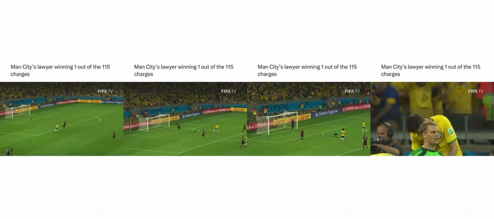
- **Hook (first second):** white plate, "Man City's lawyer winning 1 out of the 115 charges", over a FIFA TV wide shot of Brazil v Germany 2014 already in play.
- **Visual/clip choice:** Oscar's 90th-minute consolation goal in Brazil 1-7 Germany, ending on Oscar trudging past Neuer. The clip's meaning maps exactly: one meaningless goal in a massacre = one charge won out of 115. Match footage, but archival and used as a metaphor.
- **Line/plate:** ties two stories (the verdict + a famous humiliation). The mechanism is a *structural* pun.
- **Sound:** original commentary, "Oscar, he's got a goal… it's Brazil one, Germany seven." The audio says the punchline out loud.
- **Story + timing:** City 114/115, posted day 1.
- **Caption:** "Gooood lawyer mate, seen signs" (5 words) + a boilerplate paragraph about Instagram's originality flag.
- **Steal this:** look for a famous football moment whose SCORE or NUMBER equals the number in the news.

### IG-02 @thatguysjokes · 25 Sep · 1.13M · reel 18 s
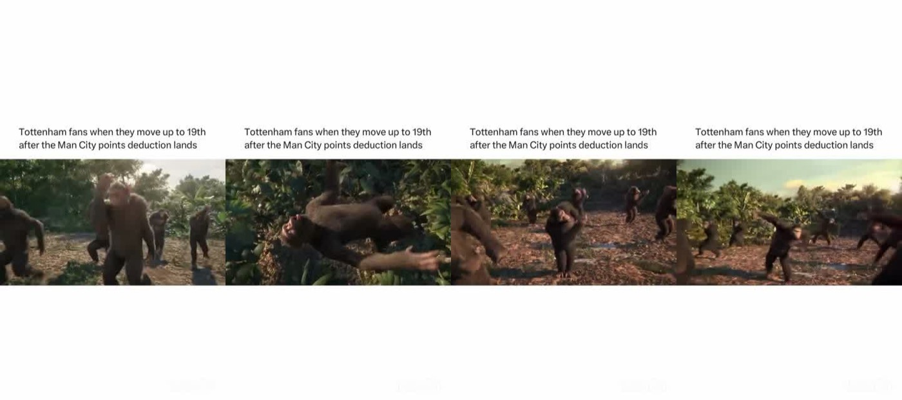
- **Hook:** "Tottenham fans when they move up to 19th after the Man City points deduction lands" + CGI apes already dancing.
- **Visual/clip choice:** the dancing-apes meme (a Planet-of-the-Apes-style jungle). Primal, over-the-top joy for a pathetic gain (19th).
- **Line/plate:** mocks a fanbase + ties two stories (Spurs bottom + City's deduction). The number "19th" is the joke.
- **Sound:** ELO "I'm Alive" (the meme's sound).
- **Story + timing:** day 1. The same idea did 1.5M on TikTok for a 441-follower account (TT-01).
- **Caption:** "Moved up a space without even playing, I've seen signs" + boilerplate.
- **Steal this:** "[Bottom club] fans when [someone else's disaster] lifts them one place". Joy out of all proportion to the gain.

### IG-03 @thatguysjokes · 26 Sep · 1.09M · reel 14 s
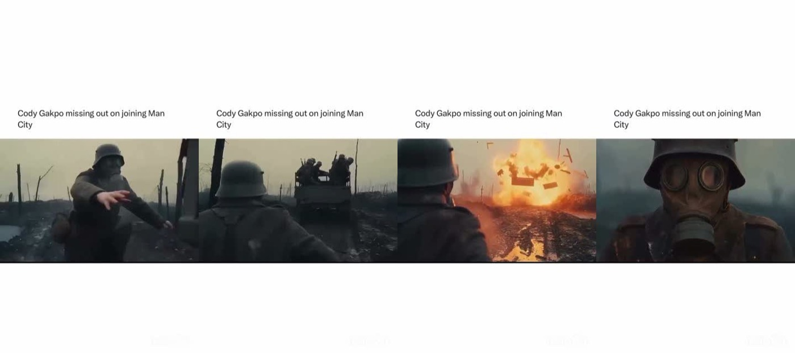
- **Hook:** "Cody Gakpo missing out on joining Man City" over a WW1 soldier in a gas mask reaching out as the truck leaves.
- **Visual/clip choice:** trench-war film. He "misses the truck" and it explodes: the dodged-a-bullet arc plays out in 14 s. Cinematic, dramatic, no football in it.
- **Line/plate:** ties a transfer rumour to the verdict. The clip provides the twist (missing out = being saved).
- **Sound:** orchestral war score.
- **Story + timing:** day 2, a fresh angle (transfer "near miss") on an old story.
- **Caption:** "Could've ended up at Spurs or Man City" + boilerplate.
- **Steal this:** "[Player] missing out on joining [disgraced club]" + any clip where the vehicle/plane/door the hero missed blows up.

### IG-04 @thatguysjokes · 25 Sep · 1.05M · reel 11 s
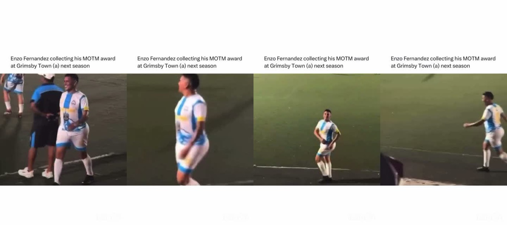
- **Hook:** "Enzo Fernandez collecting his MOTM award at Grimsby Town (a) next season" + a stocky Sunday-league player in a blue-white kit swaggering off.
- **Visual/clip choice:** an amateur clip whose kit colours echo Argentina, with a body and swagger that make the relegation image. Low-fi on purpose.
- **Line/plate:** the absurd future: City in League Two, with "(a)" fixture shorthand that only football fans read.
- **Sound:** music bed.
- **Caption:** "Bang see you later you're going Grimsby" (+ credits the X user who made it).
- **Steal this:** "[Star] [doing normal thing] at [small club] (a) next season". The "(a)" is the in-group wink. Note the credit: thatguysjokes reposts X users' reel ideas with credit.

### IG-05 @thatguysjokes · 25 Sep · 462K · reel 14 s
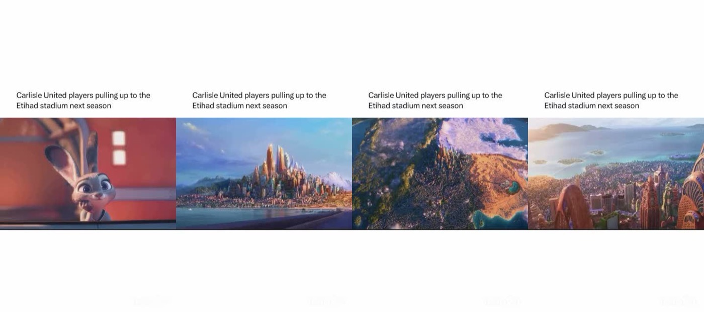
- **Hook:** "Carlisle United players pulling up to the Etihad stadium next season" + Judy Hopps' wide-eyed train-window face.
- **Visual/clip choice:** Zootopia's small-town bunny arriving in the dazzling city. Awe = a lower-league team visiting a palace.
- **Line/plate:** the absurd future, told from the other side (the lower-league visitor).
- **Sound:** Zootopia score.
- **Steal this:** tell the same story from the small club's POV. Cartoons carry awe/innocence better than film.

### IG-06 @thatguysjokes · 27 Sep · 675K · reel 6 s
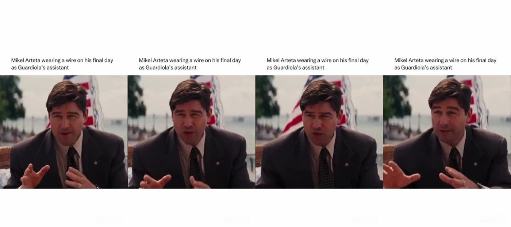
- **Hook:** "Mikel Arteta wearing a wire on his final day as Guardiola's assistant" + the FBI agent (Kyle Chandler) on the boat in Wolf of Wall Street.
- **Visual/clip choice:** the FBI agent = the informant/wire. 6 s, one line of dialogue.
- **Line/plate:** conspiracy (Arteta as the mole who sank City). Ties two stories (Arteta ex-City + verdict).
- **Sound:** original: "Can you say that again? Just the way you say." That's the payoff.
- **Story + timing:** day 3, which only works because it's a NEW angle.
- **Steal this:** conspiracy frame + a film line of dialogue that confirms it. 6 s is enough.

### IG-07 @roastedballers (18K) · 25 Sep · 3.73M (pinned; ≈8× acct median ~450K) · reel 10 s
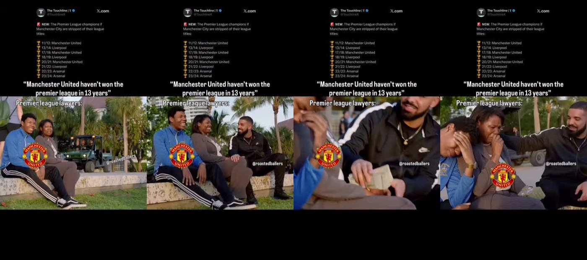
- **Hook:** black canvas, a real The Touchline tweet listing "PL champions if City are stripped" (United 11/12, 17/18, 20/21…), then the quote line "'Manchester United haven't won the premier league in 13 years'", then the label "Premier league lawyers:".
- **Visual/clip choice:** Drake's God's Plan video, handing cash to a crying mother and son, with a United crest stuck on the son. Generosity = lawyers handing United titles.
- **Line/plate:** a receipt (the list) + a fanbase's own taunt flipped + the label. The receipt makes it readable by anyone.
- **Sound:** Drake "God's Plan".
- **Caption:** a long, *relevant* news paragraph about the verdict (not boilerplate).
- **Steal this:** receipt-stack = [real news screenshot] → [the taunt a rival fanbase always uses] → ["X:" label] → crest-tagged clip.

### IG-08 @roastedballers · 25 Sep · 1.91M · reel 13 s
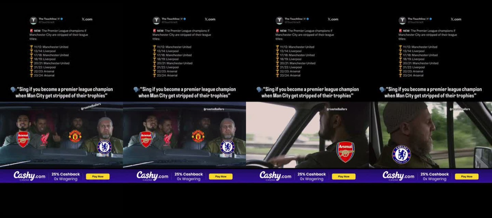
- **Hook:** the same Touchline receipt + "🗣️'Sing if you become a premier league champion when Man City get stripped of their trophies'".
- **Visual/clip choice:** a car full of men (film) with Arsenal/Liverpool/United crests singing, while the CHELSEA-crested driver stays stone-faced. Chelsea gain nothing from the list, and the non-singer is the punchline.
- **Line/plate:** football chant grammar ("Sing if you…") + a hidden second joke for whoever reads the crests.
- **Sound:** a singalong track (mysocial logged Dua Lipa "Dance The Night").
- **Note:** a casino ad bar sits under the clip (they monetise with sponsor bars).
- **Steal this:** put crests on every face, and give one crest the opposite reaction. That's the joke the fans of that club tag each other in.

### IG-09 @roastedballers · 25 Sep · 20K (≈4% of median, IN-ACCOUNT FLOP) · reel 7 s
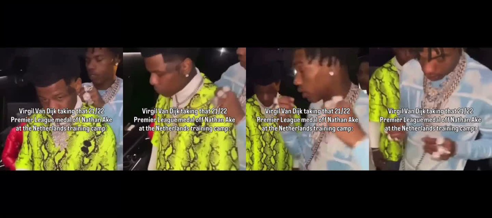
- **Hook:** white shadowed text over the middle of the clip: "Virgil Van Dijk taking that 21/22 Premier League medal off Nathan Ake at the Netherlands training camp:".
- **Visual/clip choice:** low-res clip of rappers taking a chain off someone.
- **Why it died:** two inference steps (21/22 → Liverpool would inherit → VVD and Aké are both Dutch). No receipt header (their hits had one). Text is stamped over faces mid-frame. It was their 4th City reel within hours.
- **Steal this (inverse):** one inference step max. If the joke needs a fact, put that fact on screen as a receipt.

### IG-10 @roastedballers · 20 Sep · 555K · reel 12 s
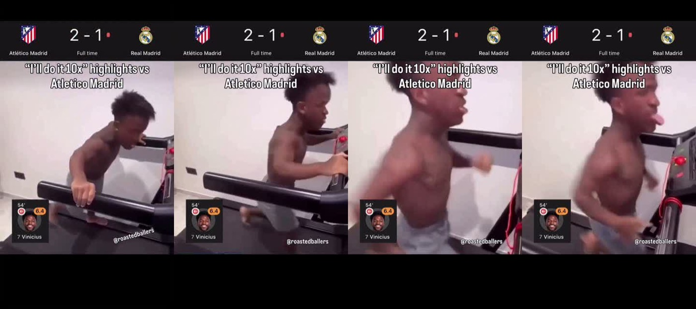
- **Hook:** a FotMob-style scoreboard "Atlético 2-1 Real Madrid, Full time" on top, then "'I'll do it 10x' highlights vs Atletico Madrid" over a kid sprinting on a treadmill and going nowhere.
- **Visual/clip choice:** running flat out and getting nowhere = Vini's busy, useless game. A "7 Vinicius 6.4" rating card sits in the corner as the receipt.
- **Line/plate:** a player's own quote ("I'll do it 10x") thrown back at him.
- **Steal this:** scoreboard + the player's rating card + a clip of futile effort. The rating is the receipt.

### IG-11 @roastedballers · 20 Sep · 6.1K (IN-ACCOUNT FLOP) · reel 9 s
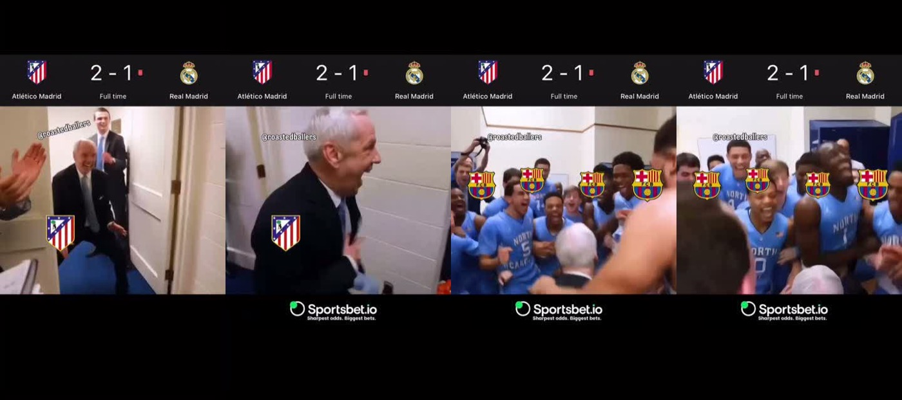
- **Hook:** the same scoreboard, then a coach celebrating with an Atlético crest, then a dressing room of Barça crests dancing. **No line at all.**
- **Why it died:** no line, and the joke (Barça benefit from their rivals' loss) is left for the viewer to assemble. It was the 4th reel on the same match.
- **Steal this (inverse):** crests are garnish, never the joke.

### IG-12 @fc.maverick (35K) · ~17 Sep · 1.5M (176× median 8.5K) · reel 18 s
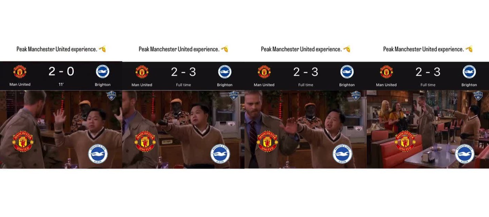
- **Hook:** "Peak Manchester United experience. 🫳" + scoreboard "Man United 2-0 Brighton, 11'".
- **Visual/clip choice:** a 2 Broke Girls confrontation (not Always Sunny, as vidIQ said), with a United crest on the man throwing his weight around and a Brighton crest on Han. The scoreboard flips to 2-3 FT mid-clip while Han takes over.
- **Line/plate:** 4 words, a verdict. The scoreboard is the story.
- **Sound:** original dialogue, "…I don't think so, homeboy. You're in my house now!", which is the comeback in one line.
- **Steal this:** a comeback result = a sitcom power reversal, with the scoreboard changing mid-clip.

### IG-13 @livekickoff (422K) · 20 Sep · 1.8M (3.9×) · reel 10 s
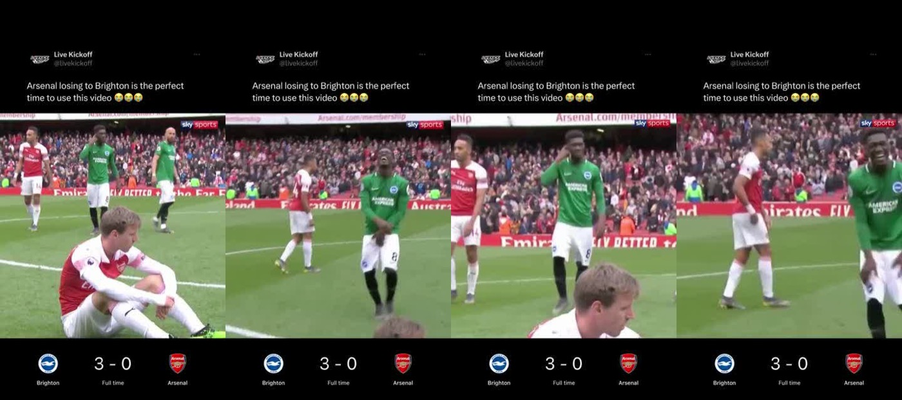
- **Hook:** tweet-style header "Arsenal losing to Brighton is the perfect time to use this video 😭😭😭" + an old Sky clip of Arsenal's Monreal slumped on the turf while a Brighton player celebrates.
- **Visual/clip choice:** archival footage of the SAME fixture going the same way, so the history repeats. A 3-0 scoreboard sits at the bottom.
- **Sound:** Lil Wayne "Let It All Work Out" (melancholy).
- **Steal this:** "the perfect time to use this video" = dig up an old clip of the same fixture/club suffering, plus a sad song.

### IG-14 @tmotty.gg (12K) · ~22 Sep · 1.1M (31.6×) · reel 7 s
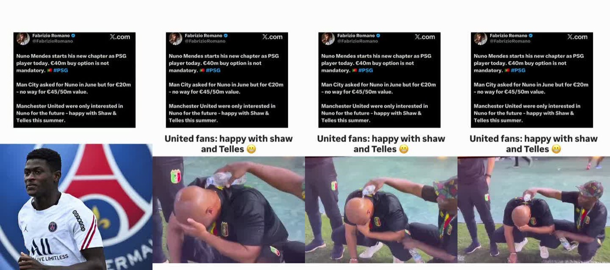
- **Hook:** Fabrizio Romano's 2021 tweet ("…Manchester United were only interested in Nuno for the future, happy with Shaw & Telles") over a PSG photo of Nuno Mendes.
- **Visual/clip choice:** it cuts to "United fans: happy with shaw and Telles 😬" over a man having water poured on his bowed head (despair baptism).
- **Line/plate:** RECEIPT: an old take that aged badly.
- **Sound:** "me and the devil" (sung, dark).
- **Steal this:** when a player shines, find the 2–5-year-old tweet where a rival club passed on him.

### IG-17 @rivalsbanter (374K) · 26 Sep · 45K likes · reel 12 s · SILENT
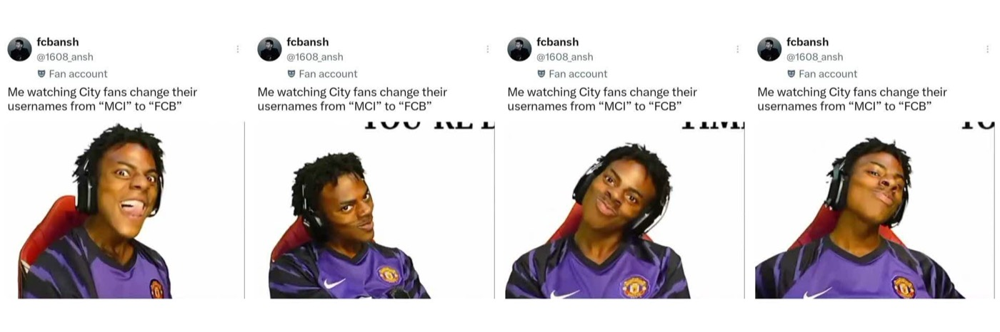
- **Hook:** a credited fan tweet, "Me watching City fans change their usernames from 'MCI' to 'FCB'", over IShowSpeed in a United shirt pulling faces.
- **Visual/clip choice:** Speed = the internet's reaction face. The United shirt makes him the rival fan.
- **Sound:** none (-91 dB). The face carries it.
- **Steal this:** a behavioural observation about a fanbase ("changing usernames") beats a result restated.

---

## TIKTOK — references

### TT-01 @homageboy (441 followers) · 25 Sep · 1.5M (18.6×) · 12.5 s
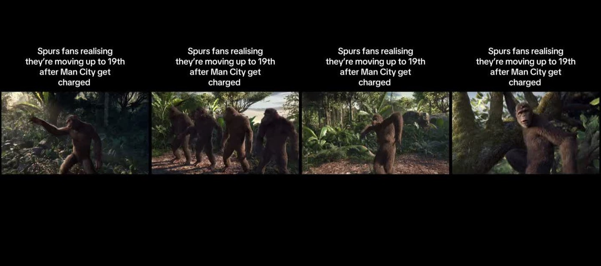
- **Hook:** TikTok-native white centred text, "Spurs fans realising they're moving up to 19th after Man City get charged", + dancing apes, letterboxed 16:9 on black.
- **Sound:** ELO "I'm Alive". **Caption:** hashtags only (#115 #manchestercity #premierleague #relegation #spurs).
- **Steal this:** it's the same premise and the same clip as IG-02, posted the same day by a 441-follower account. TikTok rewards the premise, not the account.

### TT-02 @hellosky (719K) · ~20 Sep · 1.3M (35×) · 6.6 s
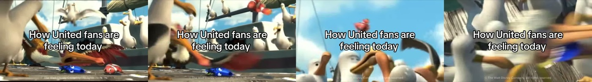
- **Hook:** "How United fans are feeling today" in native text over Finding Nemo's seagulls mobbing, full 16:9.
- **Sound:** the "pecked by the seagulls" chant remix. **Caption:** "Pecked by the Seagulls".
- **Steal this:** when a club's nickname has a famous cartoon version (Seagulls, Bees, Wolves, Magpies, Canaries, Foxes, Eagles), that cartoon clip IS the reel.

### TT-03 @croatball (48K) · 20 Sep · 1.6M (152×) · 7.8 s
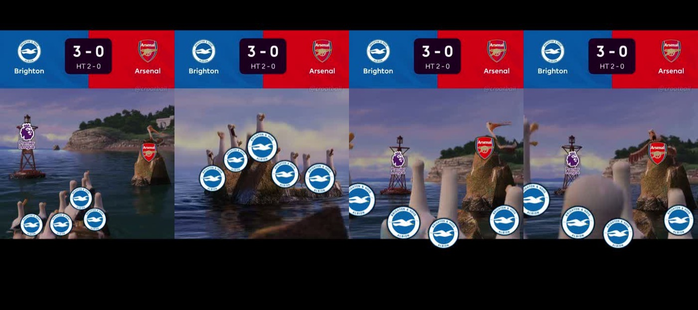
- **Hook:** broadcast-style score bar "Brighton 3-0 Arsenal, HT 2-0", then the Nemo seagulls with Brighton crests on every gull, an Arsenal crest on the pelican, and a Premier League logo on the buoy.
- **Sound:** "Mine! Mine!" from the film.
- **Steal this:** score bar + crests on every character + the film's own sound, with no plate line at all. It works because the vessel carries the club name. The exception that proves IG rule 7: a no-line reel only works when the vessel already names the club.

### TT-04 @thfcron_ (19K) · 25 Sep · 875K (21×) · 17.7 s
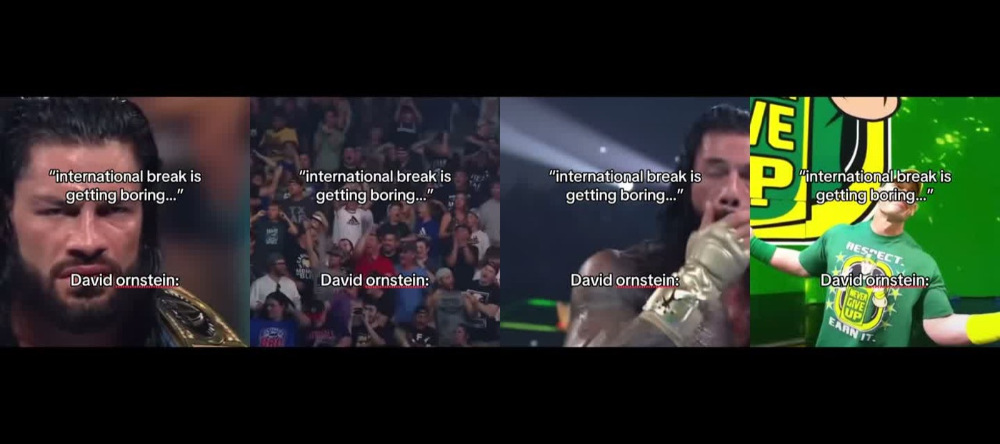
- **Hook:** "'international break is getting boring…'" / "David ornstein:" over Roman Reigns glaring, which builds to the arena erupting and a John Cena entrance.
- **Sound:** entrance music + a crowd pop ("What? No way!").
- **Steal this:** "[Boring situation]… / [Journalist/ref/player]:" + a WWE surprise entrance. The format works for any bombshell.

### TT-05 @iduate (158K) · 25 Sep · 2.1M (552×) · 7.7 s · face skit
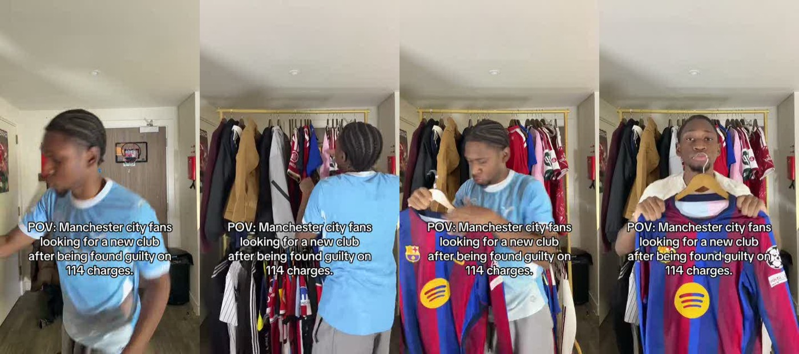
- **Hook:** "POV: Manchester city fans looking for a new club after being found guilty on 114 charges." A City-shirted guy rifles a kit rail and ends holding a Barça shirt to his chest.
- **Sound:** J. Cole "No Role Modelz". **Gap:** needs a face and a kit rail. An idea for Alex, not for us.

### TT-06 @lifetokhq (14.5K) · 25 Sep · 1.7M (24×) · 7.4 s · found-footage
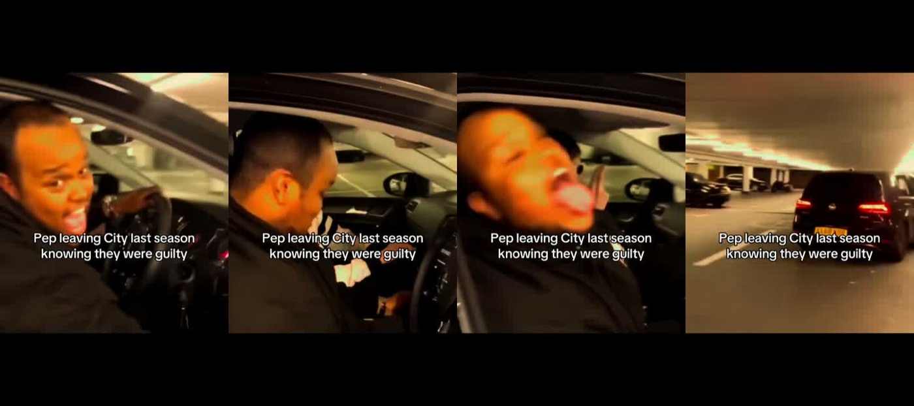
- **Hook:** "Pep leaving City last season knowing they were guilty" over a guy laughing maniacally in a car, then the car speeding out of a car park.
- **Visual:** getaway energy (laughing + escaping), and it's found footage, not a skit by the poster. **Steal this:** "[Person] leaving [club] knowing [scandal]" + any getaway clip. Contrast with OUR Pep reel (OURS-04): same premise, 2 days late, 17 s, blurred fill → 1.1K.

### TT-07 @kameliusdinglebottom2 (475) · ~19 Sep · 1.3M (1,335×) · 6.5 s
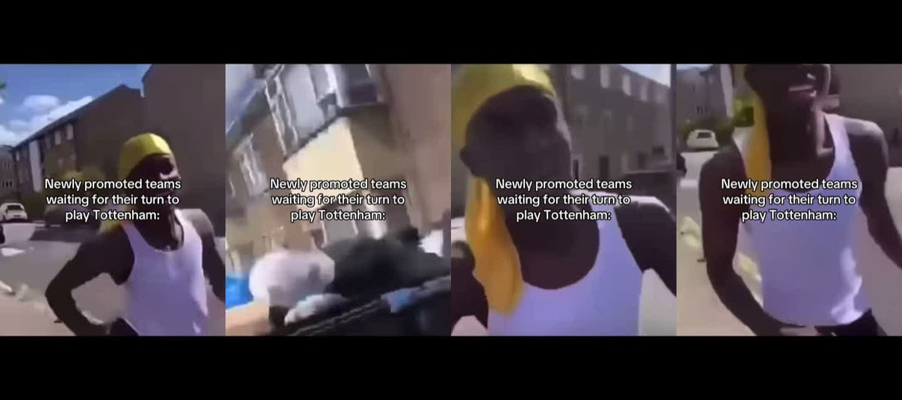
- **Hook:** "Newly promoted teams waiting for their turn to play Tottenham:" over a street clip: "Shh, shh, calm down… you're gonna get some."
- **Steal this:** "[Weak teams] waiting for their turn to play [struggling giant]:" + a clip of someone impatient/cocky. The colon format is the standard TikTok template.

### TT-08 @firastalksfootball (54K) · 25 Sep · 1.2M (48×) · 15 s · face skit
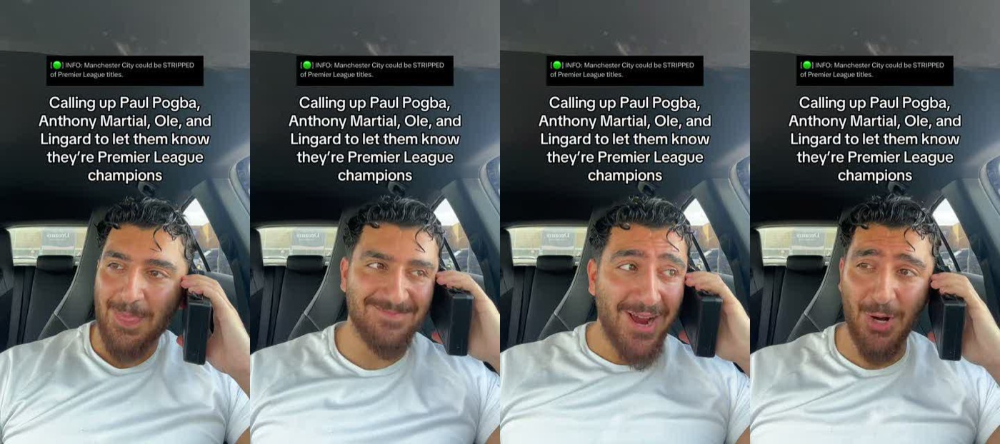
- **Hook:** a small news tweet ("INFO: Manchester City could be STRIPPED of PL titles") + "Calling up Paul Pogba, Anthony Martial, Ole, and Lingard to let them know they're Premier League champions" + a guy on a brick phone.
- **Gap:** face skit. **Steal the plate:** naming the most unlikely beneficiaries (Lingard, Ole) is funnier than naming the club.

---

## YT SHORTS — references (thumbnails only)

### YT-01 The Bonkus Donkus (456 subs) · Fri 25 Sep 17:08 · 192K (102×) · 15 s
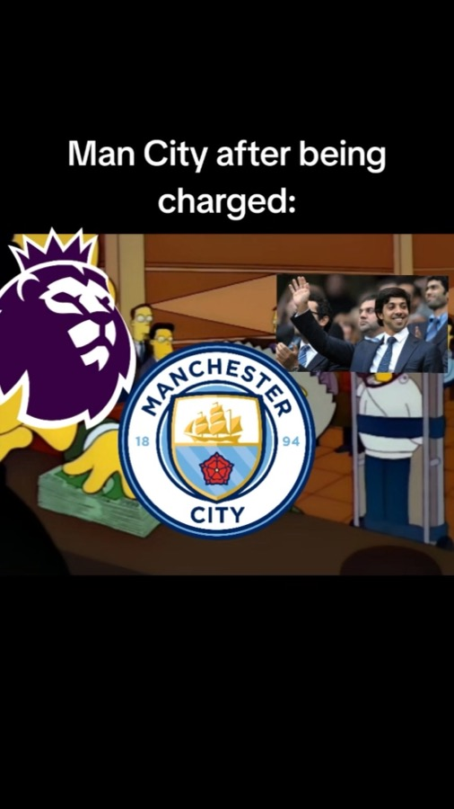
- **Hook:** bold white "Man City after being charged:" on black + a Simpsons courtroom/crowd scene with a PL lion and a City crest. **Title:** "Man City Fans Seeing the 115 Charges News 💀😂". **Timing:** ≈1 h after the story. **Steal this:** cartoon + crests + a "[Club] after [news]:" title, posted within the first 1–2 hours.

### YT-02 United Road (16K) · 25 Sep 17:58 · 257K (7.7×) · 19 s
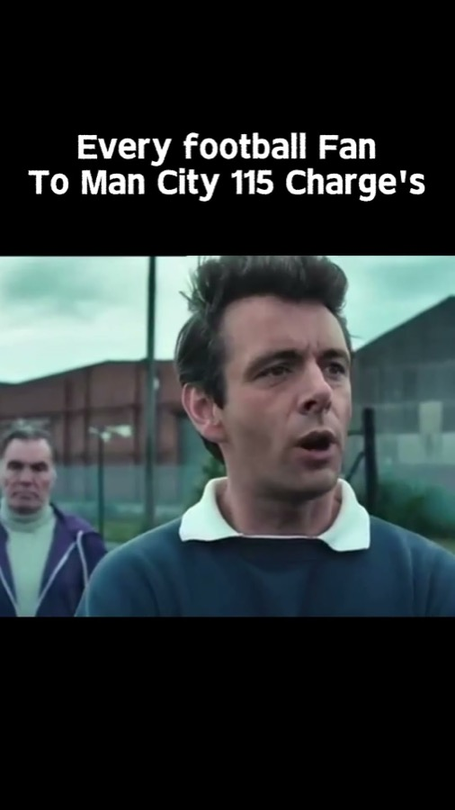
- **Hook:** "Every football Fan To Man City 115 Charge's" over Michael Sheen (as Brian Clough in The Damned United) mid-rant. **Steal this:** a football film is a football meme vessel with built-in credibility, and the typo didn't matter.

### YT-03 United Road · 25 Sep 17:46 · 181K (5.4×) · 10 s
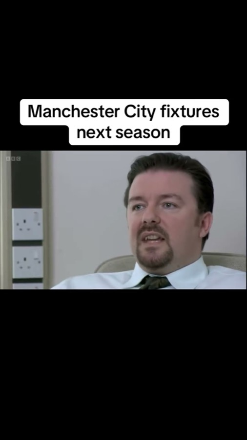
- **Hook:** a white-box label "Manchester City fixtures next season" over David Brent (The Office), presumably reading out lower-league opponents. **Steal this:** the absurd future as a British sitcom reading a list. Same channel posted 2 City Shorts 12 min apart, and both hit.

### YT-04 Mowler (8.2K) · 25 Sep 18:03 · 31K (8×) · 10 s · THE COPY
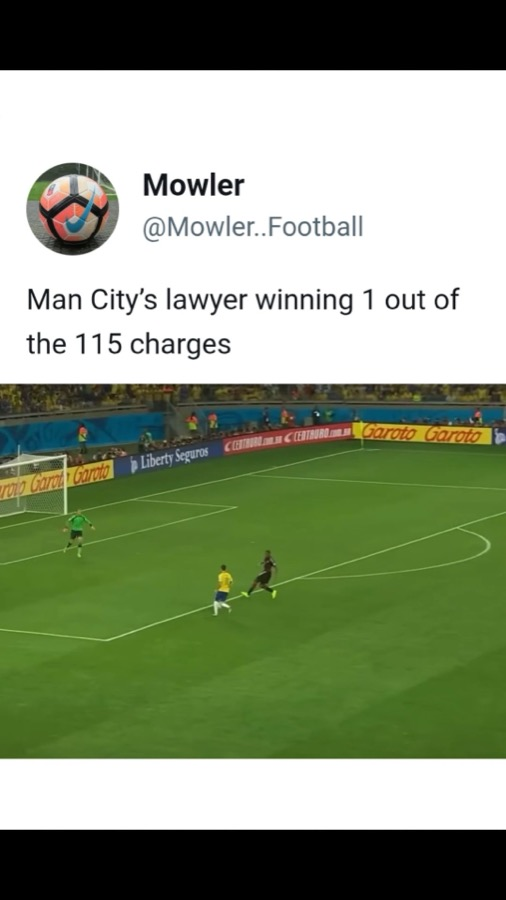
- The identical tweet plate + Oscar clip as IG-01, reposted. 31K against the original's 2.64M, and ours on YT got 31 views. **Steal this (inverse):** copying a joke that's already out gets ~1% of the original's reach.

### YT-05 FootyFlicks (17K) · Sun 27 Sep 11:08 · 375K (11.6×, 13.5K views/h) · 18 s
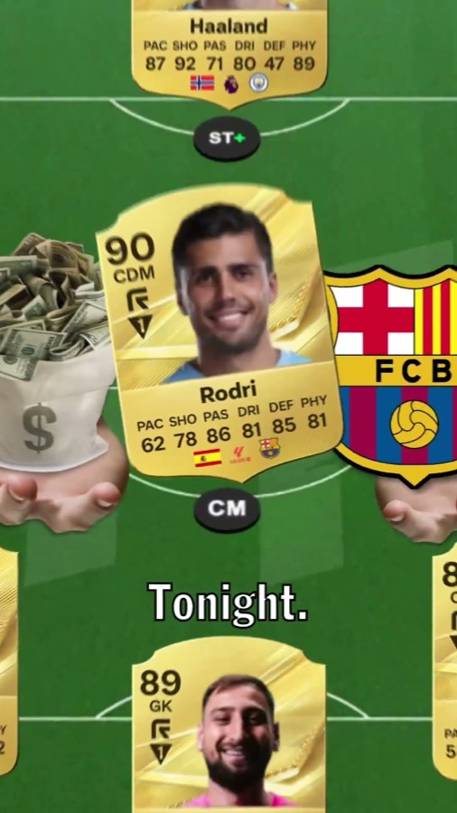
- **Hook:** an animated FC-card squad (Haaland, Rodri with a money bag, a Barça crest), "Tonight." **Title:** "Man City 114/115... Did Everyone Know Except Haaland?! 😭💀". **Steal this:** by day 3 only a new FORMAT (game-UI animation) and a question title still broke out.

### YT-06 byAvais (1.35K) · Sat 26 Sep 16:55 · 56K (79×) · 12 s
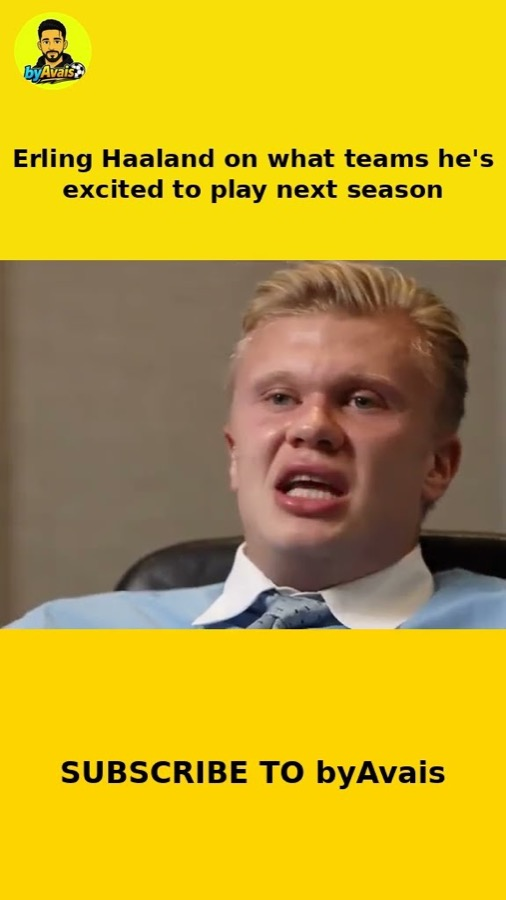
- **Hook:** a yellow template: "Erling Haaland on what teams he's excited to play next season" over a Haaland lookalike/actor pulling a face, with "SUBSCRIBE TO byAvais" in the bottom band. **Steal this:** a fixed branded frame (colour + subscribe line) on every Short = recognisable series, with the player's name in the plate.

---

## FB REELS — our own hits vs our own flops (Metricool, 09-18→09-28)

### FB-01 OURS · 18/19 Sep (night before the match) · 78,577 views, 722 likes · 21 s
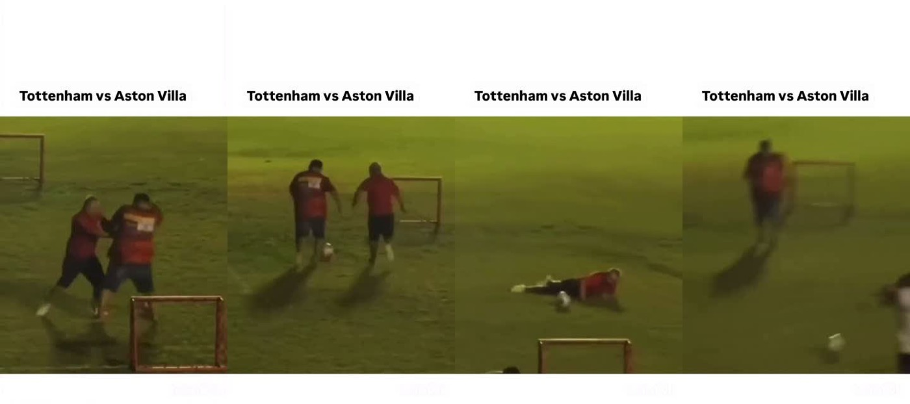
- **Hook:** bold "Tottenham vs Aston Villa" (3 words) over two heavy blokes in a floodlit kickabout, colliding and collapsing.
- **Why it worked:** universal slapstick that needs no football knowledge, so FB can show it to anyone. The 3-word plate leaves the audience to write the joke themselves.
- **Steal this:** "[Fixture]" + a slapstick amateur clip on the eve of a match between two bad teams.

### FB-02 OURS · 20 Sep · 44,522 views, 233 likes · 11 s
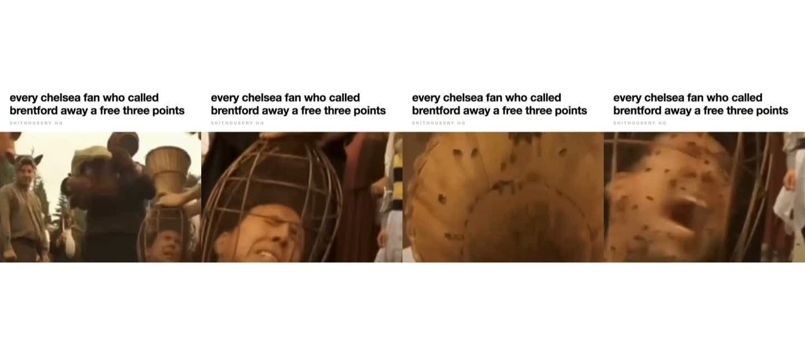
- **Hook:** "every chelsea fan who called brentford away a free three points" over Nicolas Cage in the bee helmet (The Wicker Man).
- **Sound:** "Not the bees! NOT THE BEES! AHHH!", the audio punchline. Bees = Brentford.
- **Steal this:** the literal nickname vessel + its own famous audio.

### FB-03 OURS · 25 Sep ~16:27 (≈30 min after the story) · 42,282 views, 499 likes · 8 s
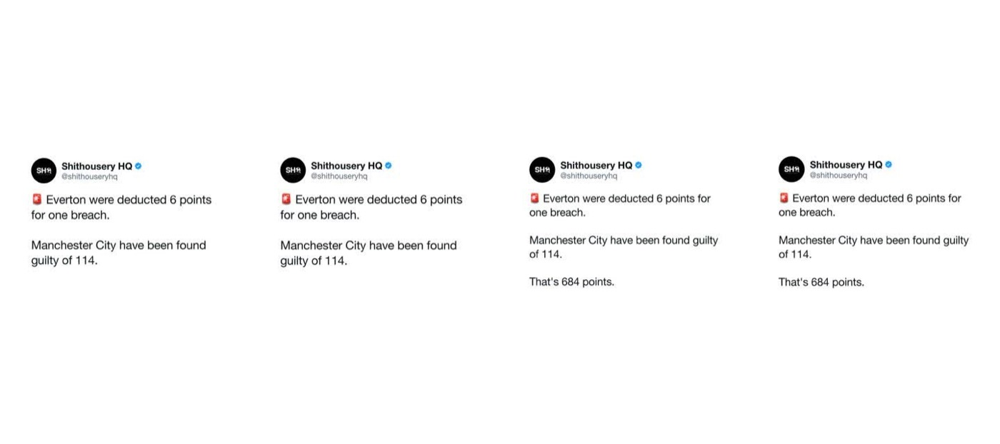
- **Hook:** our own tweet card, "🚨 Everton were deducted 6 points for one breach. Manchester City have been found guilty of 114.", which then reveals "That's 684 points." as a second beat.
- **Why it worked:** first out + a maths receipt + a two-beat reveal (it moves).
- **Steal this:** our maths format works as video IF it's out within the hour and reveals in beats.

### FB-04 OURS · 26 Sep · 42,153 views, 317 likes · 12 s
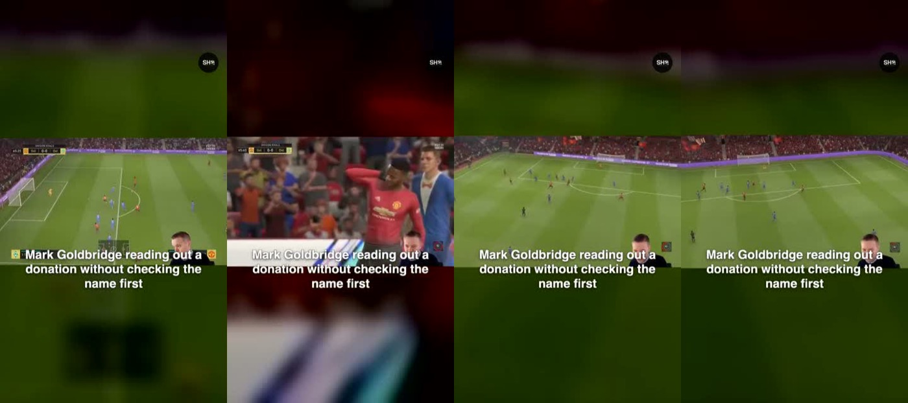
- **Hook:** "Mark Goldbridge reading out a donation without checking the name first" (lower-middle, over a blurred fill).
- **Sound:** "…That was from Icewallowcom." An audio-only punchline.
- **Steal this:** Goldbridge audio mishaps are FB gold; the plate must set up the audio without spoiling it.

### FB-05 OURS · FLOP · 22 Sep · 26 views · 8 s
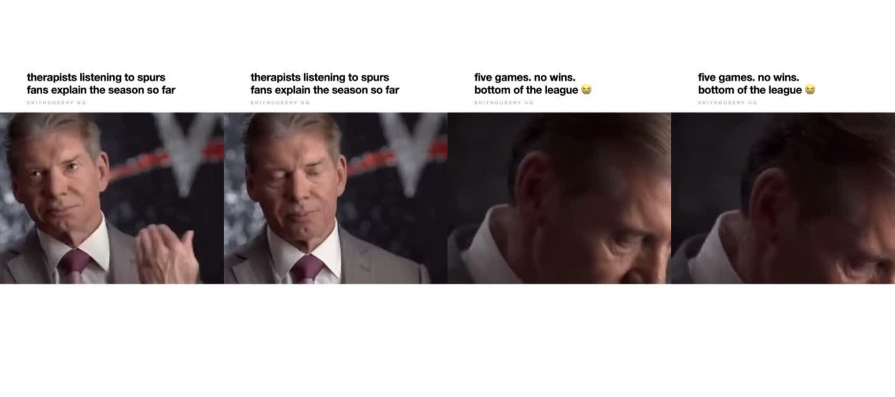
- **Why it died:** the plate CHANGES mid-reel ("therapists listening to spurs fans…" → "five games. no wins. bottom of the league"), which spells out and restates the stat. The McMahon reaction is a generic mood, and nothing in it is a therapist.

### FB-06 OURS · FLOP · 19 Sep · 34 views · 16 s
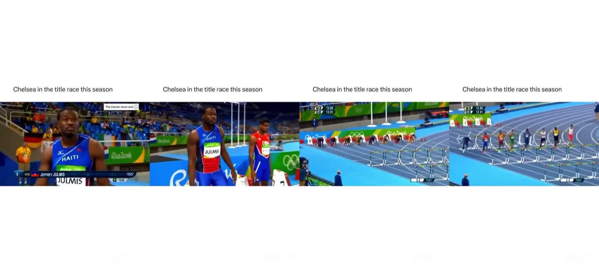
- **Why it died:** the plate says "stung by the bees" and the clip is a hurdler falling at Rio 2016. Line and vessel don't match. The next day, the same story with the literal bees did 44,522 (FB-02).

### FB-07 OURS · FLOP · 23 Sep · 27 views · 4.6 s
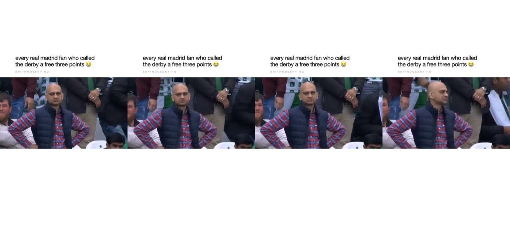
- **Why it died:** the same phrasing as FB-02, but the clip is the near-static "disappointed fan" meme (hands on hips, no motion, no audio joke), and Real Madrid is a smaller English-FB audience.

---

## OURS on IG — reels (Graph API: views · shares · avg watch)

### OURS-01 IG · 25 Sep 17:00 · 6,153 views · 472 shares · avg watch 6.3 s of 36 s
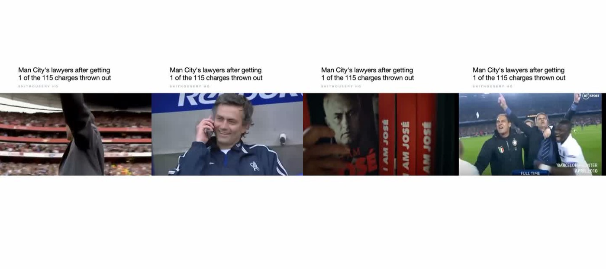
- **Plate:** "Man City's lawyers after getting 1 of the 115 charges thrown out" (white-plate template, faint SHITHOUSERY HQ subline) over a Mourinho montage (arms up at Arsenal, phone call, "I Am José" books, the Barcelona 2010 celebration).
- **Why it died:** 36 s for a one-beat joke (viewers left at 6 s). Mourinho is a football face with his own meaning, which confuses. It went out after the same lawyer premise was already viral. BUT a 7.7% share rate, our best ever on a reel, so the premise was right and the execution wasn't.

### OURS-02 IG · 25 Sep 16:58 · 2,446 views · avg watch 5.7 s
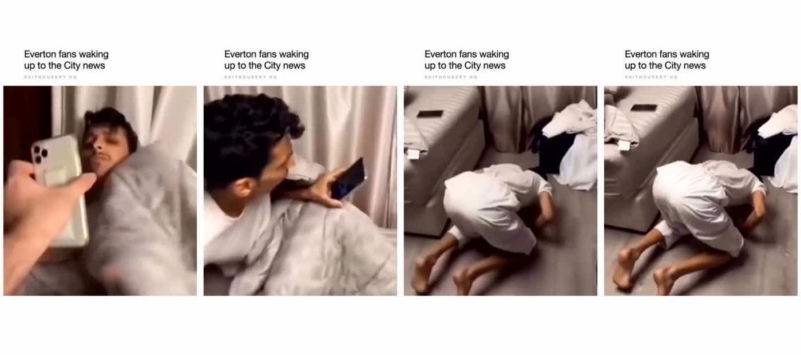
- **Plate:** "Everton fans waking up to the City news" over a man woken with a phone who drops to the floor. **Why it died:** the plate describes and names no consequence ("…to the City news"). The clip shrinks to a portrait strip. Compare "Tottenham fans when they move up to 19th…" (1.13M).

### OURS-03 IG · 25 Sep 17:09 · 1,693 views · 57 shares
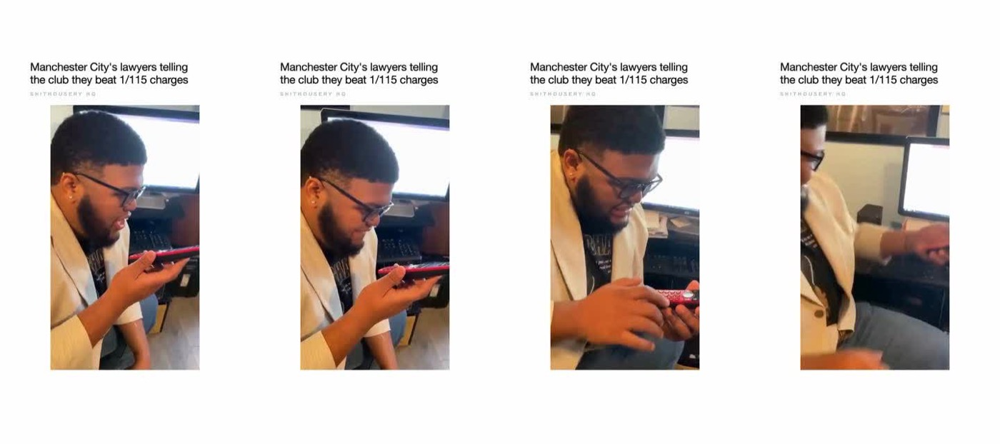
- **Plate:** "Manchester City's lawyers telling the club they beat 1/115 charges" + a man on the phone: "Good news, we got your payment. Bad news…". **Why it died:** our 3rd lawyer angle in 10 minutes (cannibalised OURS-01), a narrow portrait clip centred in white, and "FEASTING" as the caption.

### OURS-04 IG · 27 Sep 22:09 · 1,122 views · 22 shares · 17 s
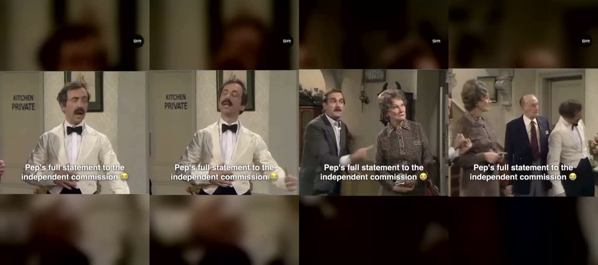
- **Plate:** "Pep's full statement to the independent commission 😭" over Manuel (Fawlty Towers): "I know nothing… I am from Barcelona."
- **Why it died:** the joke is actually strong (the audio lands "I am from Barcelona"), but it went out 2 days after the story, at 17 s, with a blurred-background fill, the clip at ~35% of the frame and the text on the clip. Put the same audio in template A on day 1 and it's a candidate for 100K+.

### OURS-05 IG · 27 Sep 22:50 · 1,541 views · 0 shares · 18 s
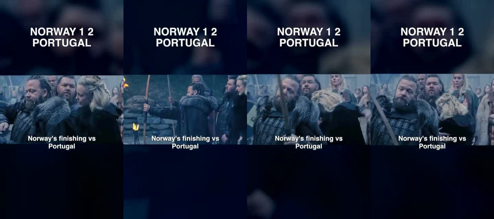
- **Plate:** "NORWAY 1 2 PORTUGAL" (a big title card) + "Norway's finishing vs Portugal" over Norsemen archers. **Why it died:** two text blocks, blurred fill, and a "| Highlights" label that means nothing on IG. The Norsemen joke is niche for an English audience. 0 shares.

---

## OURS on IG — carousels (slides pulled via Graph API)

### CAR-01 · 24 Sep post-match · 83,527 views · 1,621 shares · 8 follows
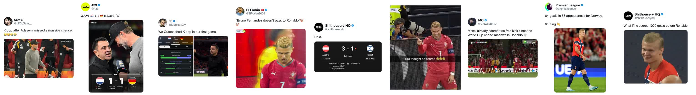
Slide 1 is Klopp's face-palm ("Klopp after Adeyemi missed a massive chance 😂😂"), then the 433 Xavi-Klopp face-off 1-1. Manager rivalry, big faces, posted ~20 min after FT. **Steal:** face + rivalry on slide 1.

### CAR-02 · 25 Sep · 24,369 views · 596 shares · **12 follows (0.49/1k, our best)**
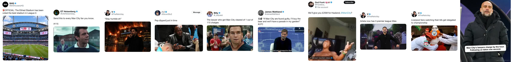
Slide 1 is OUR OWN fake-official "🚨OFFICIAL: The Etihad Stadium has been voted the best stadium in League 2". The frame mocks Arsenal fans (Arteta's "3 titles"). The last slide is the CTA "Man City's lawyers charge by the hour. Following us takes one second." **Steal:** an own absurd-official slide first + a fanbase-mock frame + a joke CTA. A/B it.

### CAR-03 · 26 Sep (City day 2) · 4,112 views · 0 follows
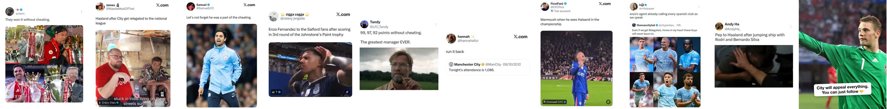
Slide 1 is a small collage "They won it without cheating" with tiny text. Day 2. **Why it died:** a weak slide 1 on a stale story.

### CAR-04 · 28 Sep (City day 4) · 2,357 views · 0 shares
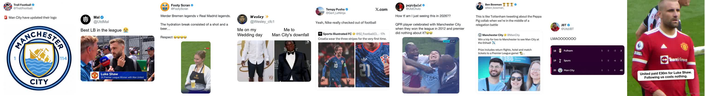
Opens on Troll Football's sinking-ship City logo (borrowed, already seen), then drifts to Werder Bremen, Croatia's kit and Nike. **Why it died:** day 4 + mixed topics + a borrowed opener.

---

## NOT OUR LANE (for contrast): news, footage and recap posts whose views come from being the SOURCE, not from a joke
We are a humour account (shithousery, satire, sarcasm, mocking fanbases, ragebait, absurd maths/receipts). These posts are here only so a reviewer can see the difference. Don't copy their format.

### NL-1 (was IG-16) @hesaballer (193K) · 27 Sep · 797K · reel 13 s
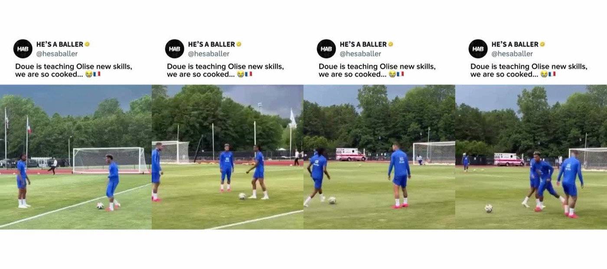
- **Hook:** their OWN branded tweet header ("HE'S A BALLER @hesaballer: Doue is teaching Olise new skills, we are so cooked… 😭🇫🇷") over France training footage.
- **Visual/clip choice:** real skill footage (a nutmeg in training). Fans share it for the football.
- **Steal this:** use our own account as the "tweet" header (brands the reel, counts as original text); for skill clips, the plate is the fan reaction ("we are so cooked").

### NL-2 (was YT-07) Chadwick TV (2.8K) · 25 Sep 22:00 · 50K (35×) · 69 s
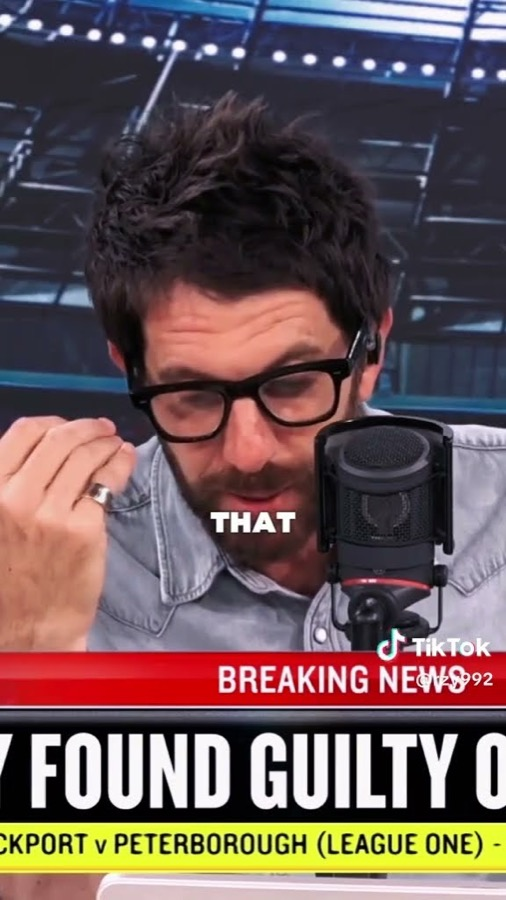
- A talkSPORT caller clip with a "BREAKING NEWS: …FOUND GUILTY" lower third. **Steal this:** on YouTube, radio/pundit/fan-reaction clips (our "match reactions" lane) break out at 69 s, as long as the title promises conflict ("DELUDED… STUNNED").

### NL-3 (was CAR-05/06) · 25 Sep · 40,018 views · 1 follow · CAR-06 Tekkers/Ronaldo · 52,206 views · 2 follows · 55 shares
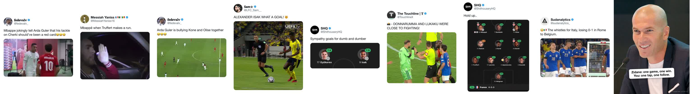
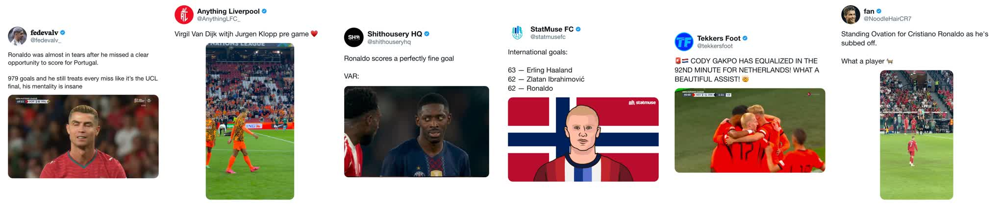
International-results recaps. **Why they convert nothing:** no fanbase mocked, no rivalry, so nobody shares or follows. Views ≠ scoreboard.

- **The lesson from all three:** footage and news bring views when you ARE the source (a club, a journalist, a broadcaster's clip). For us they bring views with ~0 follows or shares (NL-3: 40–52K views, 1–2 follows). If a post has no joke, it isn't ours.

## GAPS / what this library does NOT yet cover
- **FB references from other Pages:** none pulled (no FB outlier tool; Chrome was off-limits). The FB section is our own Page only. Next: ODDSbible/Football Planet FB reels via Bright Data.
- **YT Shorts frames:** thumbnails only (yt-dlp is bot-blocked); sounds unknown.
- **@midnitefootball top reel** (DdyoPr-IoM4, 790K): download failed.
- **IG carousels from reference accounts** (oddsbible 70.7K likes, ftblmemeshub 29.7K likes): no slide download path without login.
- **Face skits** (4/8 TikTok outliers, e.g. TT-05/08) are a lane we can't run without a face; flag to Alex.
