# Banger library: X + Threads (studied 28 Sep 2026)

**What this is:** 25 humour/banter bangers from X, 5 of our own best X posts and 5 of our X flops, 10 Threads posts (9 ours, 1 external) and 3 Threads flops. Every entry has a real screenshot next to it, and I looked at each one. We are a humour account, so news and journalist posts only appear at the bottom, in NOT OUR LANE.

**How it was built:**
- Screenshots come from X's and Threads' own embed renderer (`platform.twitter.com/embed/Tweet.html?id=…`, `threads.com/…/embed`), captured headless. They are 900px and live in `x/` and `threads/`.
- Likes and views were read from the logged-in X session. Our own Threads numbers come from the Threads Graph API (read-only GET).
- X numbers were read about 10:00–13:00 Oslo on 28 Sep. Times are Oslo.
- Videos show only their poster frame. For those, I describe the clip from the frame plus the caption.

**The week's big stories** (the rest of the file assumes you know these):
- **Man City found guilty on "virtually all" charges.** Ornstein broke it about 15:41 on Thu 25 Sep; @TheHateCentral2's quote of him went out at 15:53.
- **Spain beat England 3-2 at Wembley** (Fri 26 Sep).
- **Portugal beat Norway 2-1** (Sat 27 Sep). Ronaldo stayed on the bench for all 90 minutes.

---

## THE CRAFT (what I saw when I looked at the posts)

A reviewer can check each rule against a draft. The numbers in brackets are the entries that show it.

1. **Cover the caption: the picture must still be about the story.**
   - Every big post passes this: Oyarzabal's 84 card next to his 99 card (01), the sinking-ship City crest (04), Agüero's shirt off (05), Endrick holding a printer (17), Mourinho's smug face (40), de Zerbi beside Spurs in 20th (41).
   - Our text-only flops fail it by definition: 50, 51, T20, T21. They got 0 to 30 likes.
2. **The face in the image must be mid-reaction, and that reaction is the punchline.**
   - Examples: Mourinho's pursed "told you so" (40), Suárez whistling innocently at the gala (21), the thousand-yard stare (20), the crying man (23), Haaland's pout (18), Dias covering his mouth (44).
   - A neutral portrait is dead on arrival. Compare 54 ("first time?" on a calm headshot, 40 likes) with 13 (Ferran "pinching the moon", 31.7K) in the same half of the same match.
3. **Two panels that contradict each other beat one panel.** The joke lives in the gap between them. Examples:
   - club card v country card (01)
   - Real Madrid's HP sleeve, then Mourinho's printouts, then an HP printer (02)
   - Ronaldo v Homelander (09)
   - England's celebration v the opponent's celebration, with a wojak for each (12)
   - Gordon outside Barça's huddle, then outside Spain's (16)
   - Sky's caption for Foden ("6-Time PL Winner") v Saka ("Player for Arsenal") (T02)
4. **The line labels the frame. It is 2–10 words and never explains.**
   - Examples: "He thought he won the league" (05, 50.3K), "Man City have updated their logo" (04), "Nueva posicion de Endrick" (17, 84K), "Bro is a reverse Raphinha" (01), "Double standards..." (12).
   - Across the 25 external bangers the line is usually 4–12 words. The picture delivers the punchline, so the line only has to name the premise.
5. **It must work for someone who only saw the headline.** Readers need to know "City got done" or "Endrick is benched", nothing more.
   - Our flop 53 ("two contracts. zero concerns") needed the Mancini double-contract detail, so it died at 11 likes.
   - 21 needs only "City lose their trophies" and did 73.8K.
6. **On a mega-story, pick a secondary fanbase, not City.** The City verdict produced at least 12 bangers in 24 hours, and almost none of them mock City directly. Each asks "who else does this make look silly?":
   - Arsenal and Arteta (03, 23)
   - Chelsea's cup finals (22, 26)
   - Agüero's 93:20 (05)
   - Marmoush facing the Championship (20)
   - Rodri escaping (07)
   - Barça's Negreira case (T10)
   - Everton's 6 points (40)
   Before drafting, list five fanbases the story touches and write for the one nobody has used yet.
7. **Timing has two windows. We keep missing both.**
   - (a) **Match moments:** post at the moment or at full time. Ferran went out at half-time (13), the Nyland stat sheet about 10 minutes after full time (25), "reverse Raphinha" just after full time (01).
   - (b) **Mega-stories:** there's a first hour (27 at +12 min, our 684 at +51 min, 23 at +1h, 21 at +1.5h), and then a second wave the next morning that only works with a NEW angle (20 at +21h, 88.7K, the relegation angle).
   - Our 44 went out 14 hours after full time with no new angle: 21 likes and 518 views after 38 minutes.
8. **Absurd-but-true maths: real numbers taken to their literal end, stated deadpan, ending on the number.** 40 (684 points), 41 (101 points), T01, T08 and 42 all do this.
   - It needs an image that proves or reacts to the maths: the table in 41, Mourinho in 40.
   - When the maths went out without its own image (42, a thread reply), it did 2K likes against 77.7K for the post above it.
9. **A callback has to be recognised in one second by a casual fan.** Examples: Mourinho's printouts (02, 17), Agüero's title-winning celebration (05), Pogba's "10x" (24), Ramos and VAR (T03).
   - Ours with Norsemen (52) needs a Norwegian TV show that most X users have never seen: 5 likes.
10. **Fake-official and absurd claims are delivered in total confidence, with no wink.**
    - Examples: a crest reading "1 … 114" with a sinking ship (04), "WE WON THE CARABO CUP AND FA CUP" in caps (26), "Throwback to when Mohamed Salah beat up an Everton fan…" (19, 51.7K).
    - The claim is false but the logic is right, which is Alex's "so dumb but still so correct".
11. **Stat-sheet roast: "[Player] vs [Team]:", three or four stat lines, then a one-word verdict, posted at full time.**
    - 25: "Ørjan Nyland vs Norway: 0 Saves / 0 High Claims / 1 Key Pass / 1 Assist / MOTM." The keeper played for Norway, so his assist went to Portugal.
    - Also 10 (England ratings as a line graph under "Players of the best league in the world").
    - This was OUR story (Norway), and Hater Central did it, not us.
12. **Leave an argument open for the replies.** The high-reply posts all leave a claim to dispute:
    - T07: a question plus a comparison card, 351 replies on 295K views.
    - T08: a receipt list, 200 replies.
    - 10: a ratings graphic, 160 replies.
    - 12: double standards, 327 replies.
    In our research notes a reply is weighted 10× a like (5 v 0.5, x_viral_formula §2). An open claim beats a closed joke.

## INSTANT FAILS (each one comes from our own flops)

- **Text-only on a match night or during a live story.** 51 "Haaland and Man City's lawyers…" got 30 likes. T20 "Norway fans after Haaland equalised…" got 257 views. T21 "Rate him out of 10" got 355 views. The joke in 51 is good; it had no picture to travel on.
- **A question with nothing to look at.** 50 "Name a worse double." got 9 likes and 498 views. A question needs a card or photo that starts the argument (T07 has one).
- **A neutral or stock photo that doesn't show the moment.** 54 used a calm headshot for "Barcelona fans: first time?" and got 40 likes. 43 got 781K views but only 1.6K likes: the photo stopped the scroll but there was no joke in the face.
- **Late match content with no new angle.** 44 went out 14 hours after full time (21 likes and 518 views at +38 min).
- **The joke needs a second detail to decode.** 53 (the Mancini double contract), 52 (Norsemen).
- **News restated with an emoji.** T22 "WILD STAT 🤯" got 513 views and 9 likes. It also printed "Sept. 27, 2016 — Norway vs. Portugal" where it meant 2026. A factual error is an automatic fail.
- **Being second.** Our 42 (the 228-matches maths) went into a thread under the 684 post and got 2K likes where the parent got 77.7K. A follow-up only works as its own post with its own image.

## FORMAT PORTFOLIO

| Format family | Best examples | When to use it (story type) | What makes it shareable |
|---|---|---|---|
| **Absurd-but-true maths** | 40 (77.7K), 41 (18.9K / 3.29M on Threads T01), T08, 42 | A number-shaped story: points, fees, charges, table positions. Once a day at most. | "So dumb but correct". People share it to say "he's not wrong". The number is quotable. |
| **Label the frame** (clever caption on one photo) | 05, 17, 07, 09, 06, 44 | Any story with ONE iconic reaction photo, or an old photo that the news makes relevant again | The picture is the joke. The line takes 1 second. Needs a face mid-emotion. |
| **Two-panel contradiction** | 01, 02, 12, 16, T02 | Club v country, then v now, us v them, broadcaster bias | People can spot the difference. Replies argue about fairness. |
| **Fanbase mockery** (reaction clip or photo, "[Fans/Player] when…") | 21, 22, 20, 03, 23, 14 | A mega-story (the second fanbase angle) or a match result | Tags the rival fanbase. Reposts come from 3 or 4 other fanbases. |
| **Fake-official / absurd claim** | 04, 26, 19 | Sanctions, rebrands, signings, "officially" anything | Deadpan confidence. Looks real for half a second. Very quotable. |
| **Receipt list** | T08, T03, 24 | Transfer fees, old quotes that aged badly, repeat behaviour | Proof-shaped. Starts a "name another one" thread. |
| **Callback** | 02, 13, 05, 24 | Any news that rhymes with a famous old moment | In-group reward. Only works if the reference is recognised in 1 second. |
| **Stat-sheet roast** | 25, 10 | Full time. Keeper errors, a striker's blank, a defender's nightmare | Looks like a data card. The verdict word is the knife. |
| **Ragebait take / verdict** | 18, 08, T07 | A contested player, the Ballon d'Or, "best league" talk | Invites "no he isn't" replies. On Threads, a question plus a card gets hundreds of replies. |
| **Lip-read caption** ("what they said") | 44 | Two players close together at full time, one hand over the mouth | Works only fresh, within 30 minutes of the photo circulating. |

---

## X: external bangers (humour lane)

Rough baselines for the "×median" figures:
- **@TrollFootball:** posts that clear 8K likes sit around 15–30K. The bangers below are about 2–4× that.
- **@UTDTrey:** hits sit around 10–20K.
- **@TheHateCentral2:** clears 10K about 15 times on a matchday.
These are estimates from the posts I collected, not full-timeline medians.

### X-01 @TrollFootball · Sat 26 Sep 22:35 · 65K likes / 606K views (≈2–3× median)
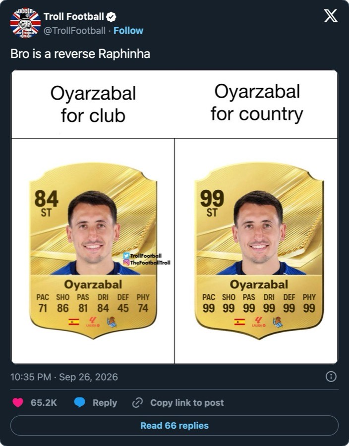
- **Line:** "Bro is a reverse Raphinha"
- **Visual:** Two identical EA FC cards of Oyarzabal: "for club" rated 84, "for country" rated 99 in every stat. Same face and pose in both, so the only thing that changes is the number.
- **Story + timing:** Oyarzabal scored again for Spain at Wembley. Posted about 10 minutes after full time.
- **Mechanism:** Ties two stories (Raphinha is famously better for club than for Brazil) and flips it with a contrast card.
- **Format:** Two-panel contradiction.
- **Steal this:** When a player overperforms for club or country, make the two-card graphic within 15 minutes of full time. Put the line on the reverse of a known player.

### X-02 @TrollFootball · Tue 23 Sep 20:19 · 77.2K likes / 2.4M views
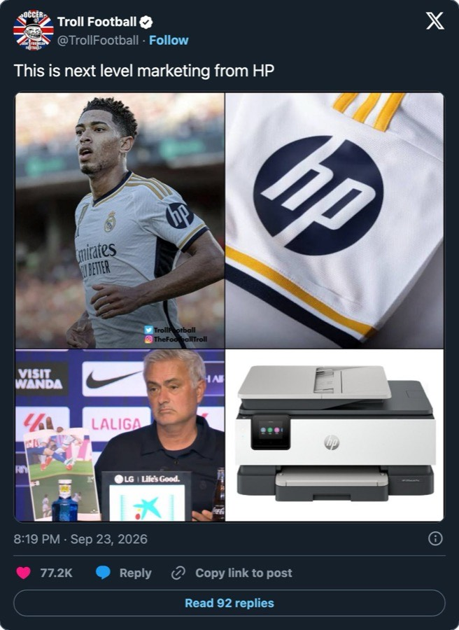
- **Line:** "This is next level marketing from HP"
- **Visual:** A 2×2 grid:
  - Bellingham in Madrid's shirt with the new HP sleeve patch
  - a close-up of the HP patch
  - Mourinho at a press conference holding colour printouts of a ref decision
  - an actual HP printer
- **Story + timing:** Mourinho brought printed photos to his press conference to argue a decision. Madrid have HP as a sleeve sponsor. Posted within a day.
- **Mechanism:** Ties two stories. The fake "marketing" reading turns Mourinho's rant into an ad.
- **Format:** Callback plus literal reading.
- **Steal this:** When a manager's rant has a PROP (printouts, a phone, a notebook), find the brand or object and make it "sponsored". The 4-panel grid reads left to right as setup, setup, victim, punchline.

### X-03 @TrollFootball · Thu 25 Sep 20:36 · 72.1K likes / 904K views (video)
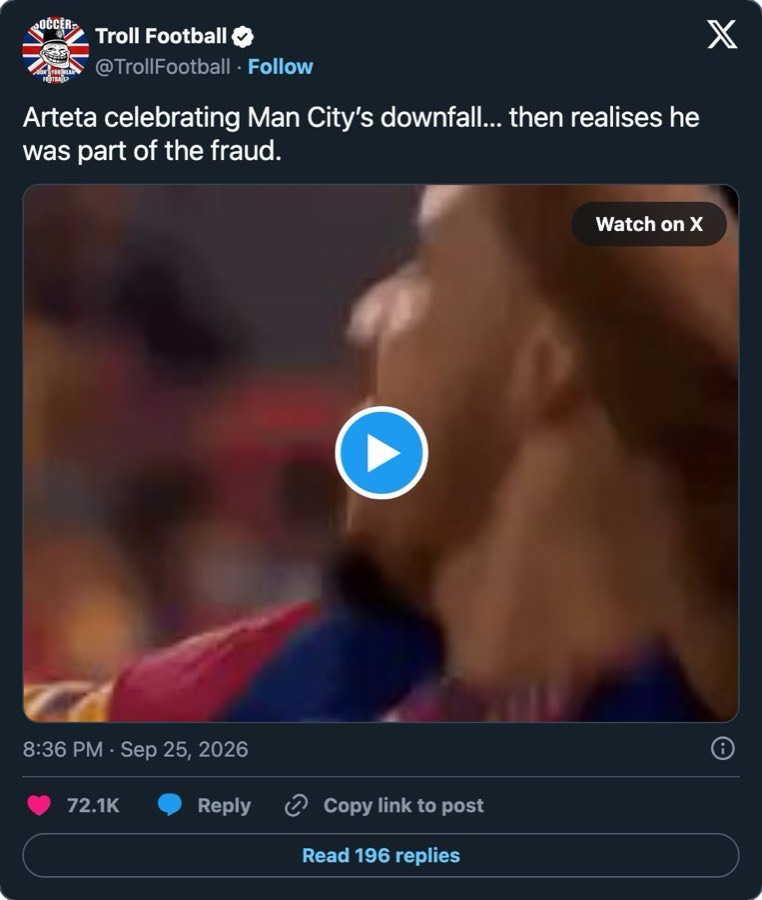
- **Line:** "Arteta celebrating Man City's downfall... then realises he was part of the fraud."
- **Visual:** A reaction clip (poster frame is a blurred face mid-celebration): someone cheering who suddenly stops.
- **Story + timing:** The City verdict, about 5 hours after it broke.
- **Mechanism:** Mocks a secondary fanbase (Arsenal). Arteta was Pep's assistant 2016–19, the years under investigation.
- **Format:** Fanbase mockery.
- **Steal this:** On a scandal, find the rival who is secretly implicated and use a "celebrate… then realise" clip.

### X-04 @TrollFootball · Fri 26 Sep 01:50 · 56.2K likes / 611K views
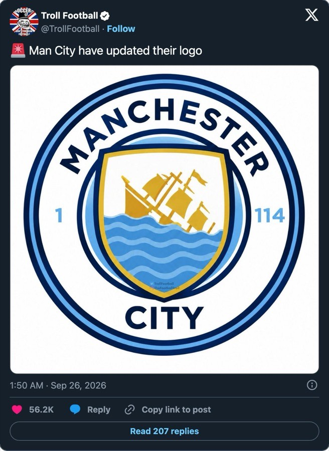
- **Line:** "🚨 Man City have updated their logo"
- **Visual:** The real City crest with two edits: the ship is now sinking into the waves, and the side numbers read "1" and "114" (the charges). It's a clean, believable redesign with no meme text.
- **Story + timing:** The City verdict, about 10 hours later, and still 56K.
- **Mechanism:** Fake-official.
- **Format:** Fake-official announcement.
- **Steal this:** A subtle edit of an official asset (crest, kit, trophy, table graphic) with a 5-word "🚨 X have updated…" line. The edit has to be small enough that it looks real for a second.

### X-05 @TrollFootball · Thu 25 Sep 18:41 · 50.3K likes / 580K views
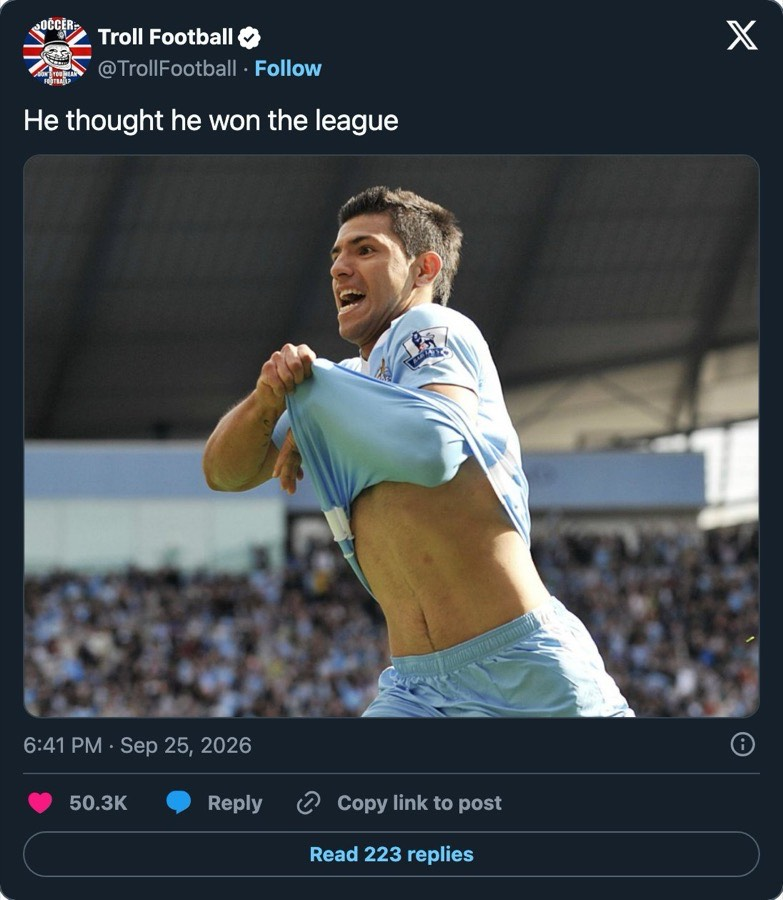
- **Line:** "He thought he won the league"
- **Visual:** Agüero, shirt off, mid-scream after the 93:20 goal in 2012. Everyone knows the frame, and the joy is maximal.
- **Story + timing:** The City verdict, about 3 hours later.
- **Mechanism:** Callback. The most joyful frame in City's history, reframed as a mistake.
- **Format:** Label the frame plus callback.
- **Steal this:** For any "titles/records under threat" story, use the club's single most iconic celebration photo and add a 5-word line that undoes it.

### X-06 @FootyHumour · Fri 26 Sep 16:11 · 39.7K likes / 1.33M views
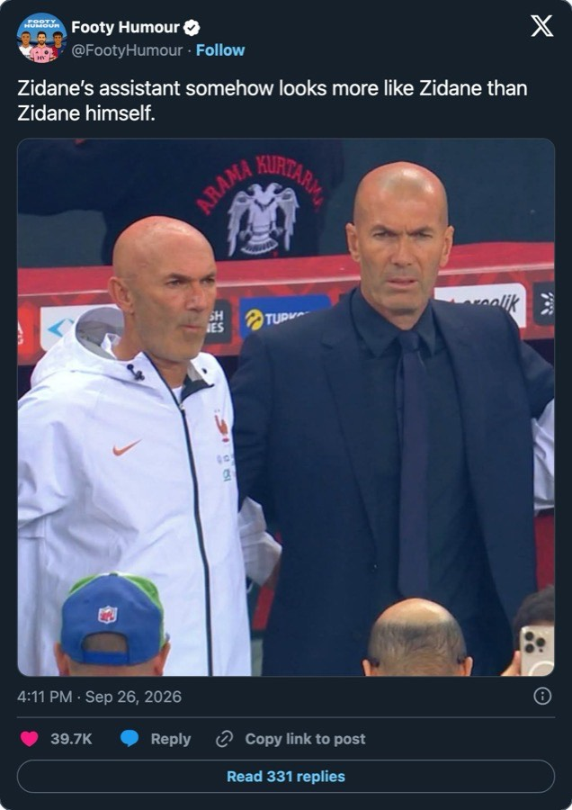
- **Line:** "Zidane's assistant somehow looks more like Zidane than Zidane himself."
- **Visual:** Zidane (France manager) and his bald assistant stand side by side at the anthems, same posture, same expression. The photo itself is the joke, and it's true.
- **Story + timing:** France away (Nations League week). It's a live broadcast screengrab, posted the same day.
- **Mechanism:** Absurd-but-true observation.
- **Format:** Label the frame.
- **Steal this:** Scan international-break broadcasts for doppelgängers, lookalikes and "two of the same" frames. The line states the observation deadpan. 1.33M views from a free screenshot.

### X-07 @TrollFootball · Fri 26 Sep 10:44 · 39.6K likes / 450K views
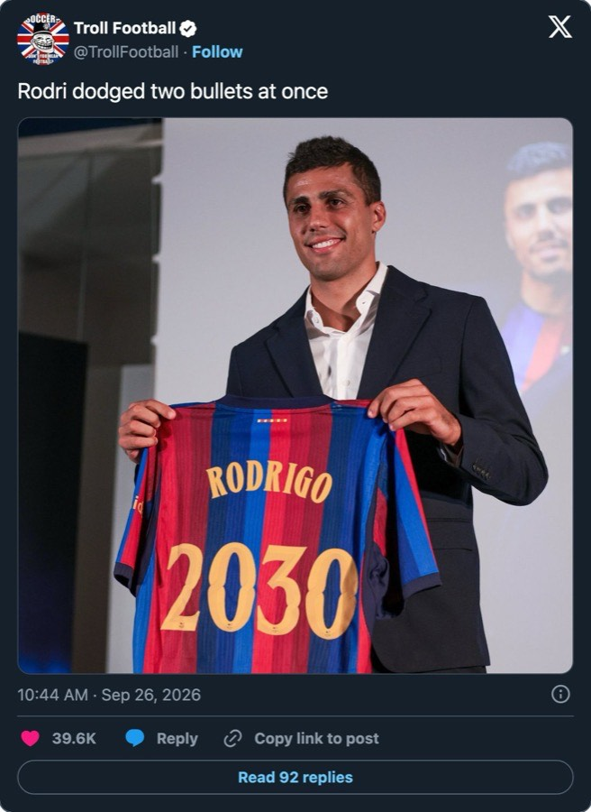
- **Line:** "Rodri dodged two bullets at once"
- **Visual:** Rodri smiling at his Barcelona presentation, holding a "RODRIGO 2030" shirt. The grin does the work.
- **Story + timing:** The morning after the City verdict.
- **Mechanism:** Ties two stories: he left City just before the verdict. I didn't pin down the second "bullet" beyond context; it reads as City plus a second escape.
- **Format:** Label the frame.
- **Steal this:** On any sinking-club story, find the player who LEFT just before, with a smiling photo at the new club.

### X-08 @TrollFootball · Wed 24 Sep 14:36 · 39K likes / 470K views
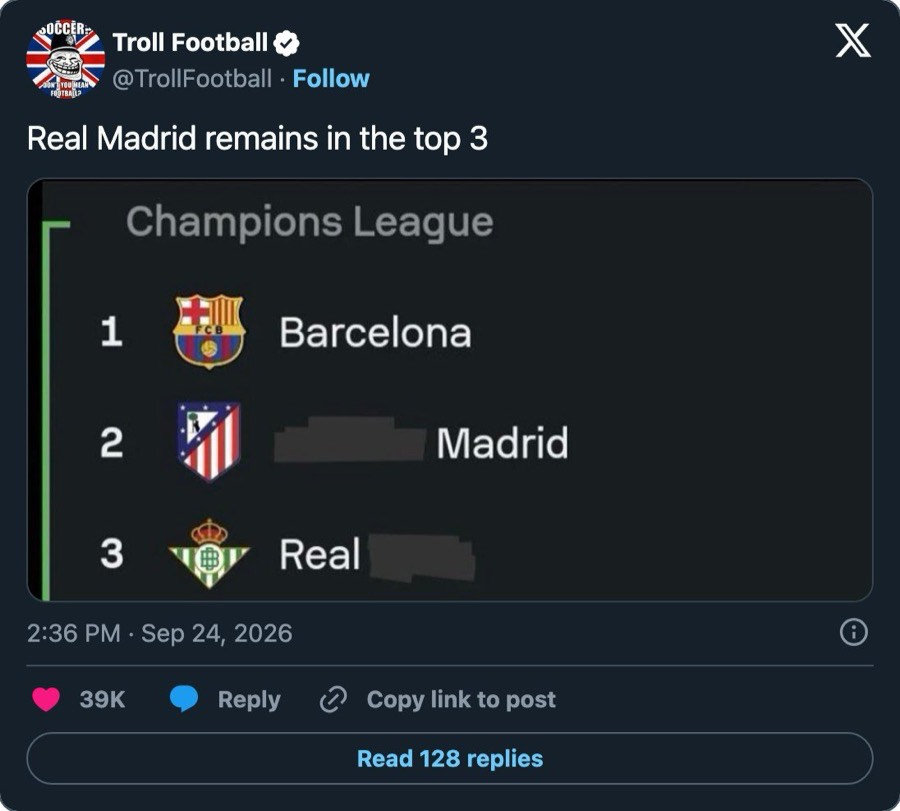
- **Line:** "Real Madrid remains in the top 3"
- **Visual:** A Champions League table: 1 Barcelona, 2 Atlético Madrid, 3 Real Betis. "Atlético" and "Betis" are blacked out, so rows 2 and 3 read "Madrid" and "Real".
- **Story + timing:** Madrid's bad start.
- **Mechanism:** Literal reading. The redaction makes a true table say something false.
- **Format:** Fake-official / absurd-but-true.
- **Steal this:** Blacking out words on a real table or graphic is a cheap, repeatable edit. Any time a club's rivals share a word with it (Madrid, United, City, Real), try it.

### X-09 @TrollFootball · Thu 25 Sep 10:34 · 37.7K likes / 371K views
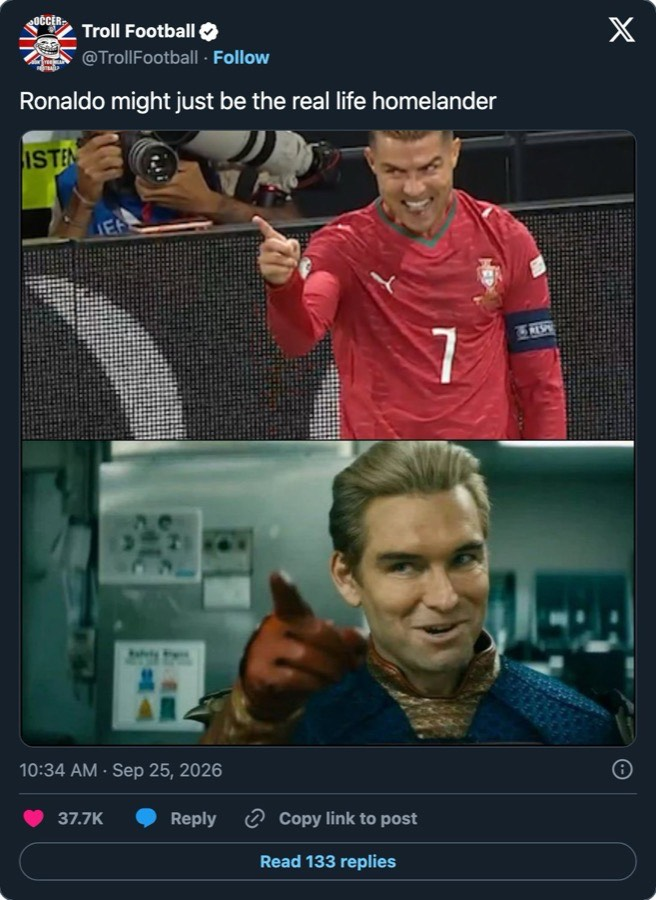
- **Line:** "Ronaldo might just be the real life homelander"
- **Visual:** Ronaldo mid-smirk pointing at the camera, above Homelander (The Boys) doing the identical smirk and point. The two poses match exactly.
- **Story + timing:** Ronaldo's celebration from the night before.
- **Mechanism:** Pop-culture pose match.
- **Format:** Two-panel contradiction/match.
- **Steal this:** Keep a folder of 20 famous TV/film reaction poses. After every match, look for a player who hit one of them.

### X-10 @TrollFootball · Sat 27 Sep 12:16 · 32.1K likes / 540K views / 160 replies
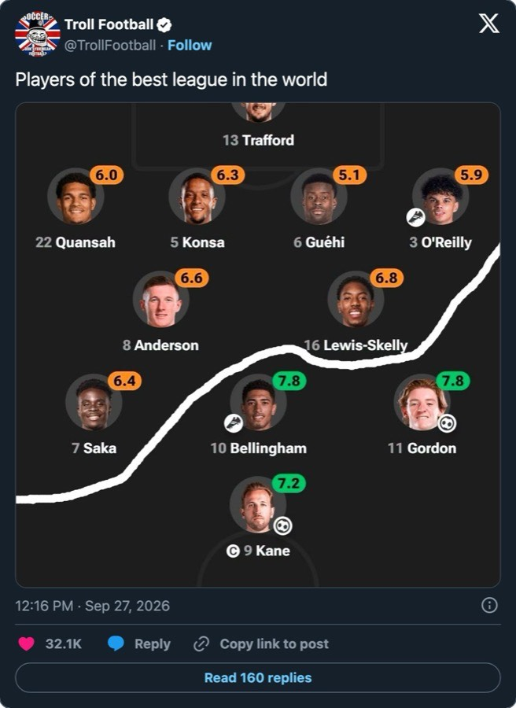
- **Line:** "Players of the best league in the world"
- **Visual:** England's FotMob ratings v Spain drawn as a pitch. A hand-drawn white line snakes up the formation: the PL players (Quansah 6.0, Guéhi 5.1, Saka 6.4) sit below it, and the non-PL players (Bellingham 7.8, Kane 7.2, Gordon 7.8) sit above it.
- **Story + timing:** The morning after Spain 3-2 England.
- **Mechanism:** Ragebait take plus data. It mocks "best league in the world" talk.
- **Format:** Stat-sheet roast.
- **Steal this:** Take a real ratings screenshot and add one hand-drawn annotation that proves the take. The annotation is the joke, and replies argue about it.

### X-12 @TrollFootball · Fri 26 Sep 23:13 · 18.5K likes / 1.28M views / 327 replies
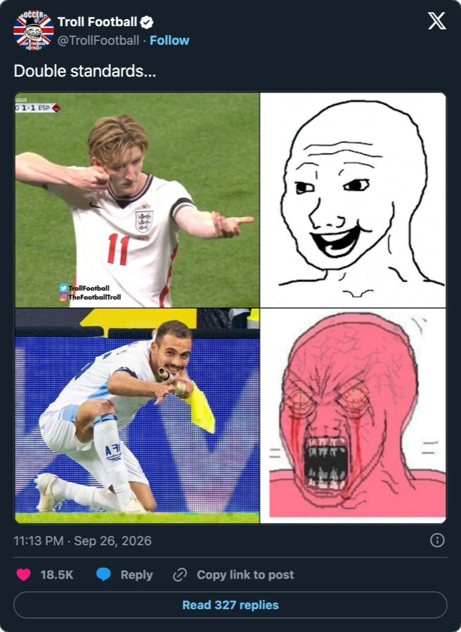
- **Line:** "Double standards..."
- **Visual:** A 4-panel. Gordon's "phone call" celebration sits next to the smug wojak. Below, an opponent doing a gun celebration by the corner flag sits next to the screaming red wojak.
- **Story + timing:** Spain v England, about 30 minutes after full time.
- **Mechanism:** Mocks England fans' hypocrisy.
- **Format:** Fanbase mockery, as a two-panel.
- **Steal this:** The wojak pair is a universal "us v them" template. Views ran 70× likes, meaning it was seen far outside the follower base (hate-shares).

### X-13 @TrollFootball · Fri 26 Sep 21:42 · 31.7K likes / 582K views (quote-post)
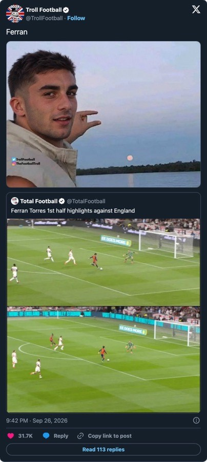
- **Line:** "Ferran"
- **Visual:** Ferran Torres's own Instagram-style photo, "pinching" the moon over a lake. It quotes @TotalFootball's "Ferran Torres 1st half highlights against England" (two misses).
- **Story + timing:** Half-time, within minutes of the quoted post.
- **Mechanism:** Callback. His own photo becomes where his shots went.
- **Format:** Callback plus quote-post.
- **Steal this:** A 1-word quote-post plus the player's own old photo. Quote the highlight/stat account's post and let the photo be the verdict. Compare our 54 ("first time?"), posted 4 minutes later on the same match: 40 likes.

### X-14 @FootyHumour · Tue 23 Sep 09:29 · 80.6K likes / 1.69M views (video)
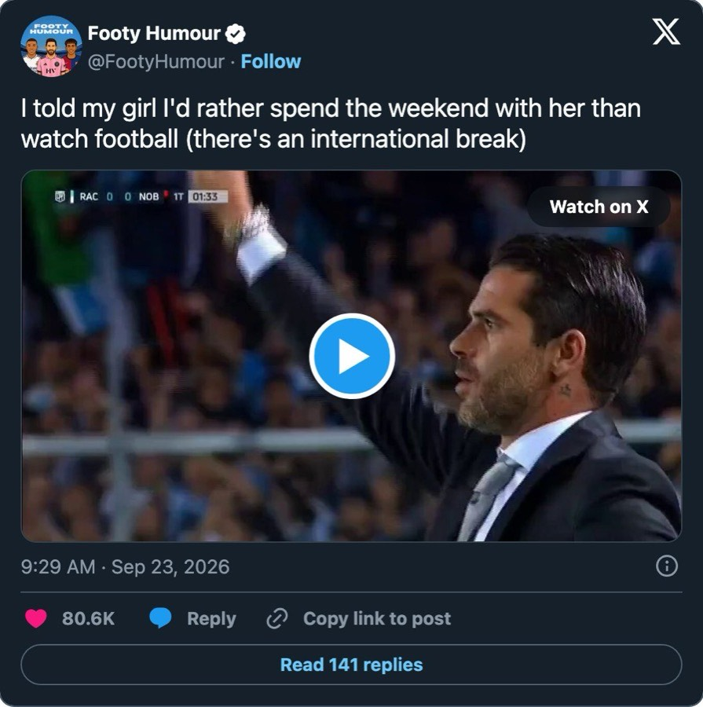
- **Line:** "I told my girl I'd rather spend the weekend with her than watch football (there's an international break)"
- **Visual:** A suited manager (Racing v Newell's, 1T 01:33 bug; looks like Fernando Gago) waving his arm with a smug, self-satisfied face, as if to say "look how generous I'm being".
- **Story + timing:** Rides the international break, a shared feeling.
- **Mechanism:** A "time-jump/shared feeling" joke with a reaction clip.
- **Format:** Label the frame (video).
- **Steal this:** Every fan feels the break, so these travel beyond club tribes. Make one per break. The bracket twist in the last words is the punchline.

### X-16 @433 · Fri 26 Sep 20:13 · 67.7K likes / 1.22M views (media account, but the post is a joke)
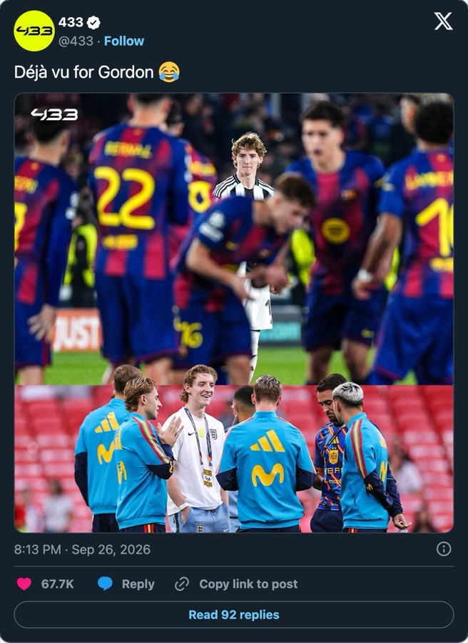
- **Line:** "Déjà vu for Gordon 😂"
- **Visual:** Two photos, stacked. Top: Gordon in a Newcastle kit, peering at Barça players in a huddle. Bottom: Gordon in an England lanyard, smiling on the edge of a Spain huddle that includes his Barça teammates.
- **Story + timing:** Pre-match at Wembley.
- **Mechanism:** Callback plus two-panel.
- **Steal this:** "Same guy, same position, different kit" works whenever a player meets his club teammates on international duty. Find the old photo that rhymes.

### X-17 @MarockX · Sun 21 Sep 15:09 · 84.4K likes / 997K views
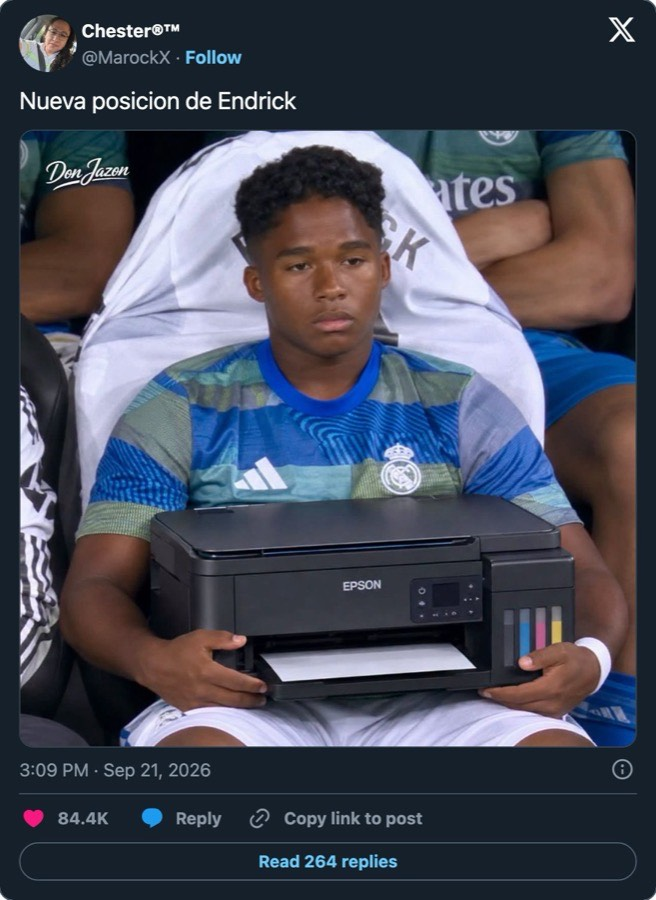
- **Line:** "Nueva posicion de Endrick"
- **Visual:** Endrick on the Madrid bench, bored, with an Epson printer photoshopped into his lap and paper coming out. His deadpan face sells it.
- **Story + timing:** Endrick unused again, plus Mourinho's printouts the week before.
- **Mechanism:** Callback plus literal reading ("his new job is running the printer").
- **Format:** Label the frame.
- **Steal this:** One clean photoshop of a news prop onto a benched player. The face must be bored or deadpan; that is what makes it funny.

### X-18 @XolidCity · Sun 21 Sep 16:11 · 75.1K likes / 2.97M views (quote-post)
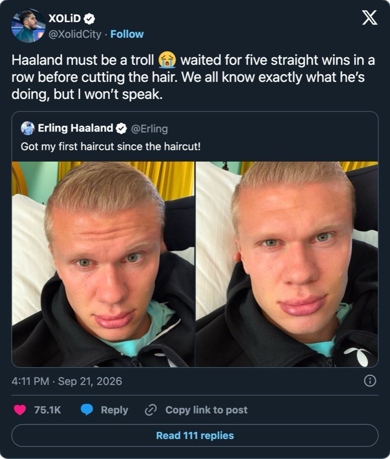
- **Line:** "Haaland must be a troll 😭 waited for five straight wins in a row before cutting the hair. We all know exactly what he's doing, but I won't speak."
- **Visual:** A quote of Haaland's own post: two pouty selfies, "Got my first haircut since the haircut!"
- **Story + timing:** Haaland's post, within hours.
- **Mechanism:** Conspiracy ("he's doing it on purpose") plus "I won't speak".
- **Format:** Ragebait/conspiracy quote-post.
- **Steal this:** Quote-post a player's own light post and read a sinister motive into it. It's long for X, but it works because of the knowing ending.

### X-19 @bobby_role · Mon 22 Sep 13:48 · 51.7K likes / 829K views
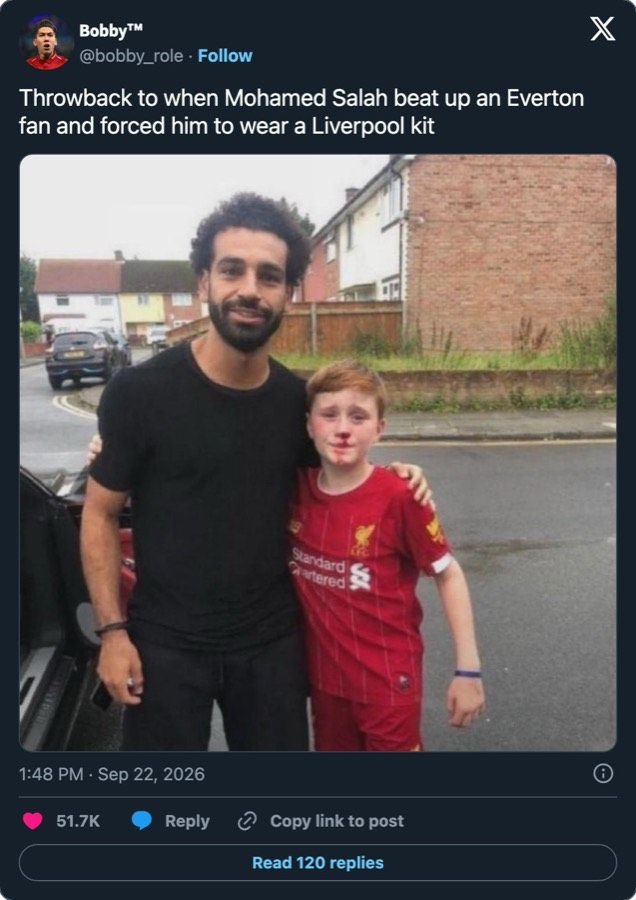
- **Line:** "Throwback to when Mohamed Salah beat up an Everton fan and forced him to wear a Liverpool kit"
- **Visual:** A real, wholesome photo of Salah with a young fan in a Liverpool kit. The kid has a nosebleed, which is the only "evidence".
- **Story + timing:** Evergreen, but rides derby banter.
- **Mechanism:** Fake-official / absurd claim built on one real detail in the photo.
- **Format:** Absurd claim.
- **Steal this:** Find a real photo with ONE odd detail (a nosebleed, a frown, a rival shirt) and narrate a crime around it. Deadpan, and "throwback" as the frame.

### X-20 @UTDTrey · Fri 26 Sep 12:24 · 88.7K likes / 974K views (video, ≈5× median)
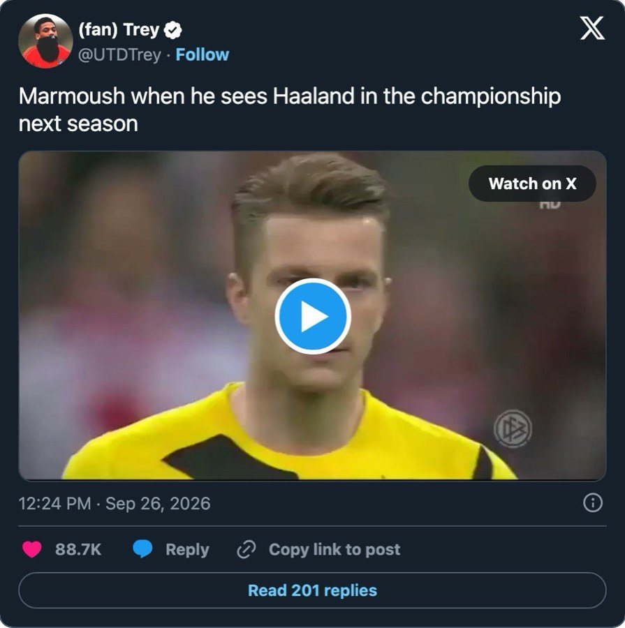
- **Line:** "Marmoush when he sees Haaland in the championship next season"
- **Visual:** A close-up reaction clip of a player in a yellow kit, staring stone-faced with a slow cold look.
- **Story + timing:** The City verdict, second wave, about 21 hours later. The new angle is relegation.
- **Mechanism:** Ties two stories (Marmoush left City; City relegated) with a reaction clip.
- **Format:** Fanbase mockery.
- **Steal this:** The next morning, don't repost day-one jokes. Jump one step ahead ("if they're relegated, then…") and pick the player on the other side of it.

### X-21 @UTDTrey · Thu 25 Sep 17:09 · 73.8K likes / 886K views / 491 replies (video)
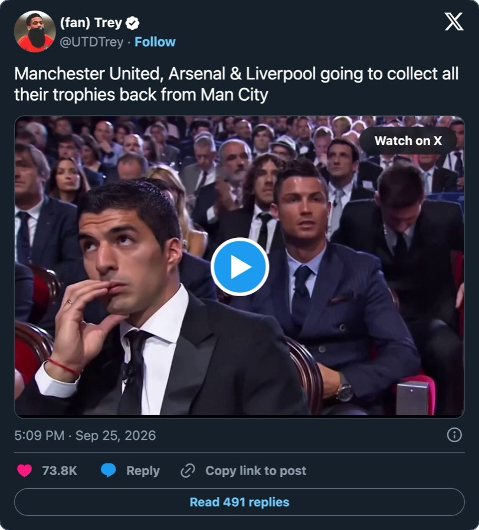
- **Line:** "Manchester United, Arsenal & Liverpool going to collect all their trophies back from Man City"
- **Visual:** The famous Ballon d'Or-gala clip of Suárez whistling innocently, hand at his mouth, with Ronaldo behind him.
- **Story + timing:** The City verdict, about 1.5 hours after it broke.
- **Mechanism:** Mocks three fanbases at once. Casting the rivals as Suárez-style chancers makes it funnier.
- **Format:** Fanbase mockery.
- **Steal this:** Name three fanbases in one line and you get reposts from all three. Use a globally famous gala or presser clip, not match footage.

### X-22 @UTDTrey · Thu 25 Sep 17:53 · 19.2K likes / 280K views (video)
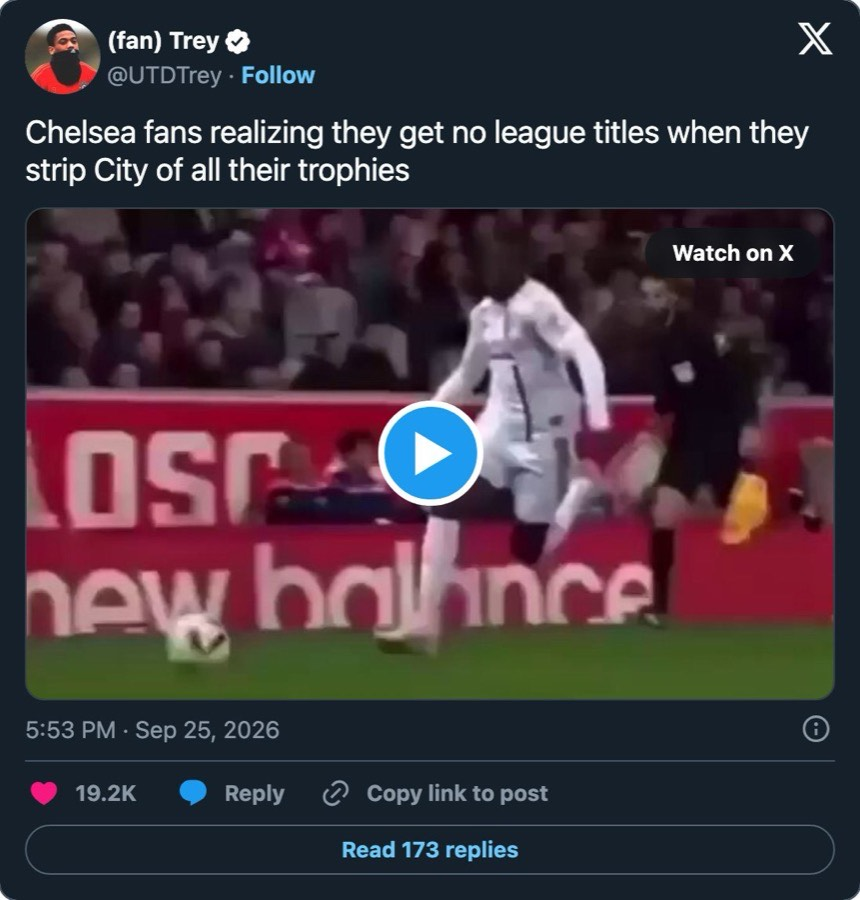
- **Line:** "Chelsea fans realizing they get no league titles when they strip City of all their trophies"
- **Visual:** A clip (poster frame): a player running at a winger by the Lille (LOSC) boards, ending in some mishap.
- **Story + timing:** The City verdict, about 2 hours in.
- **Mechanism:** Mocks the fanbase with nothing to gain.
- **Format:** Fanbase mockery.
- **Steal this:** On any redistribution story, work out who gets NOTHING and aim at them.

### X-23 @TheHateCentral2 · Thu 25 Sep 16:42 · 35.4K likes / 358K views (video)
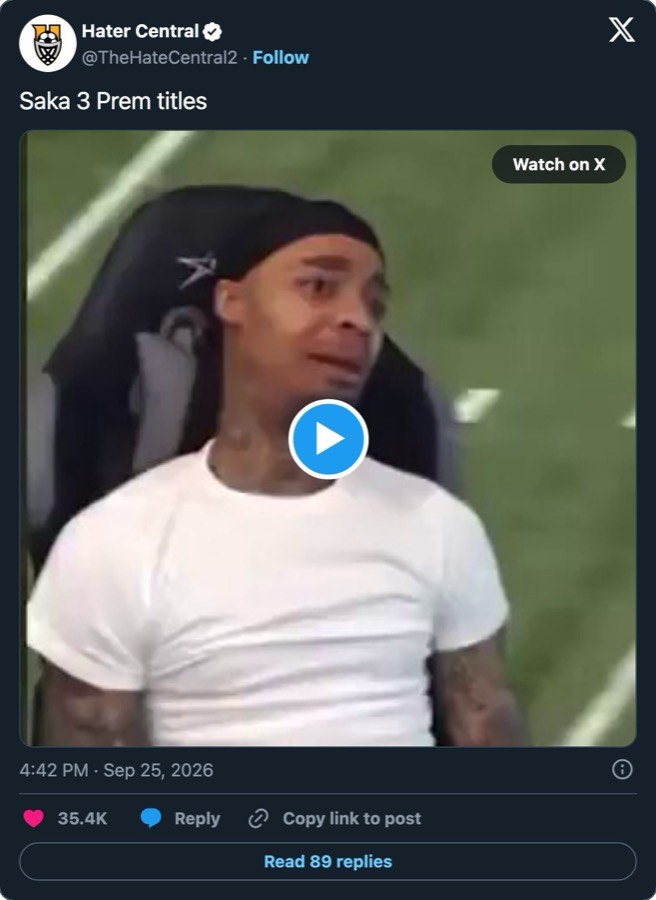
- **Line:** "Saka 3 Prem titles"
- **Visual:** A streamer in a gaming chair mid-cry and mid-laugh, emotionally overwhelmed.
- **Story + timing:** The City verdict, about 1 hour in.
- **Mechanism:** Absurd-but-true projection. If City's titles go to the runners-up, Saka "wins" three.
- **Format:** Absurd-but-true, plus a reaction clip.
- **Steal this:** A four-word line, the maths done for the reader, and a crying-laughing reaction clip. This is our 684 idea in four words.

### X-24 @TheHateCentral2 · Sat 20 Sep 18:50 · 32.4K likes / 562K views (quote-post)
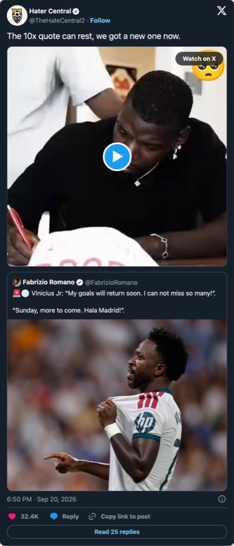
- **Line:** "The 10x quote can rest, we got a new one now."
- **Visual:** A video of Pogba signing (the old "10x" quote). It quotes Romano: Vinícius "My goals will return soon. I can not miss so many!"
- **Story + timing:** Quote-post of Romano within hours.
- **Mechanism:** Receipt/callback, adding a new line to the hall of shame.
- **Format:** Receipt quote-post.
- **Steal this:** Quote the news card and declare it the new entry in a famous series of bad quotes.

### X-25 @TheHateCentral2 · Sat 27 Sep 22:57 · 6.2K likes / 57K views
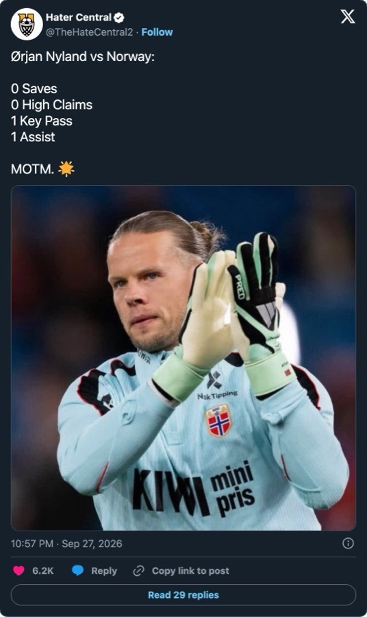
- **Line:** "Ørjan Nyland vs Norway: 0 Saves / 0 High Claims / 1 Key Pass / 1 Assist / MOTM. ☀️"
- **Visual:** Nyland applauding, calm and polite. The gentle clap against the stat list is the joke.
- **Story + timing:** About 10 minutes after full time of Portugal 2-1 Norway.
- **Mechanism:** Stat-sheet roast (his "key pass" and "assist" went to the opponent).
- **Format:** Stat-sheet roast.
- **Steal this:** This was OUR story. Keep a template ("[Player] vs [Team]:" plus 4 lines plus a verdict word) ready and post it at full time. Pick an applauding or smiling photo, never a sad one.

### X-26 @CFC_Janty · Thu 25 Sep 19:10 · 20.6K likes / 254K views (video)
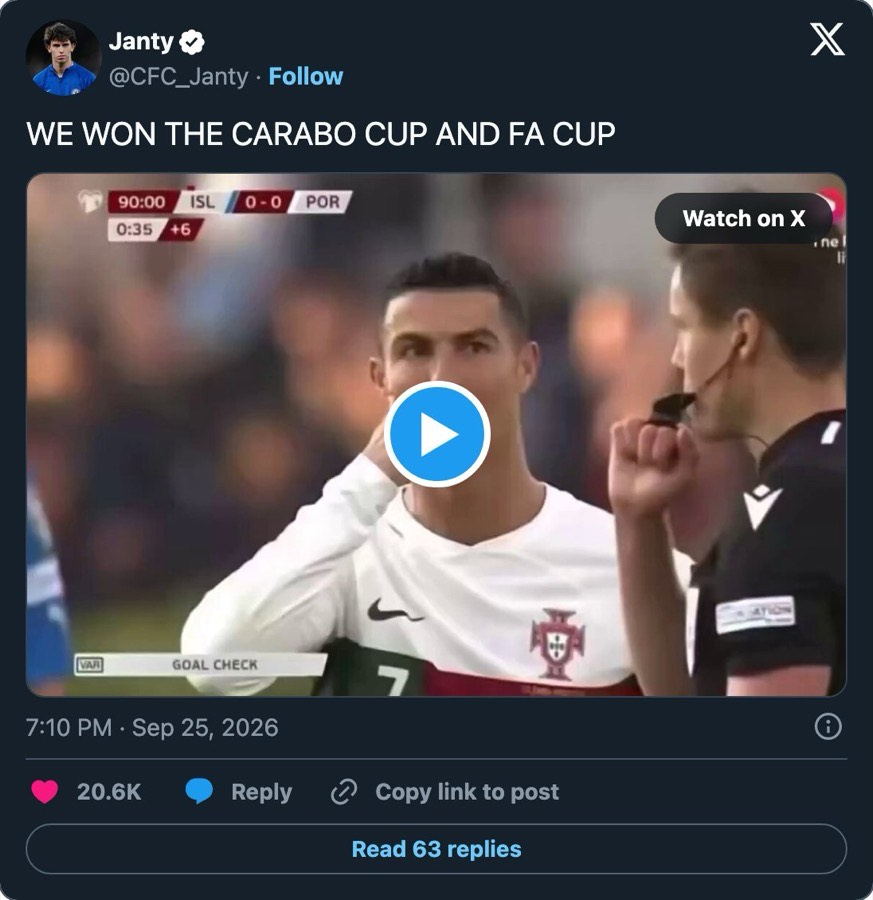
- **Line:** "WE WON THE CARABO CUP AND FA CUP"
- **Visual:** Ronaldo at 90:00 of Iceland v Portugal (VAR "GOAL CHECK" bug) doing his calm-down hand-to-ear gesture beside the ref.
- **Story + timing:** The City verdict, about 3.5 hours in.
- **Mechanism:** Fan-voice absurd claim. Chelsea "inherit" the cups they lost to City.
- **Format:** Fake-official / absurd claim.
- **Steal this:** All caps, first person, a club fan's voice, and the claim is technically what they'd believe. Over-confidence is the joke.

### X-27 @TheHateCentral2 · Thu 25 Sep 15:53 · 29.3K likes / 383K views (video quote-post)
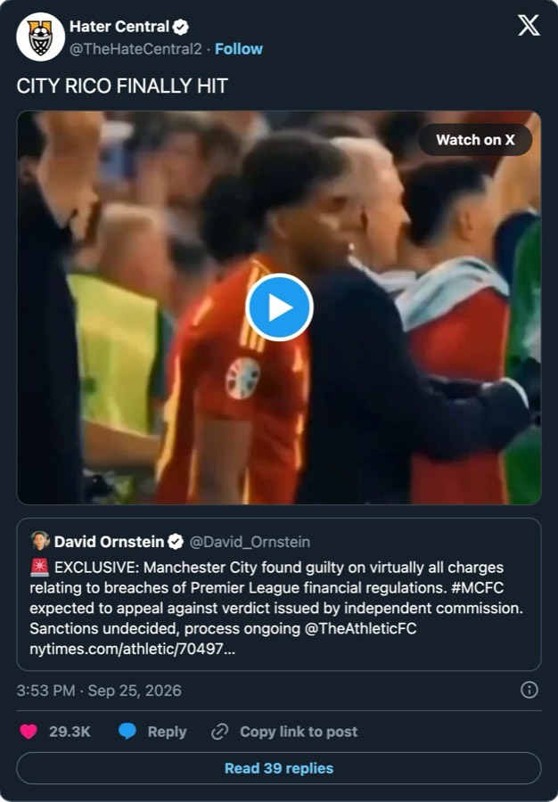
- **Line:** "CITY RICO FINALLY HIT"
- **Visual:** A celebration/walk-off clip, quoting Ornstein's EXCLUSIVE card.
- **Story + timing:** 12 minutes after Ornstein. It was the first banter post on the story that I found.
- **Mechanism:** A verdict in 4 words ("RICO" is a crime-meme callback).
- **Format:** Verdict quote-post.
- **Steal this:** On a mega-story, the first 15 minutes only need 3–4 words and a reaction clip over the news card. Be first, then do the crafted one (our 684 came at +51 min).

## X: ours (best)

### X-40 @ShithouseryHQ · Thu 25 Sep 16:32 · 77.7K likes / 1.36M views (≈1,000× our view median)
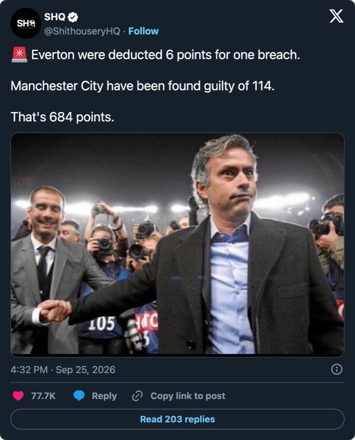
- **Line:** "🚨 Everton were deducted 6 points for one breach. / Manchester City have been found guilty of 114. / That's 684 points."
- **Visual:** Mourinho, eyebrows up, lips pursed in a smug "told you so", shaking Pep's hand while Pep grins behind him. The photographers frame it like a verdict moment.
- **Story + timing:** The City verdict, 51 minutes after Ornstein.
- **Mechanism:** Absurd-but-true maths plus the perfect reaction face. It ties two stories (Everton's punishment).
- **Format:** Absurd-but-true maths.
- **Steal this:** Three short lines: a fact, a fact, then the number. 🚨 first, no emoji at the end. The photo is not "about" the maths; it is the audience's reaction to the maths.

### X-41 @ShithouseryHQ · Wed 24 Sep 11:01 · 18.9K likes / 380K views (and 3.29M views on Threads, T01)
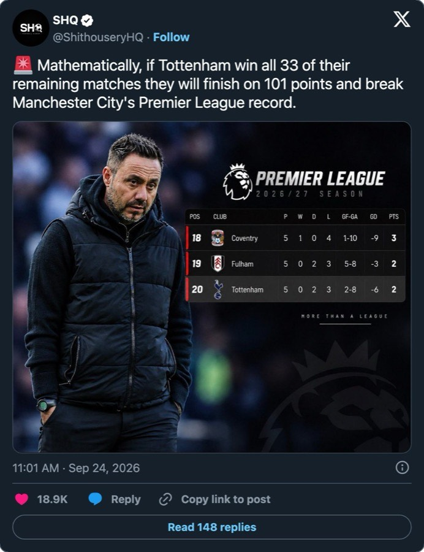
- **Line:** "🚨 Mathematically, if Tottenham win all 33 of their remaining matches they will finish on 101 points and break Manchester City's Premier League record."
- **Visual:** De Zerbi, hands in pockets, head down, alone, beside a slick PL table graphic showing Spurs 20th on 2 points.
- **Story + timing:** Spurs bottom during the international break.
- **Mechanism:** Absurd-but-true maths. The image is the receipt.
- **Format:** Absurd-but-true maths.
- **Steal this:** "Mathematically, if…" plus a real table plus a sad manager. Stay deadpan throughout. The graphic must look official.

### X-42 @ShithouseryHQ · Thu 25 Sep 17:56 · 2K likes / 76K views (thread reply to X-40)
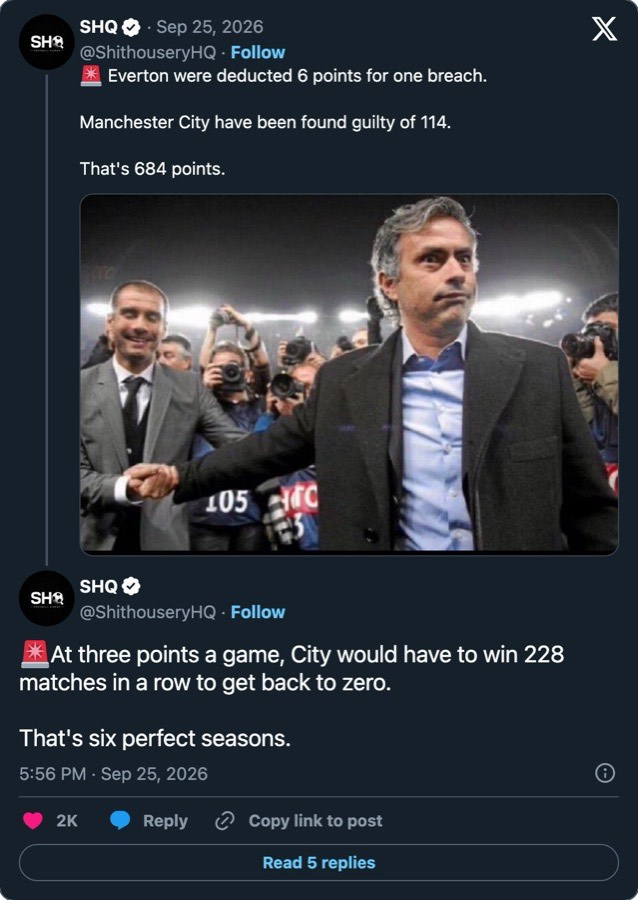
- **Line:** "🚨 At three points a game, City would have to win 228 matches in a row to get back to zero. That's six perfect seasons."
- **Visual:** No image of its own; it rides the quoted parent.
- **Mechanism:** Maths follow-up.
- **Steal this:** A good second joke wasted as a reply. It should have gone out as its own post, with its own image (the City squad lifting a trophy, or the table with City on −684), 1–2 hours later.

### X-43 @ShithouseryHQ · Fri 12 Sep 16:45 · 1.65K likes / 781K views
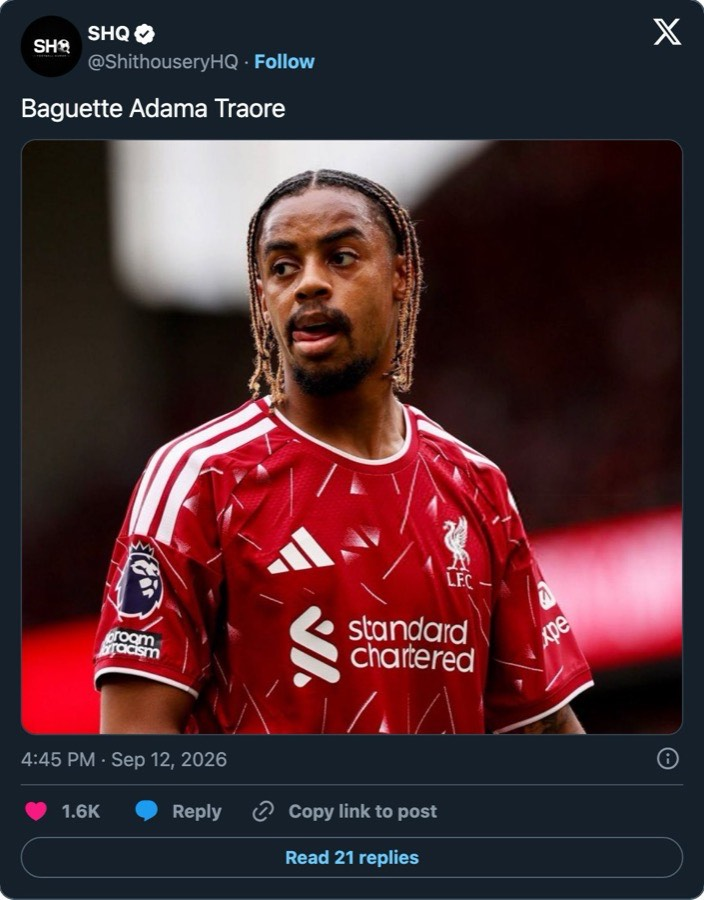
- **Line:** "Baguette Adama Traore"
- **Visual:** Liverpool's new French winger with braids, tongue out, looking sideways. The resemblance carries it.
- **Mechanism:** A nickname (lookalike).
- **Format:** Nickname / label the frame.
- **Steal this:** Huge reach (781K) but a 0.2% like rate. People looked and didn't feel anything. A nickname needs a second beat (a stat or a moment), or it's just a label.

### X-44 @ShithouseryHQ · Mon 28 Sep 12:21 · 21 likes / 518 views at +38 min (Alex's post today, recorded as a format example)
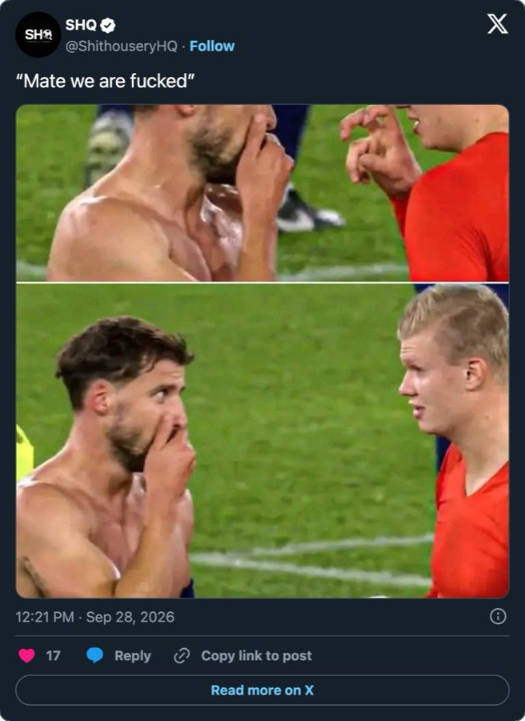
- **Line:** "“Mate we are fucked”"
- **Visual:** Two stacked frames. Rúben Dias, shirtless, covers his mouth with his hand while talking to Haaland in Norway red at full time; the bottom frame is the wider shot of both faces.
- **Story + timing:** Portugal 2-1 Norway (Sat night), plus the City verdict (both play for City). Posted about 14 hours after full time.
- **Mechanism:** Lip-read caption. It ties two stories: the Norway loss and the City verdict.
- **Format:** Lip-read / "what they said".
- **Steal this:** The format is strong. The hand-over-mouth frame is the best "secret conversation" image there is, and the line ties both stories. What's missing is timing: this frame circulated at full time, so posting it within 30 minutes of the photo appearing is the whole difference. Worth re-reading at 24 hours.

## X: ours (flops)

### X-50 @ShithouseryHQ · Mon 28 Sep 11:52 · 9 likes / 498 views
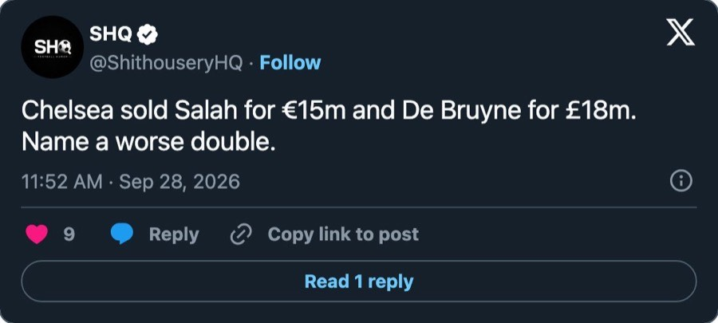
- **Line:** "Chelsea sold Salah for €15m and De Bruyne for £18m. Name a worse double."
- **Why it died:**
  - Text only.
  - No news peg today; it's a ten-year-old fact.
  - The question does the work the image should do.
  - No face, no receipt image.
  - Fix: the same idea as a receipt card (two photos with the fees on them) on a day when Salah or KDB is in the news.

### X-51 @ShithouseryHQ · Sat 27 Sep 22:59 · 30 likes / 1.4K views
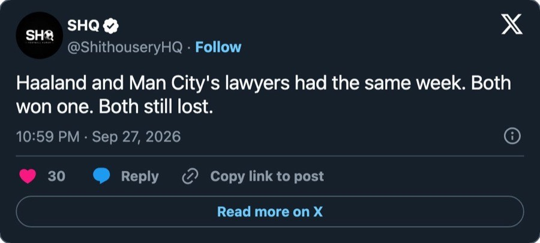
- **Line:** "Haaland and Man City's lawyers had the same week. Both won one. Both still lost."
- **Why it died:** The joke itself is good: it ties two stories, in the playbook's own example shape. But it went out as text only, 15 minutes after full time. With X-44's Dias/Haaland frame, or a Haaland-dejected photo next to the City legal team, it has a vehicle. Text-only works only for roast-by-fact one-liners from big accounts (F3 in x_viral_formula).

### X-52 @ShithouseryHQ · Sat 27 Sep 22:43 · 5 likes / 1.1K views
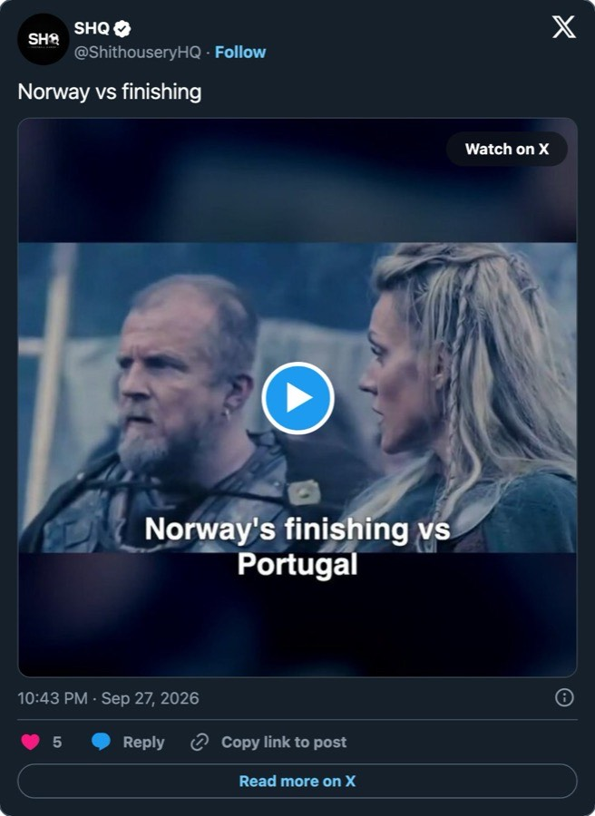
- **Line:** "Norway vs finishing"
- **Why it died:**
  - The Norsemen clip is unknown outside Norway.
  - A two-word "[X] vs [Y]" needs a clip that is globally legible failure, or the player's own miss.
  - The burned-in caption repeats the tweet text.
  - Compare 25 (Hater Central, the same match, 6.2K).

### X-53 @ShithouseryHQ · Mon 28 Sep 12:09 · 11 likes / 559 views
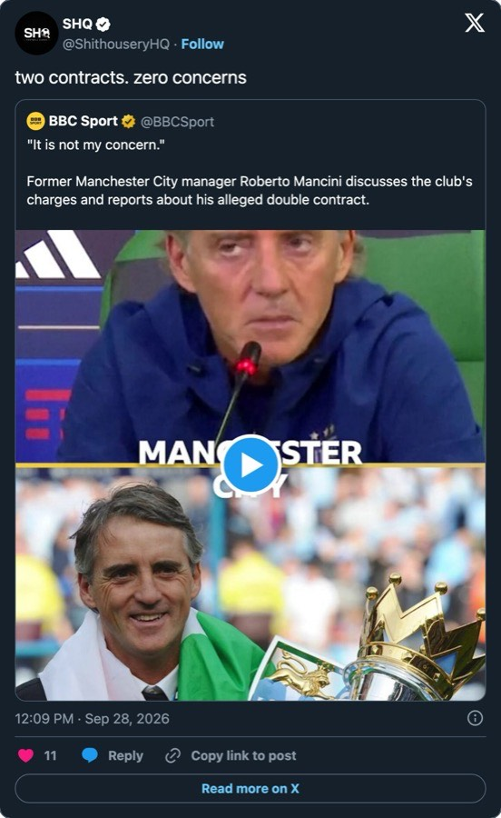
- **Line:** "two contracts. zero concerns" (quoting BBC Sport's Mancini "It is not my concern.")
- **Why it died:**
  - Day 3 of the story.
  - Needs the Mancini double-contract detail to decode.
  - Quotes a news card whose own picture (Mancini's bored face) already made the joke, so we added nothing visual.

### X-54 @ShithouseryHQ · Fri 26 Sep 21:46 · 40 likes / 1.4K views
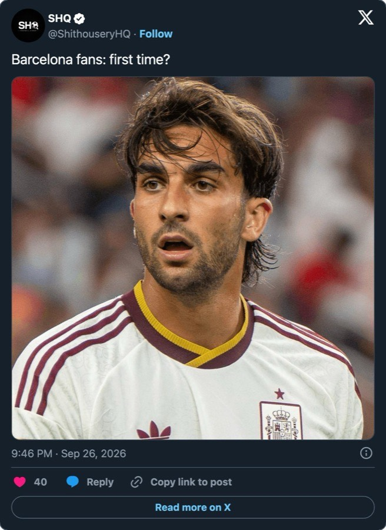
- **Line:** "Barcelona fans: first time?"
- **Why it died:**
  - A neutral headshot of a Spain player with his mouth half-open.
  - The face shows no emotion that matches the line.
  - "First time?" is a stale template.
  - The same moment gave @TrollFootball 31.7K with Ferran's own moon photo (13).

---

## Threads (ours, via Threads API, plus 1 external)

**What Threads adds:** here the raw number of views is driven by debate (replies) and by maths. The like rate is much lower than on X, except for the 684 post, which had the best like rate and the most reposts of anything on Threads.

### T-01 @shithouseryhq · Sun 21 Sep 13:07 · 3.29M views / 4,945 likes / 148 replies / 223 shares
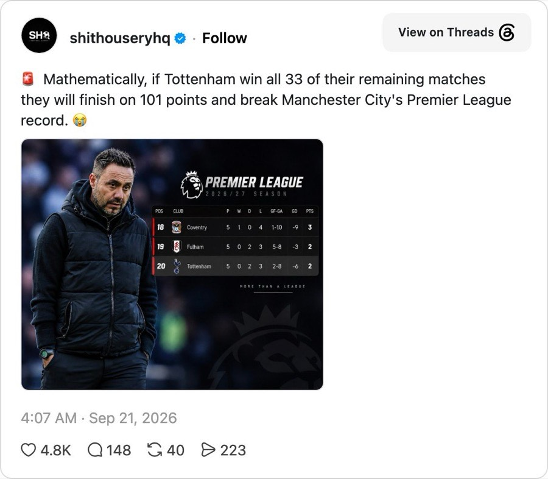
- **Line / Visual:** The same as X-41: the Mathematically/Tottenham line, with the de Zerbi plus table image. It ends with 😭 here.
- **Mechanism:** Absurd-but-true maths.
- **Steal this:** On Threads, maths posts get pushed to non-followers at scale. One per day. Keep it deadpan.

### T-02 @shithouseryhq · Wed 24 Sep 16:25 · 2.70M views / 5,837 likes / 142 replies / 226 shares
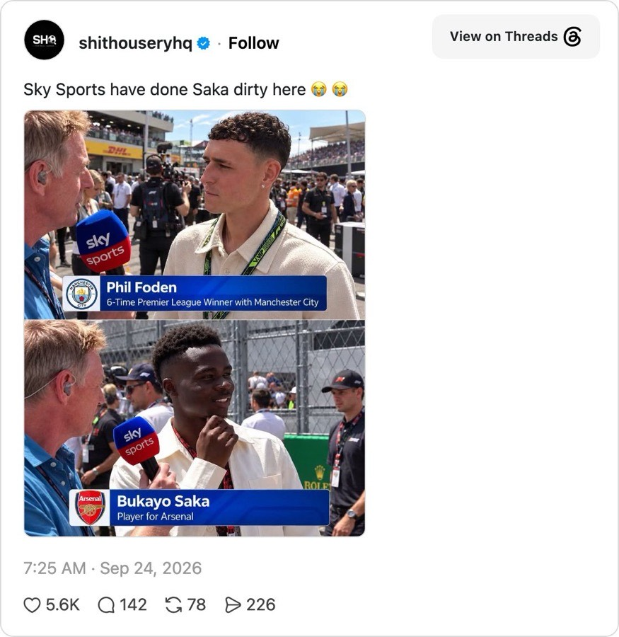
- **Line:** "Sky Sports have done Saka dirty here 😭😭"
- **Visual:** Two Sky Sports F1-paddock interview grabs. Foden's lower-third reads "6-Time Premier League Winner with Manchester City". Saka's reads "Player for Arsenal". The broadcaster's own graphic is the joke.
- **Mechanism:** A found-object two-panel that mocks a fanbase (Arsenal) with the broadcaster as the culprit.
- **Steal this:** Lower-thirds, captions, chyrons and graphics with unfortunate wording are free bangers. Screenshot them the moment they air.

### T-03 @shithouseryhq · Sun 31 Aug 10:36 · 1.43M views / 3,881 likes / 115 replies
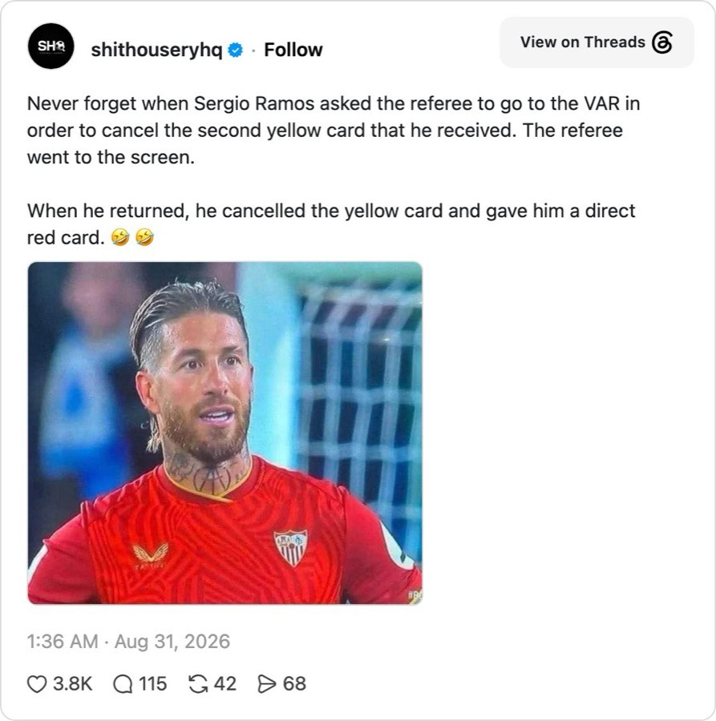
- **Line:** "Never forget when Sergio Ramos asked the referee to go to the VAR… he cancelled the yellow card and gave him a direct red card. 🤣🤣"
- **Visual:** Ramos in Sevilla red, a smug, innocent face.
- **Mechanism:** Receipt/callback with a story twist.
- **Steal this:** A "Never forget when…" story with the twist in the last clause works as a long Threads caption. The photo should be the victim's smug face from before the twist.

### T-04 @shithouseryhq · Sun 21 Sep 22:48 · 1.21M views / 1,181 likes / 154 replies
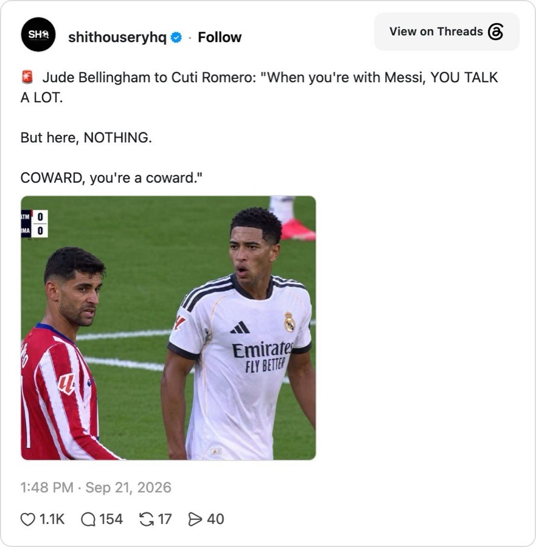
- **Line:** "🚨 Jude Bellingham to Cuti Romero: 'When you're with Messi, YOU TALK A LOT. But here, NOTHING. COWARD…'"
- **Visual:** Jude and Romero face to face in the derby (ATM 0-0 RMA bug). Their body language matches the quote.
- **Mechanism:** Quote v picture, confrontation.
- **Steal this:** Beef quotes plus a face-off frame work. ⚠️ Any quote must be real and sourced (fact-checker), or a Community Note kills reach.

### T-05 @shithouseryhq · Thu 25 Sep 15:50 · 840K views / 962 likes
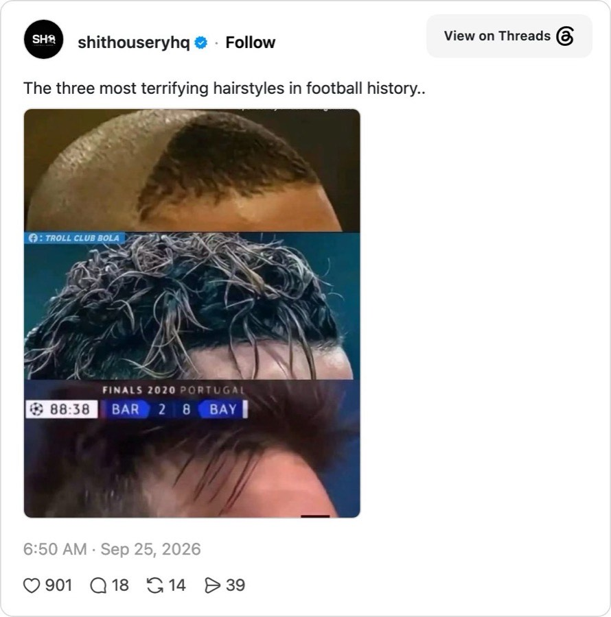
- **Line:** "The three most terrifying hairstyles in football history.."
- **Visual:** Three hairline crops:
  - Ronaldo's 2002 wedge
  - a dreadful curly perm
  - Messi's hairline at the Bayern 8-2 (the "88:38 BAR 2-8 BAY" bug is visible)
  The third is the punchline, because "terrifying" is really about the 8-2.
- **Mechanism:** A list whose last item is a callback.
- **Steal this:** A "top 3" where #3 is secretly a different joke. Crop tight so people have to guess.

### T-06 @shithouseryhq · Thu 25 Sep 20:12 · 373K views / 1,915 likes / 35 reposts
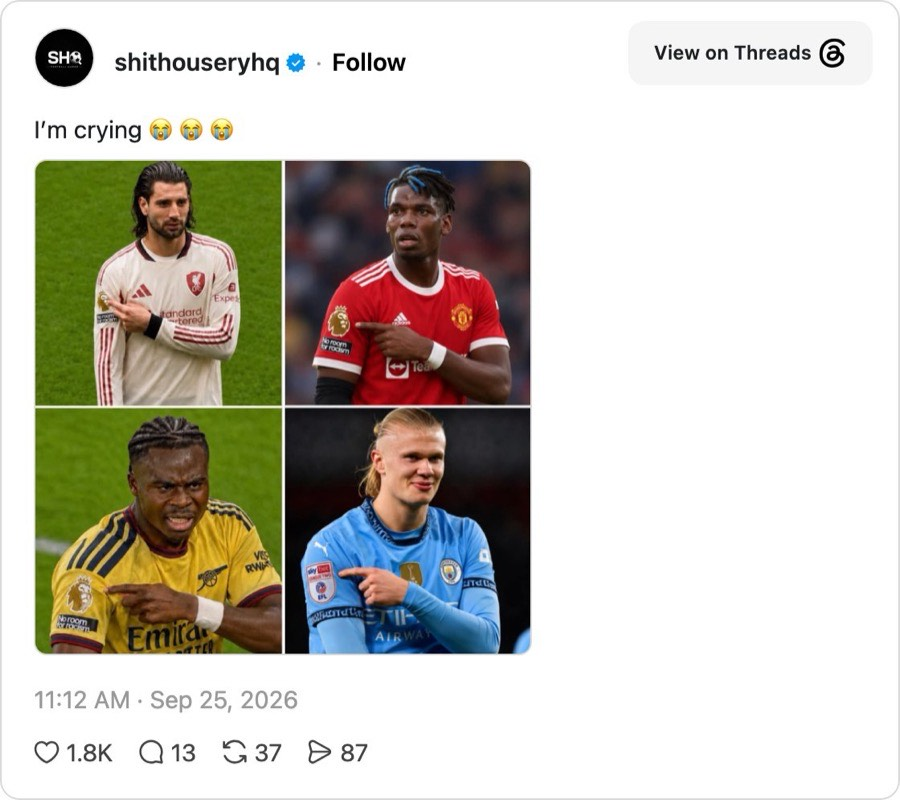
- **Line:** "I'm crying 😭😭😭"
- **Visual:** A 2×2 grid of four players (United, Pogba, Arsenal, Haaland) all doing the same pointing-at-self gesture.
- **Story + timing:** The evening of the City verdict. I could not fully decode the link from the image alone. It worked mostly as a pattern-spot, and a reviewer should ask what the shared gesture means before copying it.
- **Steal this:** A grid of the same gesture invites "what am I looking at" replies. The weakness is that the line explains nothing, so the reach depends on people already getting it.

### T-07 @shithouseryhq · Thu 25 Sep 14:01 · 295K views / 3,929 likes / 351 replies
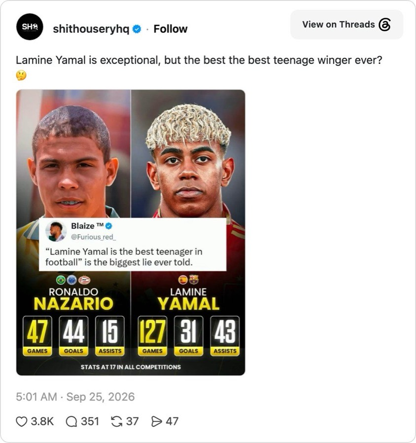
- **Line:** "Lamine Yamal is exceptional, but the best the best teenage winger ever? 🤔"
- **Visual:** A comparison card: Ronaldo Nazário at 17 (47 games, 44 goals, 15 assists) v Yamal (127 / 31 / 43), with a quoted tweet calling it "the biggest lie ever told".
- **Mechanism:** Ragebait question plus a data card.
- **Steal this:** On Threads, a question WITH a comparison card gets the most replies of anything we post. The card must be arguable both ways (goals v assists).

### T-08 @shithouseryhq · Sat 27 Sep 13:34 · 261K views / 1,020 likes / 200 replies
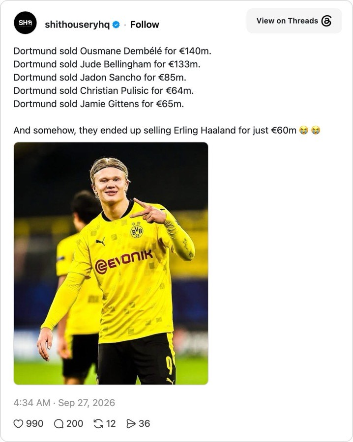
- **Line:** "Dortmund sold Dembélé for €140m… Bellingham €133m… Sancho €85m… Pulisic €64m… Gittens €65m. And somehow, they ended up selling Erling Haaland for just €60m 😭😭"
- **Visual:** Haaland in Dortmund yellow, smiling and pointing.
- **Mechanism:** A receipt list where the knife is the last line.
- **Steal this:** Five big numbers, then one tiny number for the best player. It works on Threads, and on X only with the photo. This is the list shape X-50 should have used.

### T-09 @shithouseryhq · Thu 25 Sep 16:35 · 260K views / 8,279 likes / 244 reposts / 190 shares (the best like and repost rate on Threads)
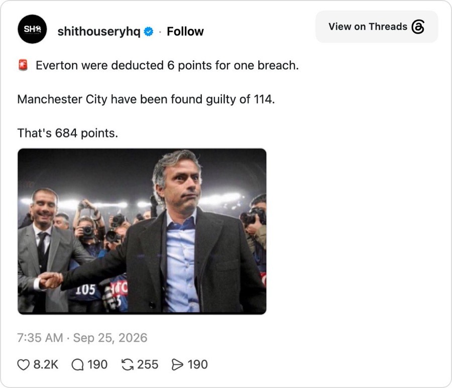
- **Line / Visual:** The same as X-40.
- **Steal this:** On Threads, a fresh mega-story plus maths plus a reaction face got 3.2% likes per view against 0.15% for T-01. Reach came from maths; enthusiasm came from the story being live.

### T-10 @mascot_madrid (external) · Fri 26 Sep · 289 likes / 53 replies
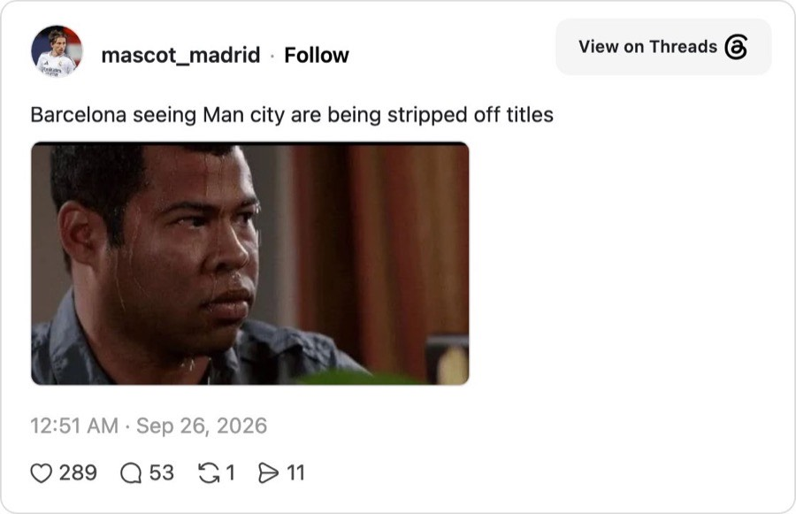
- **Line:** "Barcelona seeing Man city are being stripped off titles"
- **Visual:** Jordan Peele sweating (the classic nervous-sweat reaction).
- **Mechanism:** Ties two stories (Barça's Negreira case).
- **Steal this:** A good angle, but small. Football banter on Threads is thin outside our account. Our own posts are the Threads reference set, and the lesson from this one is the angle, not the numbers.

### Threads flops
- **T-20** "Norway fans after Haaland equalised: we're so back. Norway fans 10 minutes later: Odin has left the chat". Text only, 257 views, 0 likes. 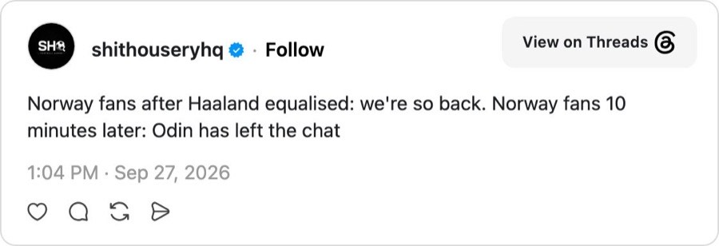 **Why it died:** Text only, a stale "we're so back" template, and a local reference (Odin).
- **T-21** "Norway's keeper tonight. Rate him out of 10 👇". Text only, 355 views. 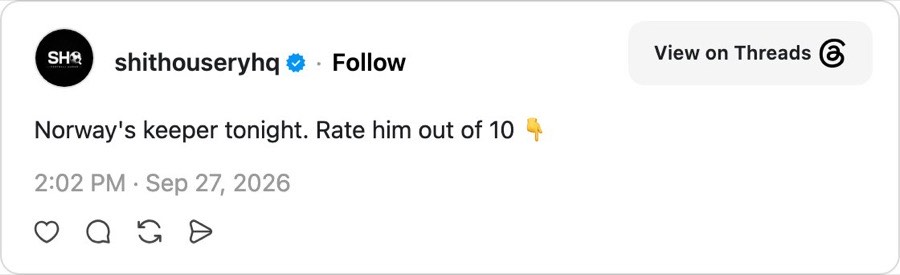 **Why it died:** Asks for engagement without showing the keeper or the error. Compare X-25, which shows the stat sheet and a clapping photo.
- **T-22** "Cristiano Ronaldo was an unused substitute… 6,678 days… WILD STAT 🤯". 513 views, 9 likes. 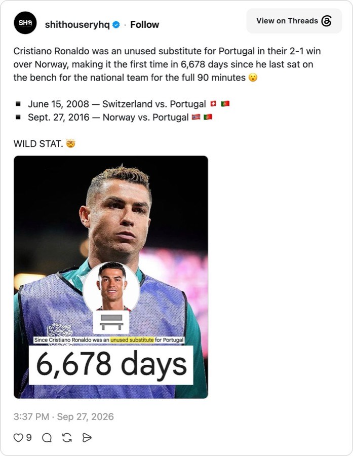 **Why it died:**
  - A news restatement with no joke.
  - It prints "Sept. 27, 2016" for last night's game.
  - Alex's own version on X ("His best performance for Portugal in years" on the bench photo) is the joke version of the same fact.

---

## NOT OUR LANE (for contrast)

These got their numbers by being the source, not through craft we can copy. Screenshots are in `x/not_our_lane/`.
- **@FabrizioRomano, Ødegaard on Ronaldo "role model"** (46.6K / 1.3M): a news quote.
- **@TouchlineX, "first time in 18 years Ronaldo stayed on the bench…"** (6.1K / 86K): a news stat. Same fact as our T-22 flop; the joke version is Alex's bench-photo line.
- **@ESPNFC, "Spain's last five opponents 💀 an absolute gauntlet"** (30K / 485K): an information graphic. The 💀 is hype, not a joke.
- **@NoodleHairCR7, "Ronaldo was teary eyed as the whole stadium chanted his name"** (56.7K): sincere fan emotion, not banter.
- **@StokeyyG2, "Fuck me, that's actually incredible."** (32K / 2.2M): a sincere reaction to an LFC goal clip.
- **@TrollFootball, "King Jack 👑"** (31K): a crowned Ireland scorer at Israel v Ireland. Politics-adjacent, so skip the type.

## Method notes / gaps

- Most external bangers come from Troll Football, Footy Humour, Hater Central, UTDTrey and single-fan accounts (MarockX, XolidCity, bobby_role, CFC_Janty). X search from Alex's Chrome stalls whenever the tab is in the background, so the sweep covers 18–28 Sep well and 14–17 Sep only thinly.
- Videos were judged from the poster frame plus the caption. I did not watch them.
- For other accounts' Threads football banter I could only find small accounts (T-10). The Threads section is mostly ours, ranked by API views.

### ALEX-PICK 09-28 23:14 — "the most pro clubs thing I've ever seen" (thefootballfeeduk IG carousel slide 1, @AJDeniro tweet on the photo)
Photo: a Netherlands #19 captain in a garish orange/teal kit, bulky, stiff mid-run next to a Brazil #9 — looks like a video-game create-a-player. Tweet: "Fam😭😭😭 this the most pro clubs thing I've ever seen".
**Why it bangs (Alex):** "really funny and shocking, highly sharable, there are MULTIPLE things about that photo that would make people react — some will comment it is fake, some will post laughing emojis, others will share it with their mates." → The IMAGE is absurd on its own (looks fake) and the line names the one reference every football gamer shares (Pro Clubs). Several reaction routes at once = comments ("fake?"), emojis, sends.
**Rule:** pick photos that make people DOUBT THEIR EYES (looks fake/AI/video-game, wrong proportions, absurd kit, impossible moment); the label names a shared reference (FIFA/Pro Clubs, Sunday league, a meme) in ≤10 words.
