# VISUAL BANGER LIBRARY: YouTube Shorts
Built Mon 28 Sep 2026 (Oslo), read-only. This replaces the thumbnail-only "YT SHORTS" section of LIBRARY_video.md (YT-01…07 there are still valid; this file continues at YT-08).

**Method.** YouTube Data API v3 via our own "shq-insights" OAuth (read-only scopes `youtube.readonly` + `yt-analytics.readonly`, same Keychain auth as social/insights.mjs). 22 `search.list` queries (type=video, videoDuration=short, publishedAfter=2026-09-14, order=viewCount, GB/US, en) gave 887 unique videos from 549 channels. `videos.list` + `channels.list` supplied stats. For 25 candidate channels, the median of their last ≤50 uploads gave the **× channel median** outlier figure, which is more honest than views/subs. Official club, league and broadcaster channels were excluded, as were plain footage re-uploads (a few are kept as "not our lane" contrast). Every thumbnail (`yt/NN_*.jpg`) was looked at. Match times come from the ESPN scoreboard API. **Our channel:** YouTube Analytics per-video metrics, traffic sources, retention curves (`elapsedVideoTimeRatio`) and daily traffic by source.
**Spend:** 2,285 Data-API units (of the ~5,000 budget; Analytics API queries don't use these units). vidIQ: 10 credits (1 `watch_shortform_content`, on YT-09); 30 left. Higgsfield `video_analysis_create` on YT-12 was still **queued** 30+ min later with no charge shown (free plan, 0.2 credits). See the Higgsfield note at the bottom.
**Limits.** Search results are sorted by views, so this is a sample of survivors. The timing tables show what *can* work, not the odds. I could not hear the audio of most outliers (no downloads). Sound is filled in only where vidIQ watched it; the rest is marked TODO for Chrome after 21:30. Times are Oslo (UTC+2). "FT" is kickoff + ~1h55.

**⚠️ Correction to the brief.** Our two hits were **not** posted the night of the match. "Spurs fans after going three down" went up Sun 20 Sep 21:39, **30 h** after Spurs 2-3 Villa. "Brighton vs Arsenal highlights" went up Mon 21 Sep 11:24, **41 h** after Brighton 3-0 Arsenal. Our fastest Short, "Norway 1 2 Portugal | Highlights", went up at the final whistle and got **5 views**. Speed did not decide ours; the frame and the loop did (see WHY OUR SHORTS DIE).

---

## References: in our lane (humour about results, fanbases, verdicts)

### YT-08 CROATBALL (291K) · Sat 19 Sep 18:14 · 642K (3.5× its 183K median) · 8 s · THE FORMAT-A ORIGINAL
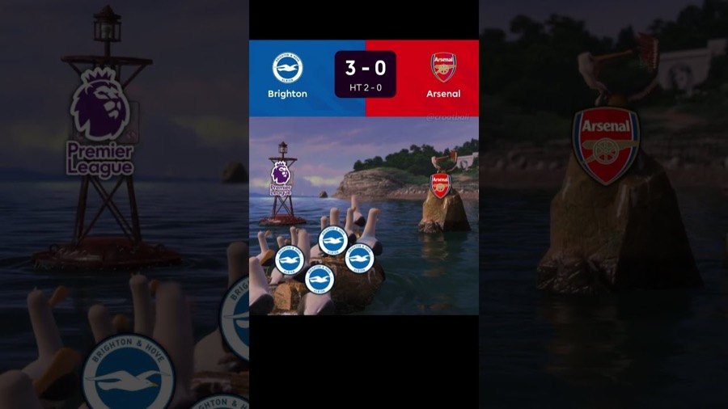
- **Hook / frame 1:** a Google-style full-time score card **"Brighton 3 - 0 Arsenal"** at the top. Below it, cartoon seagulls (Finding Nemo "mine") with **Brighton crests on the birds** and an Arsenal crest. The clip fills the frame.
- **Title shape:** `Brighton 3 0 Arsenal | Highlights`: exact result, no emoji, no hashtags in the title.
- **Clip choice:** a structural pun: seagulls = Brighton, the flock pecks = 3-0. The crests sit ON the characters.
- **Sound:** no speech (audio language `zxx`); the seagulls' "mine mine" sound presumably. TODO: hear it.
- **Timing vs story:** **~20 min after FT**.
- **Length / loop:** 8 s.
- **Description / tags:** line 1 `brighton vs arsenal 3-0 highlights`, then `Gameweek 5 Premier League 2026/2027`, then the meme phrase of the day **`pecked by the seagulls`**, then 7 hashtags. The tags are search variants (`Brighton vs Arsenal 3-0 Premier League Highlights`, `brighton 3:0 arsenal highlight`, `arsenal fans`, `FPL`…). The title catches people searching for real highlights; the meme keeps them watching.
- **Why it won:** first, obvious club-to-vessel mapping, and a result card that explains everything in one glance. It's also a **series**: 14 of 14 uploads in 15 days are "[H] x y [A] | Highlights", at 0.7/day, with a median of 183K. The latest, England 2 3 Spain (36 min after FT), got 670K.
- **Steal this:** the whole anatomy. Result card on top, a vessel carrying the crests, the exact score as the title, the day's phrase in the description, out within 60 min.

### YT-09 NAT_ (716 subs) · Thu 17 Sep 09:54 · **2.50M (1,583× its 1.6K median)** · 8 s
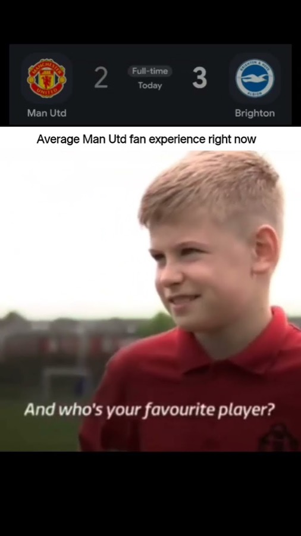
- **Hook / frame 1:** a score card **"Man Utd 2 · Full-time Today · 3 Brighton"** on top, the plate "Average Man Utd fan experience right now", and a schoolboy in a red shirt on a playing field.
- **Title shape:** `90 minutes of pure Manchester United pain 💔 | #manutd #brighton #CarabaoCup #memes`
- **Clip choice (vidIQ watched it):** a viral BBC vox-pop. Boy: "Manchester United." Reporter: "And who's your favourite player?" Boy (deadpan, wipes his nose): "**None of them – they're all rubbish.**" Adults gasp and laugh. It's a United fan's own mouth saying the joke. The punchline lands at 0:04–0:05.
- **Sound:** original audio: dialogue, subtitled, and the laugh.
- **Loop:** near-perfect. The clip restarts on "Manchester United", which re-answers the question, so it reads as endless disillusion (vidIQ).
- **Timing vs story:** Man Utd 2-3 Brighton (Carabao Cup, FT ~22:55 Wed) → posted **11 h later, the morning after**.
- **Description:** a long, *relevant* paragraph ("Bottling a 2-0 lead in 10 minutes is actually a talent at this point…"), ending with a question to the fans. No tags.
- **Why it won:** the clip is funny with zero football knowledge (FB rule 1 holds on YT too). The score card supplies the context. 8 s, and it loops. A 716-sub account got 2.5M, so channel size doesn't matter.
- **Steal this:** a found clip of a real fan or kid saying the verdict out loud, under the result card. Morning-after is fine for a fanbase-misery joke.

### YT-10 NAT_ · Sun 20 Sep 02:13 · 114K (72× median) · 9 s
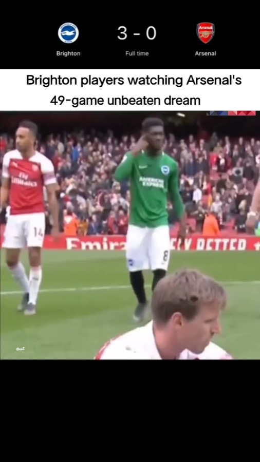
- **Hook:** the score card "Brighton 3 - 0 Arsenal · Full time" over a white band: "Brighton players watching Arsenal's 49-game unbeaten dream", then archive footage of an old Arsenal v Brighton game.
- **Title:** `Pecked by the Seagulls...🔵⚪ | #Arsenal #Brighton #PremierLeague #memes #manutd`, the day's phrase again.
- **Timing:** 8.3 h after FT, in the middle of the night.
- **Why it won:** it mocks the fanbase's summer boast ("Invincibles") with the result card as proof. The description is a real paragraph ("The Invincible delusions didn't even survive until the autumn leaves fell 💀🍂…").
- **Steal this:** *the boast vs the result*. Quote what the fanbase claimed, then show the card.

### YT-11 ballersvibefc (241 subs) · Sat 19 Sep 18:51 · 68K (71× median) · 10 s
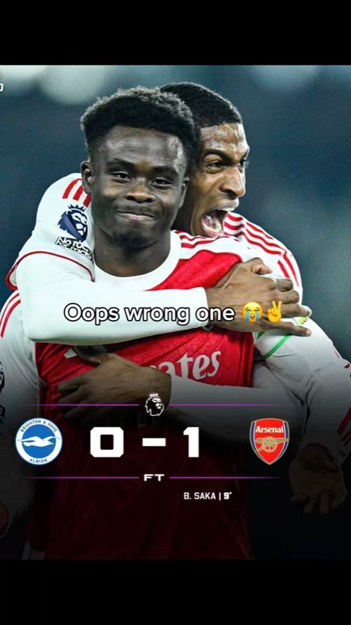
- **Hook:** Saka's celebration over an old **"Brighton 0-1 Arsenal FT"** graphic, captioned "**Oops wrong one 😭✌️**". The fake-out shows the old win, then cuts to today.
- **Title:** `Arsenal getting pecked by the seagulls 🤣✌️ | #edit #funny #memes #arsenalfc #football #soccer`
- **Timing:** ~55 min after FT.
- **Why it won:** a bait-and-switch in the first second, plus the phrase every fan was typing that hour. At least 4 top Shorts that day used "pecked by the seagulls" (CROATBALL description, this one, KS7⚡️ 191K at +2.4 h, NAT_).
- **Steal this:** find the day's phrase in the first hour (X/Reddit match thread) and put it in the title or the description.

### YT-12 Mr Cristiano (44K) · Thu 24 Sep 23:47 · 680K (36× its 19K median) · **5 s**
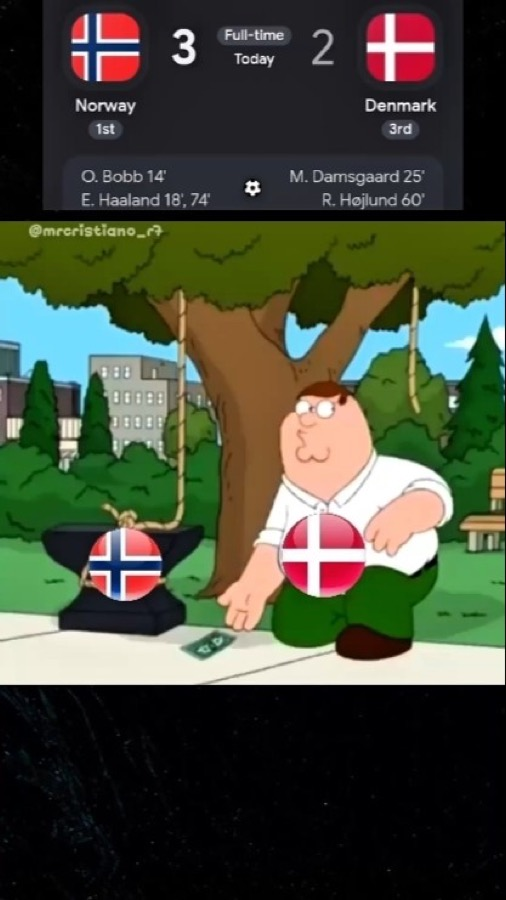
- **Hook:** a Google score card **Norway 3-2 Denmark with scorers** (Bobb 14', Haaland 18' 74'), over a **Family Guy** clip of Peter at a tree and anvil with the **Norway and Denmark flags on the objects**.
- **Title:** `Norway 3 - 2 Denmark | Highlights`. Description: `norway vs denmark 3-2 highlights 😂 football memes` + competition line + 7 hashtags. Tags: Haaland, Norway, Denmark.
- **Timing:** ~65 min after FT.
- **In-account proof of the window (same format, same channel):** same-night uploads got Norway 3-2 Denmark **680K**, Czechia 1-2 Croatia **48.6K**, Norway 1-2 Portugal (+40 min) **73K**. Next-day uploads got Germany 0-1 Greece (+16 h) **93**, England 2-3 Spain (next morning ×2) **237 and 400**.
- **Why it won:** a known cartoon trap (anvil) = a nation walking into defeat. 5 s makes it loop almost automatically.
- **Steal this:** for international and neutral results, a flag-on-cartoon vessel plus the card, out the same night. Next day is dead.
- **Sound:** TODO (Higgsfield job queued, see bottom).

### YT-13 World Cup ball 26 (2.6K) · Sun 20 Sep 17:22 · 254K (4.7× its 54K median) · 6 s · THE TEMPLATE SERIES
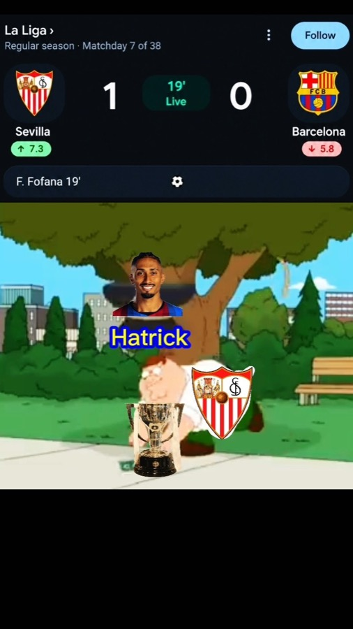
- **Hook:** a Google **live** score card (Sevilla 1-0 Barcelona 19'), then the **same Family Guy tree template** with Raphinha's face labelled "Hatrick", the Sevilla crest and a trophy.
- **Title:** `Barcelona vs Sevilla/3-1/Highlights/#laliga #viral`, typos and all.
- **Timing:** **18.5 h** after FT, so the next day still worked here (CROATBALL had it out 4 h earlier at 183K).
- **Series:** every upload is **6 s**, same template, 1.2/day. Recent run: 632K, 254K, 182K, 87K, 67K, 67K, 66K, 58K… Its one 13 s upload (Arsenal vs Brighton, next day) got **574**.
- **Why it won:** a recognisable template repeated with a new score. Viewers learn the format and the feed learns the audience.
- **Steal this:** ONE fixed vessel template per series. Swap only the card and the face/crest. Keep it at 6 s.

### YT-14 DAZN Bet UK (116 subs) · Sun 20 Sep 19:47 · 91K (307× its 297 median) · 11 s
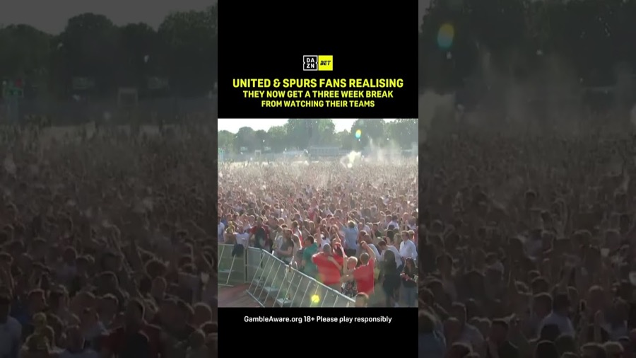
- **Hook:** plate "UNITED & SPURS FANS REALISING THEY NOW GET A THREE WEEK BREAK FROM WATCHING THEIR TEAMS" over a festival crowd going wild.
- **Title:** `Spurs and United fans the only people welcoming the international break`. Description: one line.
- **Timing:** ~20 min after Fulham 1-1 Man United, the last result that made the joke true (Spurs had lost the day before).
- **Why it won:** two fanbases in one line, pathetic joy (a break from your own team), and a clip of pure euphoria. The same shape as IG-02 (apes, Spurs 19th).
- **Steal this:** "[Fanbase A] & [Fanbase B] fans when [a non-event]" + an ecstatic crowd. Post the minute the second result lands.

### YT-15 Yanited Archive (3.7K) · Sat 26 Sep 17:12 · 171K (136× its 1.3K median) · 9 s
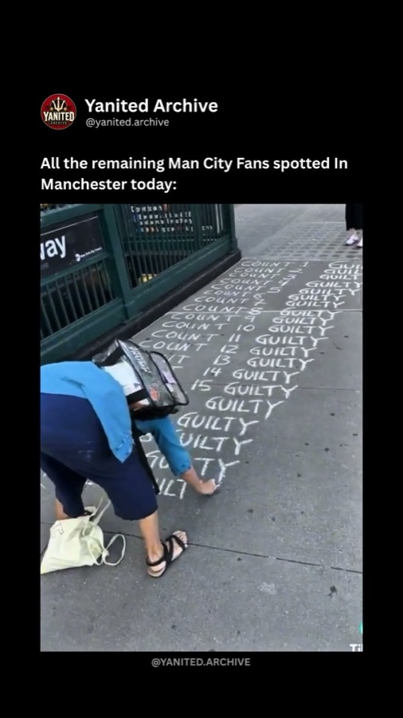
- **Hook:** tweet-style header (avatar + "Yanited Archive") "All the remaining Man City Fans spotted In Manchester today:", then found footage of a woman chalking "**COUNT 11 GUILTY… 14 GUILTY… 15 GUILTY**" on the pavement.
- **Title:** **hashtags only** (`#mufc #manchesterunited #mancity #mancitynews…`). The title did no work.
- **Timing:** 25 h after the verdict. Day 2, yet the angle was new.
- **Why it won:** a structural pun (the chalk count *is* the charge sheet). Its 8 other City Shorts that week got 40–41K; this one got 171K.
- **Steal this:** found footage whose literal content equals the story's number or word. The title can be lazy if frame 1 carries it.

### YT-16 Marquitos G (14K) · Fri 25 Sep 22:12 · 403K (48× its 8.5K median) · 17 s · FACE SKIT
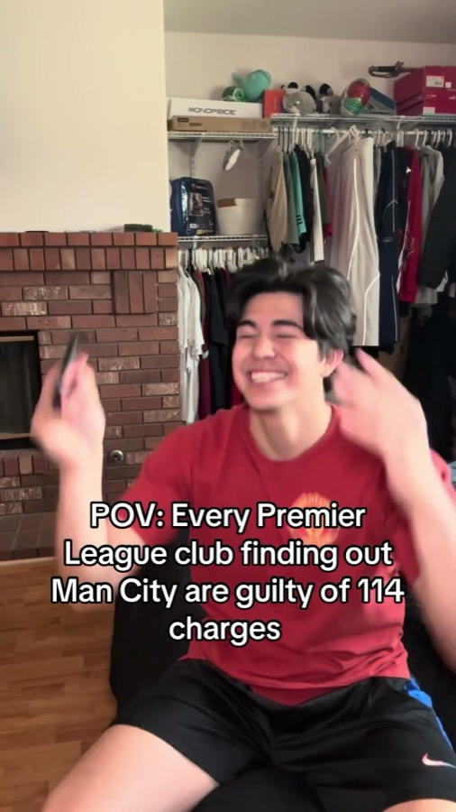
- **Hook:** the creator in a United shirt, in his bedroom, laughing hysterically. POV plate: "POV: Every Premier League club finding out Man City are guilty of 114 charges".
- **Title:** `114 charges is CRAZY 😭✌️🔥🚨 #mancity #premierleague #viral #trending #memes #manchesterunited`
- **Timing:** 6.2 h after the story, so the late evening still broke out with a *face*.
- **Engagement:** 12K likes and 378 comments (3% like rate, very high).
- **Why it won:** a human face reacting reads as original content (the originality gate), and "every club" makes it about every fanbase.
- **Steal this:** not our production today. Note it as the lane that survives late and passes originality checks.

### YT-17 Sillymartin (1.3K) · Tue 22 Sep 20:07 · 69K (47× its 1.5K median) · 9 s
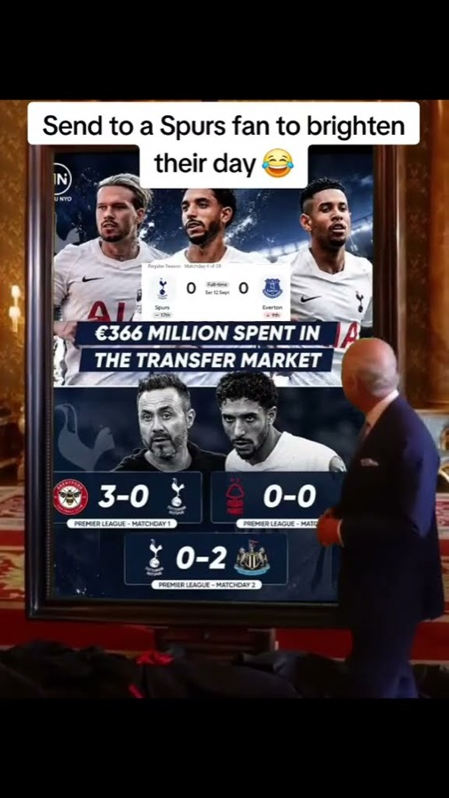
- **Hook:** plate "Send to a Spurs fan to brighten their day 😂" over a TV board listing Spurs' season: "€366 MILLION SPENT", "3-0" (Brentford), "0-0", "0-2" (Newcastle), with a man in a suit presenting it.
- **Title:** `Send to a Spurs Fan`: 4 words, a share instruction plus the fanbase.
- **Timing:** ~3 days after the Villa loss. An **evergreen fanbase state** ("Spurs are bad") has no clock.
- **Why it won:** the title tells viewers what to do with it (share → DM → new viewers). The receipts are on screen.
- **Steal this:** `Send to a [Club] fan` as the title for receipt Shorts about a club's season.

### YT-18 Two2idiots (958) · Fri 25 Sep 20:42 · 115K (25× its 4.6K median) · 11 s
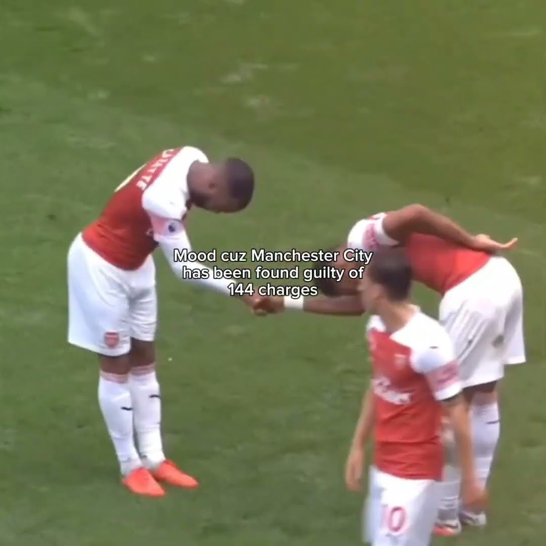
- **Hook:** tiny caption "Mood cuz Manchester City has been found guilty of 144 charges" (sic) over old Arsenal players bowing to each other.
- **Title:** `Arsenal fans are the happiest people on earth😭💔`: the *rival* fanbase's reaction.
- **Timing:** 4.7 h after the story. **Why it won:** the story is framed from a big fanbase's point of view (Arsenal, City's title rival), which gives that fanbase a Short to send each other. Neither the typo (144) nor the small text mattered.
- **Steal this:** for a verdict or scandal, title it from the **beneficiary fanbase** ("[Rival] fans right now"), not the victim.

### YT-19 GØØNBALL (356) · Mon 14 Sep 19:13 · 81K (16× median) · 8 s
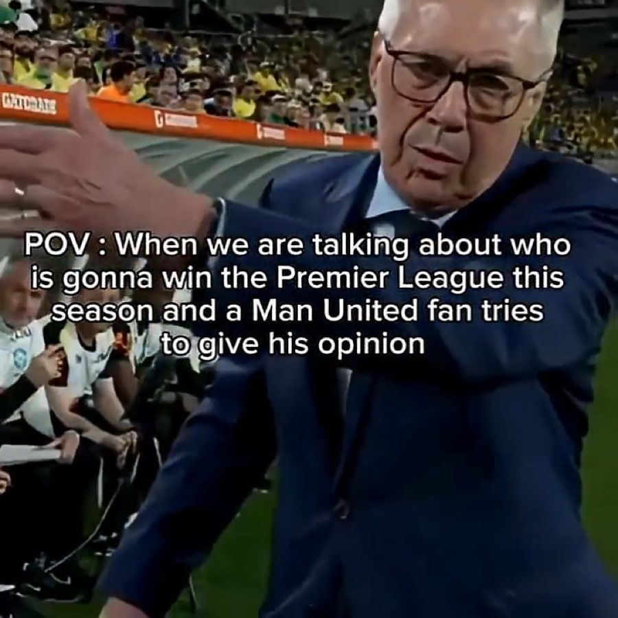
- **Hook:** Ancelotti's dismissive hand-wave. POV plate: "When we are talking about who is gonna win the Premier League this season and a Man United fan tries to give his opinion".
- **Title:** `Man United fans are still crying 😂🥀`. **Timing:** ~24 h after the derby loss.
- **Engagement:** 169 comments on 81K (United fans arguing back). The debate bait worked.
- **Steal this:** "[Fanbase] fan tries to give his opinion" + a famous dismissal gesture. Comments are the ragebait dividend.

### YT-20 Top Hat Top Bins (104K) · Tue 22 Sep 02:00 · 2.40M (17.5× median) · 6 s · and the COPY
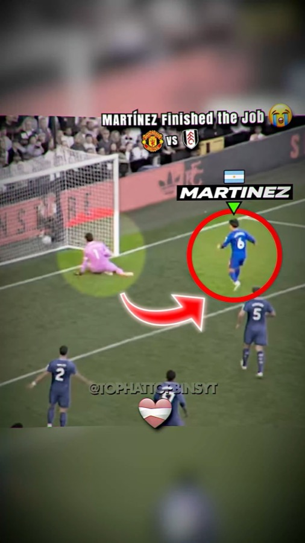
- **Hook:** "MARTÍNEZ Finished the Job 😭" + United crest vs Fulham, over broadcast footage with a red circle on Martínez and an arrow.
- **Title:** `United Found A Way 😭`. Understatement: "found a way" = found a way to not win.
- **Timing:** ~31 h after Fulham 1-1 United.
- **THE COPY:** GoalBiteX (223 subs) posted the identical title 35 h later → **37K, 1.5% of the original**. That's the second measured case after Mowler's lawyer copy (31K vs 2.64M, YT-04).
- **Steal this:** the ironic understatement title. **Don't** steal the broadcast footage (Content ID / strike class).

### YT-21 SanexEditz (18K) · Tue 15 Sep 17:01 · **30.0M (252× its 119K median)** · 6 s · VIDEO-GAME LANE
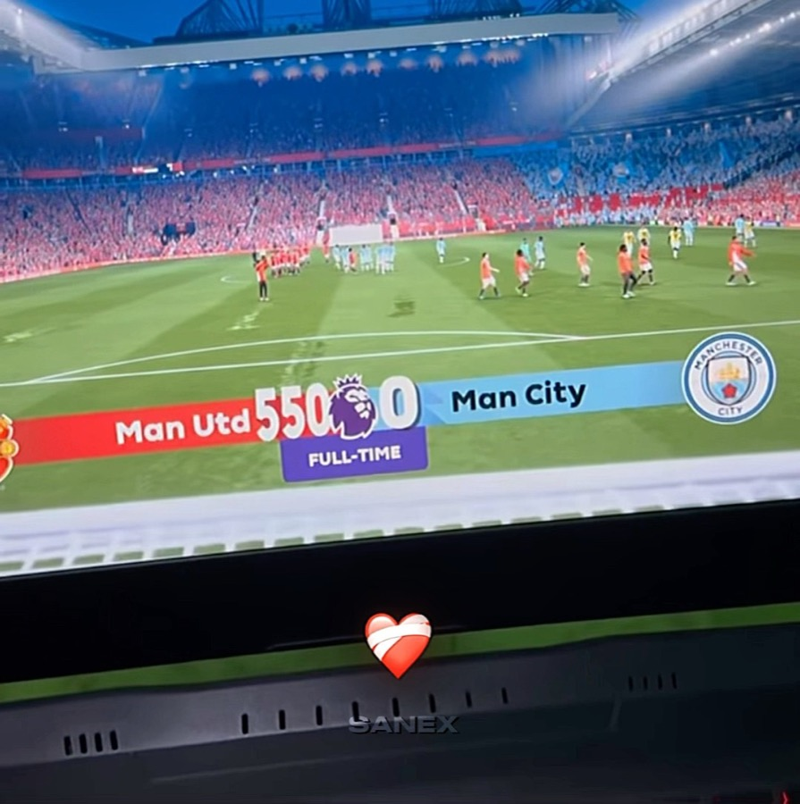
- **Hook:** EA FC on a TV: "**Man Utd 55 – 0 Man City · FULL-TIME**".
- **Title:** `Man U Fans Got Their Revenge 😭🥀`. **Timing:** ~46 h after the derby (City won 1-0).
- **Why it won:** an absurd number in a believable UI. The fanbase's fantasy revenge is played out in a game. 132K likes. It's game footage, not a broadcast, so there's no broadcaster Content ID.
- **Steal this:** the absurd scoreline in a game UI (FC/FIFA) as the vessel for "[Fanbase] revenge". Our maths-reveal instinct, animated.

### YT-22 Jordan Stratton TV (12.6K) · Fri 25 Sep 18:09 · 160K (17× its 9.2K median) · 11 s · FACE + RECEIPT
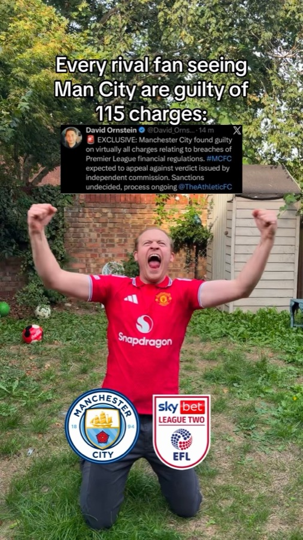
- **Hook:** plate "Every rival fan seeing Man City are guilty of 115 charges:", **the Ornstein tweet screenshot** (receipt), the creator on his knees in a United shirt screaming, and a **City crest next to the League Two / EFL badge** (the absurd consequence).
- **Title:** `MAN CITY GUILTY😂`. **Timing:** 2.2 h after the story.
- **Steal this:** three layers in one frame: receipt (tweet) + reaction + **absurd consequence badge**. We can do the receipt and the badge without a face.

---

## Adjacent lanes (huge on YT right now, not ours; noted so nobody mistakes them for our formula)
- **YT-23 DNXTY (1.2K) · 20 Sep · 3.03M (79× median) · 16 s:** `Haaland Had a Sneaky Plan for Bellingham 👀🧽 #parody`. A C-drama/lookalike clip relabelled as players (see `yt/23_dnxty_haaland_parody_ai.jpg`). The same family: "He asked for a BIGGER milk bottle" (562 subs, 2.5M), "Not under Haaland's watch, Mbappe" (5.7K, 5.1M). Also the "Ronaldo x Yamal Skills 🤣🔥" 6 s edits (millions each, dozens of channels). This is templated, mass-produced content, **the exact target of YouTube's 2026 inauthentic-content sweep**. Do not copy.
- **YT-24 Goal Up (26K) · 20 Sep · 1.33M (36×) · 23 s:** `Tottenham Still Believed 💔` (`yt/18_goalup_tottenham_still_believed.jpg`). A broadcast-footage edit of the Villa comeback, "*EASY 3-0!*". Footage re-upload. NOT OUR LANE (strike risk). Its title shape (ironic 3 words + 💔) is still worth stealing.

## OURS: the two hits vs the flops (YouTube Analytics)

### OURS-YT1 "Brighton vs Arsenal highlights" · Mon 21 Sep 11:24 (41 h after FT) · 1,397 views · 10 s
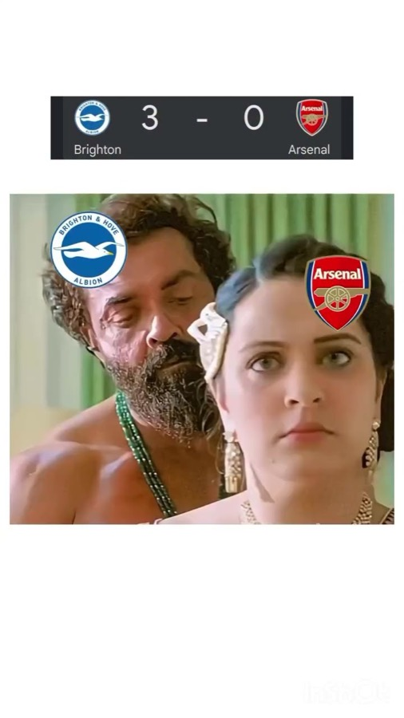
- **Frame 1:** score card "Brighton 3 - 0 Arsenal" on top, then an Indian-film still with a **Brighton crest on the man and an Arsenal crest on the woman**, filling the frame. **The only Short of ours with the winners' anatomy.**
- **Traffic:** Shorts feed **1,361 of 1,397 (97%)**. 1,364 views on day 1, then 8, 1, 20, 4. It passed the first pool and never got a second.
- **Retention:** audienceWatchRatio 1.46 at 1%, **1.75 at 11%** (replays), 1.03 at the end. relativeRetentionPerformance 0.83–0.93. 129% average viewed. 593 engaged views. **0 subscribers, 2 shares.**
- **Top countries:** NO 146, ZA 122, AU 89, IR 76. The seed was global, not UK.

### OURS-YT2 "Spurs fans after going three down at home #shorts" · Sun 20 Sep 21:39 (30 h after FT) · 1,180 views · 6 s
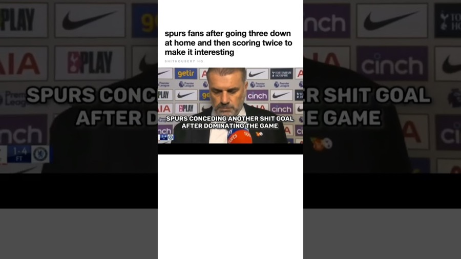
- **Frame 1:** white plate with a 16-word lower-case sentence and a Postecoglou presser clip that has **its own burnt-in caption** ("SPURS CONCEDING ANOTHER SHIT GOAL AFTER DOMINATING THE GAME"). The clip is someone else's meme, re-captioned.
- **Traffic:** Shorts feed 1,149 of 1,180. 1,170 on day 1, then 7, 1, 2.
- **Retention:** 1.70 at 1%, 1.77 at 11%, 1.02 at the end, relative 0.80–0.88. It's 6 s, so it loops by default.

### OURS-YT3 "Norway 1 2 Portugal | Highlights" · Sun 27 Sep 22:43 (≈FT) · **5 views** · 19 s
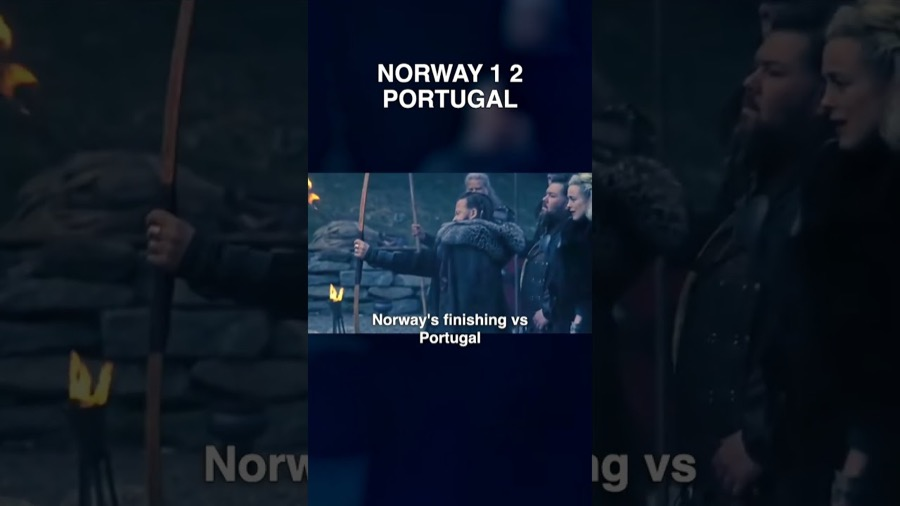
- **Frame 1:** a dark navy frame, "NORWAY 1 2 PORTUGAL" in big type, a dark Norsemen clip filling ~30% of the frame height, and a second caption "Norway's finishing vs Portugal". **No card, no flags on the vessel, two text blocks, 19 s.**
- Mr Cristiano posted the same title 36 min later with the card and a cartoon: **73K** (YT-12). The difference is the frame, not the timing.

### OURS-YT4 "Germany 0-1 Greece | Highlights" · Mon 28 Sep 00:40 (~2 h after FT) · 188 views at ~16 h · 10 s
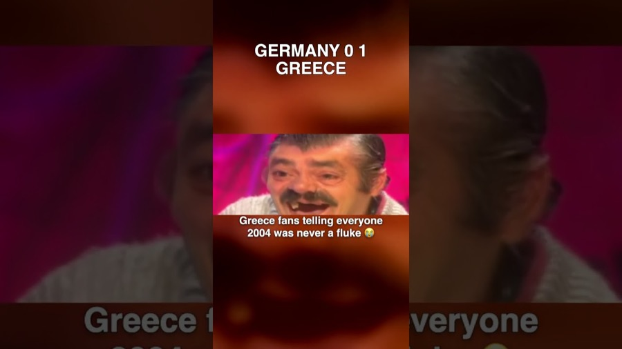
- **Frame 1:** a blurred orange frame, "GERMANY 0 1 GREECE", El Risitas laughing in a box filling ~25% of the frame, "Greece fans telling everyone 2004 was never a fluke 😭". Our best Short this week (traffic source not yet in Analytics, which lags 2–3 days). Mr Cristiano's same title the next day got 93.

### OURS-YT5 "Man City lawyers telling the club they beat 1 of 115 charges" · Fri 25 Sep 17:49 (1.8 h after the story) · 50 views · 10 s
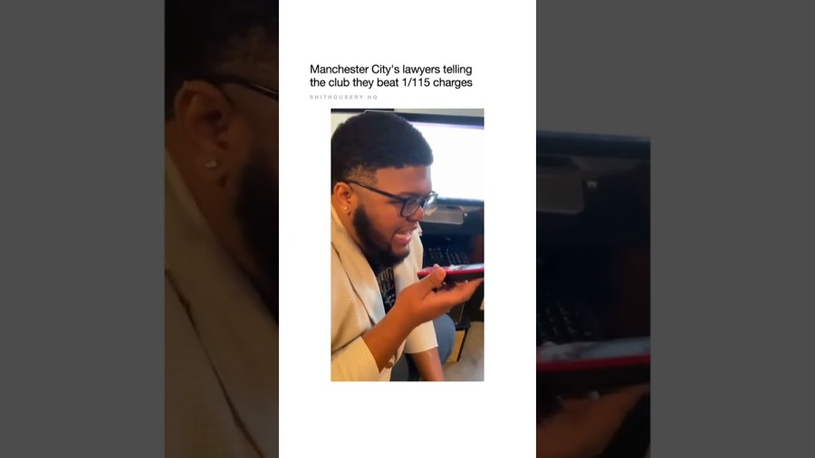
- **Frame 1:** white plate, small text, and a man on the phone in a box filling ~35% of the frame. **Traffic: YT search 30, Shorts feed 0.** Retention 1.29 at start, **0.50 at the end** (relative 0.48–0.65). The premise was already out (thatguysjokes IG, Mowler YT).

**Contact sheet of our standard render** (last 6 uploads' frames, cropped): white or blurred plate, text top-left or top-centre, clip in a box filling 25–40% of the height, and 30–45% of the frame empty. Every outlier above fills ≥60% of the frame with moving picture or a card.

---

## THE CRAFT for YT Shorts (from evidence). Check every draft against these
1. **Frame 1 fills the screen.** The clip, or card + clip, covers **≥60% of the 9:16 frame**. Text is ONE band of **≤12 words**. There are no empty white areas. *Check:* export frame 0 at phone size. Is ≥60% picture, and is there one text block? (Every outlier YT-08…22 passes. Our OURS-YT3/4/5 fail with a 25–40% clip. Our Brighton hit passes.)
2. **Result Shorts carry a full-time score card on top** (Google/FotMob style: crests + score, scorers optional) **and the crests/flags sit ON the vessel's characters.** *Check:* with the caption covered, can you tell who beat whom from the card, and who is who from the crests? (YT-08, 09, 10, 12, 13, OURS-YT1.)
3. **Length 5–10 s for a one-beat joke** (outlier median 9 s; our hits were 6 s and 10 s; the 6 s template series stays at 6 s; WCB26's one 13 s upload got 574 against its 54K median). Over 15 s needs a second beat that pays off. *Check:* seconds ≤10, or name the second beat.
4. **Loop to ≥100%.** The last frame cuts straight back into frame 1: no end card, no fade, no logo tail. The first line must re-read as a setup (YT-09's "Manchester United" → "favourite player?"). *Check (after posting):* averageViewPercentage ≥110% and audienceWatchRatio at 100% ≥1.0 (both our hits: 1.02–1.03; the flops: 0.47–0.50).
5. **Pick the joke type by the clock.**
   - **Result/verdict jokes: ≤60 min after FT or the story.** Mr Cristiano same-night got 48K–681K; next-day got 93–400 (same format, same week). CROATBALL posts at +20–40 min.
   - **Fanbase-state jokes** (Spurs are bad, United suffer, Arsenal bottle) have **1–3 days**: NAT_ +11 h 2.5M, DAZN +28 h 91K, Sillymartin +77 h 69K.
   - *Check:* write the type and the deadline on the draft. If a result joke is past +2 h, turn it into a fanbase-state joke or drop it.
6. **Be first or be different.** A copy gets 1–2% of the original: Mowler 31K vs 2.64M, GoalBiteX 37K vs 2.40M. *Check:* search YouTube (filter Shorts, last hour) for the premise before rendering.
7. **Title = a fanbase or the exact result, ≤60 characters.**
   - Result Shorts use exactly `[Home] x y [Away] | Highlights`.
   - Fanbase Shorts use `[Club] fans [are/after/when…]` or `Send to a [Club] fan`, framed from the fanbase that *enjoys* it (YT-18), or an ironic 3–4-word understatement (`United Found A Way 😭`, `Tottenham Still Believed 💔`).
   - The day's phrase ("pecked by the seagulls") goes in the title or on description line 1.
   - Titles matter less than frames in the feed (YT-15 had a hashtag-only title and got 171K). They matter for search, which is where ~all our current views come from.
8. **Description line 1 = the searchable result** (`brighton vs arsenal 3-0 highlights`), then the day's phrase, then 5–8 hashtags. Tags = search variants. *Check:* line 1 contains both club names + score, or the story keyword (115 / charges).
9. **One series, one template.** Winners repeat ONE format: CROATBALL 14/14 "| Highlights", WCB26 always the same 6 s Family Guy template, byAvais the same yellow frame (YT-06). *Check:* does this draft look like the last 3 Shorts on the channel? Our channel currently mixes 6 formats (memes, "Highlights", quizzes, 9-min quizzes, Goldbridge streamer clips, maths cards).
10. **What the feed rewards for tiny channels: per-Short retention, not channel size.** 116-, 241-, 457- and 716-sub channels hit 68K–2.5M, so the feed judged each Short alone. But it only judges Shorts it *shows* (see below). Volume among in-lane winners is **0.3–2 Shorts/day** (median of 23 outlier channels ≈1.4/day; NAT_ 0.7/day; CROATBALL 0.7/day). *Check:* ≤2 uploads/day on this channel.

## WHY OUR SHORTS DIE (YouTube Analytics, pulled 28 Sep)
1. **Most were never shown in the Shorts feed.** Daily Shorts-feed views for the channel:
   - 20 Sep 1,142 and 21 Sep 1,628 (the two hits)
   - 22 Sep **9**, 23 Sep **6**, 24 Sep **26**, 25 Sep **12**
   - Over the same days we uploaded 2, 3, 6 and 12 Shorts.
   - Of the ~35 Shorts uploaded 20–25 Sep (the ones Analytics covers so far), only **3** got more than 250 feed views (1,361 / 1,149 / 293). The typical Short got **0–3 feed views**. The rest of their views came from **YouTube search** (e.g. City lawyers: 30 search, 0 feed; West Ham fan: 35 search).
   - A Shorts view now counts at play start, so feed views ≈ feed impressions. **These weren't swiped away. They were barely served.** (Confirm in Studio: "Viewed vs swiped away" per Short. TODO for Chrome after 21:30. The API doesn't expose it.)
   - All uploads are 9:16, show up as Shorts (`/shorts/` returns 200), have no region blocks and are not "made for kids". So it isn't a classification bug.
2. **When the feed did test a Short, retention decided it, and only the loopers passed.**
   - Hits: replay ratio 1.46–1.77 early and ≥1.02 at the end; relative retention 0.80–0.93.
   - The one fed flop ("Spurs fans looking for a win", 293 feed views): 0.47 at the end, relative 0.55–0.66, and the feed stopped at ~300.
   - Every search-fed flop we can measure ends at 0.39–0.50.
3. **Even the hits die after one pool.** Both did ~1,200–1,400 on day 1, then under 20/day, with 0 subscribers and 0–2 shares from 2,577 views. The seed pool was global (NO/ZA/AU/IR, not UK). Nothing in the Short asked for a share or a follow, and the next upload wasn't the same format to catch the returning viewer.
4. **Our standard render doesn't look like a Short that wins.** It uses a white or blurred plate, a 16–20-word sentence, a clip in a box filling 25–40% of the height, and 30–45% empty frame. Our only full-frame card + crest Short (Brighton) is our best by views. The Norway one used the right *title* with the wrong frame and got 5 views against Mr Cristiano's 73K for the same title.
5. **Volume and format soup.** 7–12 uploads/day from 24 to 27 Sep (winners post 0.3–2). Six unrelated formats, including 9-minute quizzes (0–4 views) and 1-minute Goldbridge streamer clips (1–3 views: someone else's content, which is also reused-content risk). *Hypothesis, not proven:* a 30-sub channel flooding weak-retention Shorts gets a smaller seed per upload. The feed collapse on 22 Sep coincides with this, but that's correlation.
6. **History says the formula already worked here.** Nov 2025 on this channel: "Liverpool fans will find some way to rationalize it too" **32,110** (96% feed; top countries ID/MY/GB/US) and "Arsenal fans will say Saka over Messi with a straight face" **17,479**. Both were 8 s, both had "[Fanbase] fans will…" titles, both ended at a watch ratio of ≥1.04, and both posted at 1–2/day.

## WHAT TO DO THIS WEEK (measurable, read Mon 5 Oct)
1. **Cap YouTube at 2 Shorts/day and allow only two formats.**
   - A: `[H] x y [A] | Highlights`, matchdays only, **live ≤60 min after FT**.
   - B: `[Club] fans …` / `Send to a [Club] fan`, 6–10 s fanbase-state jokes.
   - No quizzes, long-form quizzes or streamer clips on this channel. (Whether to unlist the old ones is Alex's call; this study changed nothing.)
   - **Metric:** Shorts-feed views per Short (Analytics `insightTrafficSourceType==SHORTS`). Target: **≥3 of the next 10 Shorts with ≥250 feed views**. Baseline: 3 of ~35 (20–25 Sep); none of the 16 uploaded since has passed 188 views.
2. **New YT render template (full-bleed):**
   - a result card or tweet/receipt band in the top ~20%
   - the clip filling ≥60–70% of the frame
   - ONE text band of ≤12 words
   - crests/flags placed on the vessel's characters for result Shorts
   - **Check before upload:** frame-0 export against craft rules 1–2 (the banger-critic can run this).
3. **Cut every Short to loop:** ≤10 s, the last frame cuts to the first, no tail. **Metric:** averageViewPercentage ≥110% on 7 of 10 (our flops sit at 60–95%).
4. **Pre-build Format A before each match window:** one fixed vessel template per series (like WCB26's 6 s template) with swap-in cards and crests for that day's fixtures, so the Short is out ≤60 min after FT. **Metric:** median minutes from FT to publish ≤60 (ours this week: Germany-Greece ~120).
5. **One cheap diagnostic (after 21:30, Chrome, read-only):** open Studio → Analytics for the last 10 Shorts and record "Viewed vs swiped away" and the feed-impression count. If the feed is still at ~0 after 5 days at ≤2/day, test the upload route: post one Short from the phone app instead of the API/scheduler. Weak evidence: the Brighton hit's file is 720×1280, unlike our 1080×1920 renders. But the Spurs hit was a 1080×1920 render, so the route is unproven. Log the result in the daily retro.

---

### Tool notes
- **Data API search** works for this: 100 units per query. 22 queries plus stats = 2,285 units, with room for a weekly rerun. The scripts are in the session scratchpad (`search.mjs`, `stats.mjs`, `rank.mjs`, `base.mjs`, `oa.mjs`). If this becomes weekly, they belong in `social/`.
- **vidIQ `watch_shortform_content`** (10 credits) gave a reliable scene-by-scene with dialogue and loop analysis (YT-09). `video_transcript` (5) is useless for most memes (music or no speech; CROATBALL is `zxx`).
- **Higgsfield `video_analysis_create` (YouTube URL):** it accepts a public Shorts URL on the free plan (0.2 credits) with no charge shown at submit. The job for YT-12 stayed `queued` for 30+ min, so the cost and quality are **unverified**. Job id `2386922e-ff7d-4f92-a9cc-1559987576cc`; check it with `video_analysis_status`.
- **Frame-level TODO (Chrome after 21:30):** hear the sound on YT-08, 12, 13, 14, 15, 17. Record frames at 0 / 35 / 65 / 92% for YT-08, 12 and 13 (the Format-A templates to rebuild).
